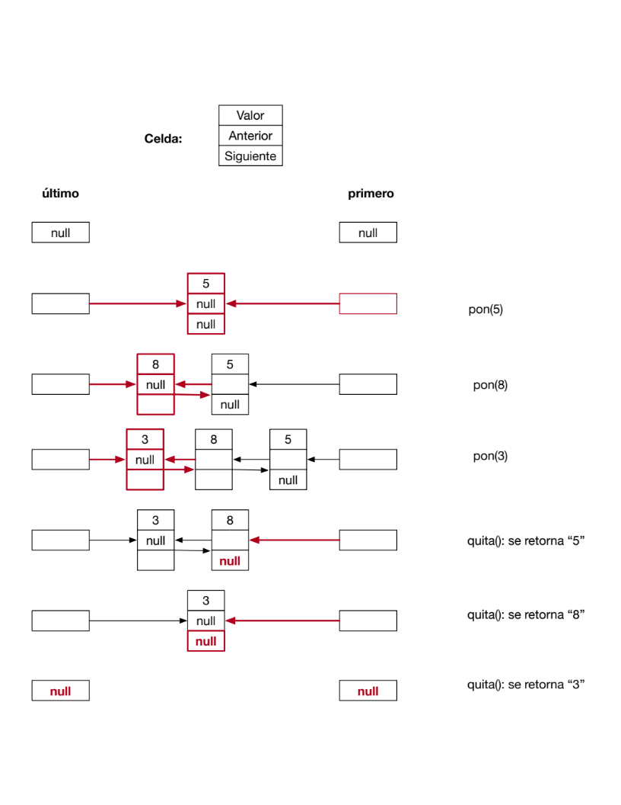
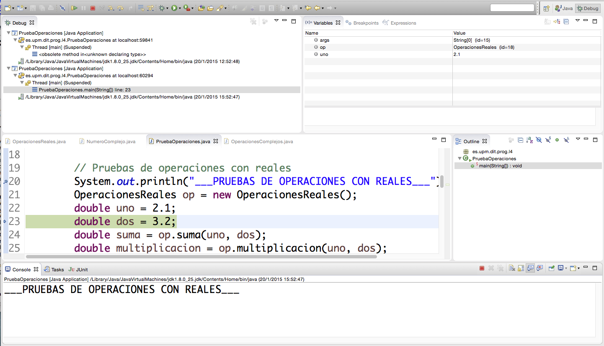

# Laboratorio 0 - ADSW

Análisis y Diseño de Sowftware, 2023

Grado en Ingeniería de Tecnologías y Servicios de 
Telecomunicación 

ETSI de Telecomunicación

Universidad Politécnica de Madrid

# Objetivos

1.  Desarrollar algoritmos sencillos,

2.  Depurar un programa, para detectar y corregir errores:

    a.  Ejecutar casos de pruebas con JUnit

    b.  Añadir trazas/registros en el código

    c.  Usar el depurador para detectar y corregir errores

# Actividades

## Ejercicio 1: Análisis del flujo de ejecución

El objetivo de este ejercicio es ejecutar los casos de prueba de una
clase y entender cómo se pueden definir. Para ello, se proporciona un
proyecto cuyo componente principal es la clase *WordCounter*, en la que
se definen varios métodos que permiten contar el número de palabras de
un texto y determinar cuáles son las *n* más (o menos) utilizadas. La
clase incluye un método *main* con una prueba básica de funcionamiento
(*smoke test*[^1]). También se proporciona una batería de pruebas
configurada con *JUnit* 5, con varios casos de prueba definidos.


En el proyecto se incluyan las siguientes clases:

-   *WordCounter*: es la clase que procesa los textos de entrada y
    genera la salida.

-   *Registro*: es un contenedor para asociar un contador a una palabra.

-   *WordCounterTest*: Batería de pruebas para *WordCounter*.

-   *Meter*: Programa para procesar varios ejemplos de ficheros de
    texto, calculando su tamaño y el tiempo de ejecución.

Las actividades que se proponen son:

1.  **Instalar el proyecto *ADSW-lab0*.**

	El proyecto está disponible en la distribución del laboraotio en GitHub. Los pasos para instalarlo en Eclipse se describen en el [Anexo 1](#anexo-1-cargar-un-proyecto-en-eclipse).

2.  **Ejecutar el programa**

	La clase *WordCounter* incluye un método *main* para ejecutar una
	prueba elemental con un texto breve. La clase *Meter* realiza el
	procesamiento de ficheros de texto más largos. Los ficheros están
	incluidos en el archivo zip en que se distribuye el proyecto (carpeta
	*libros*).

	Para ejecutar una clase,

	1.  Seleccionarla en el explorador de paquetes

	2.  Con el botón derecho, Run As > Java Application

3.  **Ejecutar la clase con las pruebas:**

    1.  Seleccionar *WordCounterTest* en el explorador de paquetes.

    2.  Run as -\> JUnit Test

4.  **Leer el código de las pruebas** para conocer su estructura y
    estudiar cómo se ejecuta.

## Ejercicio 2: Depuración de un programa

En este ejercicio, se proporciona un proyecto que tiene una clase que
implementa una lista doblemente enlazada. La gestión de los elementos es
de tipo FIFO: el primer dato insertado será el primero en salir. La
clase proporciona métodos para poner y quitar valores enteros de la
lista, para conocer el tamaño de la lista y escribir la lista.

La implementación se basa en guardar los valores en objetos de la clase
*Celda*. Para mantener la lista, cada celda apunta a la celda anterior y
a la siguiente. La lista contiene dos referencias que apuntan,
respectivamente, a la primera y a la última celda.

La lista doblemente enlazada tiene la ventaja de que no ocupa apenas
memoria si no hay objetos en la lista.

En el proyecto se incluyan las siguientes clases (ver la figura del
modelo de clases):

-   *Lista*: Interfaz de una lista FIFO acotada.

-   *Celda*: La celda que mantiene un enlace a una celda anterior, un
    enlace a la celda siguiente y el valor de la celda.

-   *ListaDoblementeEnlazada*: Lista doblemente enlazada. La lista tiene
    una capacidad máxima, y si se llena no se pueden añadir más valores.

-   *Prueba_ListaDoblementeEnlazada*: Ejecución de una lista.


En la siguiente figura se muestra un ejemplo de la ejecución.
Inicialmente, las referencias *primero* y *último* contienen *null*.
Según se ponen o quitan valores, se van actualizando estas variables.
Por ejemplo, al poner un valor cuando la lista está vacía hay que
actualizarla así:

-   *Primero* y *último* apuntan a la celda nueva.

-   Los enlaces de la celda nueva apuntan a *null*, porque no hay más
    celdas

Al añadir un nuevo valor hay que hacer que:

-   El atributo *siguiente* de la nueva celda apunte a la celda a la que
    apuntaba *último*

-   El atributo *anterior* de la celda que estaba en último lugar
    (aquella a la que apuntaba la referencia *ultimo* de la lista)
    apunte a la celda nueva.

-   *Último* apunte a la celda nueva

Las operaciones del método *quita* se comportan de forma análoga.



El código proporcionado tiene errores. Para poder corregir los problemas
se propone realizar las siguientes actividades:

1.  **Identificar el paquete *Lista* y sus componentes**
Este paquete se instaló junto con la instalación del proyecto ADSW-lab0 en el ejercicio anterior.

2.  **Estudiar bien el funcionamiento de la lista.** Si no, será difícil
    corregir los errores

3.  **Crear una clase de pruebas y generar pruebas.**
Las pruebas que se proponen son:
    1.  Añadir el valor *1* y comprobar que el tamaño de la lista es *1.* Luego,
        quitar un valor y comprobar que se retorna un *1* y que el tamaño
        es 0.
    2.  Haga algo similar añadiendo varios valores, sin llenar la lista, y
        comprobar que se retornan bien los datos y el tamaño es correcto.
    3.  Añadir valores hasta llenar la lista. Comprobar que no se cambia la
        lista cuando se añada un nuevo valor. Comprobar que los contenidos y
        el tamaño de la lista son correctos.

4.  **Ejecutar un programa de prueba básico.**
Se puede tomar como punto de partida el programa *Prueba_Lista
Doblemente Enlazada* incluido en el proyecto.

5.  **Añadir trazas para seguir la ejecución**.
Las trazas (*logs*) sirven para tener información sobre el estado de la lista al ejecutar un programa.

6.  **Ejecutar el programa con las trazas.**
Observe la salida para detectar los fallos. En caso de que sea necesario, añada trazas adicionales.

7.  **Ejecutar el programa usando el depurador.**

Defina puntos de ruptura y ejecute el programa paso a paso, o hasta el siguiente punto de ruptura, y compruebe si la ejecución es correcta.

## Ejercicio 3: Desarrollar un algoritmo sencillo

En este ejercicio, se propone desarrollar el siguiente método de la
clase *ListaDoblementeEnlazada*:


Use las técnicas propuestas en este enunciado para comprobar si el
código es correcto.

## Ejercicio 4: Pruebas de nuestra instalación de eclipse (Borrador)

El proyecto que hemos descargado permite practicar el proceso de entrega de prácticas de la asignatura y comprobar que nuestra instalación de Eclipse particular es correcta. Este laboratorio no es puntuable, pero esta entrega nos permite probar nuestra instalación y asegurar que no hubiera problemas en las prácticas evaluables. 

En Moodle hay un vídeo ilustrando el proceso en Windows y Mac. Para instalar Ubuntu hay un enlace con los cambios que hay que realizar.

El proyecto que hemos instalado incluye un script de entrega de prácticas. Ese script nos permitirá probar nuestras instalaciones. El proceso de entrega:

- El proyecto ADSW-lab0 incluye un script de entrega (Practica0Entrega.launch) que podemos ejecutar seleccionando el script y ejecutando Run \> Run As \> Practica0Entrega. Este script nos va indicando en la consola de Eclipse los pasos que va dando (chequeos y compilaciones, ejecuciones de pruebas, calculo de notas, comprimir entregas, subidas a moodle, ...). Nos muestra la estimación de nota calculada. 

- Si hay errores de compilación, o si lo que se debe desarrollar en la práctica no se ajusta a lo que indica la guía (identificadores, signaturas de métodos, visibilidad de clases o métodos, …), las pruebas no se pueden ejecutar y el fichero zip no se construirá. Si ha podido ejecutar pruebas dejará construido un fichero ADSW-lab0.zip en la raíz del proyecto Eclipse. Para hacerlo visible debemos refrescar el proyecto con el comando Refresh del menú de contexto del explorador de proyectos de Eclipse.

- Si tenemos un fichero entregable, se arranca un browser empotrado que nos permite logarnos en Moodle. Es la primera vez que utilizamos esta herramienta y es compleja porque depende de muchas cosas (versión de Eclipse, sistema operativo, versión Java que utilizamos). Si queremos hacer la entrega, nos logamos en moodle, y subirá la entrega, y subirá también la nota calculada. Si no queremos hacer la entrega simplemente cerramos el browser y terminará la entrega, sin subirse nada a Moodle. 

- La versión actual de Moodle, algunas veces se queda paradas, y dejan de mandar datos al browser, y eso se puede arreglar algunas veces si recargamos la página en el browser empotrado. 


# Anexos:

## Anexo 1: Cargar un proyecto en Eclipse

Alternatica 1: 

- Descromprime el fichero (ADSW-lab0.zip) que se obtenido

- Seleccione el menú File > Import > Existing Projects into
  Workspace > Next
- Navegue hasta el directorio que se ha generado al descomprimir 
  el fichero original.
- Compruebe que el proyecto está marcado, y seleccione Finish


## Anexo 2: Generar y acceder a la documentación con Javadoc en Eclipse

La documentación existente se encuentra en la carpeta *doc* del
proyecto. Para consultarla, abra el fichero *index.html* en un navegador
(botón derecho \> Open with \> Web browser).

También puede consultar la documentación desde una ventana del editor de
código Java. Si posiciona el ratón sobre el nombre de una clase o un
método aparece una ventana auxiliar con un resumen de la documentación.

Si tiene activada la vista *Javadoc* (con Window \> Show View \>
Javadoc), al hacer clic sobre el nombre de un elemento se mostrará la
documentación correspondiente en la ventana correspondiente a esta
vista.

Para generar o actualizar la documentación *javadoc* vaya al menú
Project \> Generate Javadoc. Si aparecen errores de codificación de
caracteres asegúrese de poner las opciones -encoding utf8 -docencoding
utf8 -charset utf8 en el cuadro *VM options* de la tercera ventana que
aparece (después de hacer Next dos veces).

## Anexo 3: Crear una clase de *JUnit*

Sitúese sobre la ventana del editor correspondiente a la clase que
quiere probar y vaya al menú File \> New \> Junit Test Case. Asegúrese
de que está seleccionada la opción "New JUnit Jupiter test", y conteste
afirmativamente si el entorno le pide añadir la biblioteca Junit 5 al
proyecto.

## Anexo 4: Configurar el registrador (*logger*) java.util.logging

### Opción 1

Los pasos básicos para configurar y usar en un programa son:

-  Importar el paquete

```java
import java.util.logging.*;
```

-  Crear el configurador, que debe ser un atributo de la clase:

```java
static  Logger LOGGER;
```

-  Configurar el registrador. Ejecutar las siguientes instrucciones en
    el constructor en el que se van a poner los registros:

```java
LOGGER = Logger.getLogger(ListaDoblementeEnlazada.class.getName());
LOGGER.setLevel(Level.FINEST);
```

-  Incluir las trazas donde se considere:

```java
LOGGER.info("Comentario");
LOGGER.fine("La lista: " + toString());
```

### Opción 2

En algunas implementaciones, la opción previa duplica las trazas. A continuación se proporciona otra opción:

-  Importar el paquete

```java
import java.util.logging.*;
```
- Copiar el fichero logging.properties por defecto en un diretorio del usuario. Este fichero se encuentra en el paquete de Java en cada computador. Para facilitar, se adjunta una versión de este fichero en la distribución de este laboratorio. 

- Asignar el nivel por defecto de la consosla a: FINEST

```
java.util.logging.ConsoleHandler.level = FINEST
java.util.logging.ConsoleHandler.formatter = java.util.logging.SimpleFormatter
```

- En el código definir el fichero de configuración que el usuario ha cambiado y crear el gestor de trazas:

```
System.setProperty("java.util.logging.config.file", "/MiDirectorio/logging.properties");
LOGGER = Logger.getLogger(ConfigurarSuma.class.getName());

```
	
- Finalmente, es posible elegir el nivel preferido:

```
	LOGGER.setLevel(Level.FINER);
```


## Anexo 5: Uso del depurador

El depurador permite identificar y eliminar errores de un programa que
compila y ejecuta pero que no produce resultados correctos. El depurador
ejecuta el programa de forma interactiva, permitiendo observar una a una
las instrucciones que se ejecutarán, las variables activas en memoria y
sus valores. Para iniciar el depurador sobre la clase que contiene el
método main marque -Menú: Run-\>Debug

Las herramientas disponibles para el control de la ejecución son varias:

-   **Puntos de parada "*breakpoints".*** Paran la ejecución del
    programa en instrucciones determinadas.
-   **Perspectiva de depuración** con las siguientes vistas:
    -   Vista de visualización y modificación de valores de variables.
    -   Vista de consola que muestra la salida del programa
    -   Vista de editor del código fuente con una línea verde en la
        instrucción que va a ser ejecutada
    -   Vista de depuración indicando la línea de código que va a ser
        ejecutada
    -   Vista de vigilancia de expresiones




    
-    **Control de la ejecución** paso a paso, entrando
    en los métodos (*Step in)* o ejecutando los métodos completos y
    parando al terminar de ejecutarlos (*Step over*).

Para buscar un error en un programa pondremos un punto de parada en la
primera sentencia ejecutable del método main. Iremos ejecutando
controladamente el código entrando en los métodos suma y multiplicación
de la clase Operaciones reales saltando las instrucciones que ejecutan
constructores o llamadas a métodos de clases de la API de Java.

Se observa que las variables *op, uno* y *dos* sólo aparecen en la vista
de variables en memoria tras su declaración. Al entrar en la ejecución
del método *suma* se modifican varias vistas. En la del editor se ve la
clase *OperacionesReales*. En la vista de variables se observan las
variables disponibles por el método suma: la referencia a la propia
instancia, *this*, y los parámetros *dos* y *uno*. Estas variables
contienen los valores pasados al invocar el método. Aunque las variables
tienen los mismos nombres que en la sentencia que invoca al método,
están cambiadas de orden de modo que la variable *dos* contiene el valor
almacenado en la variable *uno* de main. Se puede seguir ejecutando y
salir del método. Se puede ver que los valores de las variables *uno* y
*dos* no han cambiado.

Respecto al ejercicio 2, utilice el depurador para ver qué ocurre y
verificar si se ha producido o no el intercambio de valores deseado.
Para ello se pone otro punto de parada en la sentencia que imprime el
mensaje de cambio de sección. Al ejecutar el programa en modo debug,
éste se parará en el primer punto de parada. Siga la ejecución hasta al
siguiente punto de parada para ya ir instrucción a instrucción. Continúe
con la depuración hasta entender por qué un método funciona y otro no.

En la tercera sección del programa se ejecuta la suma y multiplicación
de dos números complejos. El programa funciona sin problemas, pero no da
el valor adecuado. Debe identificar y corregir los errores usando el
depurador.

[^1]: Un *smoke test* es una prueba elemental de que un programa
    funciona, sin entrar en detalles ni casos particulares.
