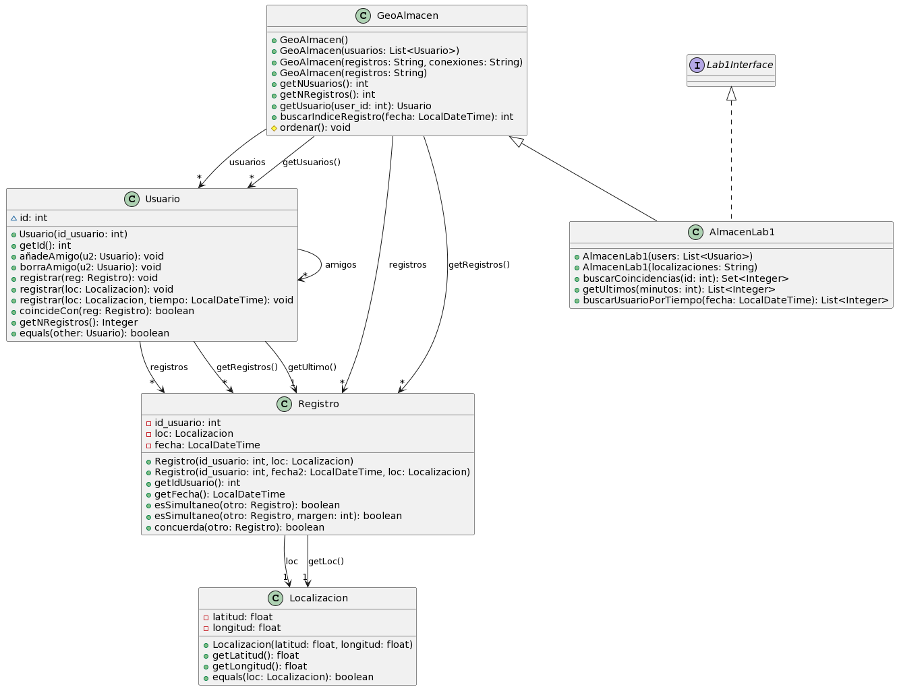
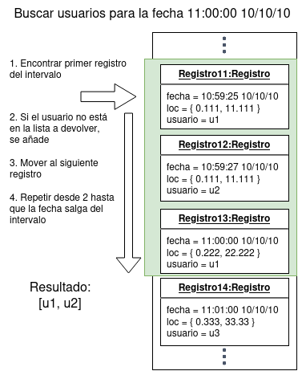

# Laboratorio 1 - Búsqueda y ordenación

En este laboratorio analizaremos datos de registros de geolocalización (*checkins*) de usuarios.
En particular, vamos a encontrar:

* Usuarios que se han registrado en el mismo sitio a la vez
* Usuarios que se han registrado en algún sitio en un cierto periodo de tiempo
* Los últimos usuarios que han hecho un registro


## Objetivos

1. Familiarizarse con los conjuntos de datos y las clases principales para las prácticas
2. Desarrollar algoritmos de búsqueda y filtrado
3. Poner en práctica la ordenación de elementos en una lista
4. Depurar un programa, para detectar y corregir errores:
    a. Utilizando casos de prueba con JUnit
    b. Desarrollando casos de prueba adicionales
    c. Añadiendo trazas/registros en el código
    d. Usar el depurador para detectar y corregir errores

## Descripción de los datos 

En este laboratorio utilizaremos datos sobre registros de geolocalización (*checkins*) de usuarios.
También tendremos información sobre amistad entre diferentes usuarios.

Los datos de todos los usuarios y registros se guardarán en una clase a la que llamaremos `GeoAlmacen`.
Además, implementaremos una serie de métodos que nos permitirán buscar entre los usuarios y los registros.

Cada usuario tiene un identificador, una lista de registros y una lista de amigos.
Un registro contiene el identificador del usuario, una localización (con latitud y longitud) y el tiempo en que se hizo el registro (`LocalDateTime`).

Utilizaremos conjuntos de datos de diferente tamaño:

- Los ficheros `data/locations<N>.tsv` contienen registros de `<N>` usuarios (desde 10 hasta 10.000)
- Los ficheros `data/friends<N>.tsv` contienen los enlaces entre los usuarios del fichero de localizaciones correspondiente

De momento, nos centraremos en los ficheros más pequeños (entre 10 y 100 usuarios).
En siguientes prácticas tendremos que utilizar ficheros mayores.

## Diagrama de clases

Los elementos principales de esta práctica son los siguientes:



## Actividades

Los ejercicios consisten en **implementar la clase `AlmacenLab1`** especificada en el diagrama de clases, método a método.
Esta clase funcionará igual que la clase `es.upm.dit.adsw.geosocial.GeoAlmacen`, con la diferencia de que también implementará los métodos definidos en el interfaz `es.upm.dit.adsw.lab1.Lab1Interface`.

**No se debe modificar ningún fichero fuera del paquete `es.upm.dit.adsw.lab1`, ni la interfaz `Lab1Interface`**. Se pueden ampliar los tests con pruebas nuevas, pero no se aconseja modificar las ya existentes.


### Ejercicio 0: Descargar el código e importarlo en Eclipse

Se debe descargar el fichero `ADSW-lab1.zip` del [repositorio en GitHub](https://github.com/adsw-upm/adsw-laboratorios).
El fichero debe importarse en eclipse mediante la opción `File -> Import -> Existing projects into workspace`, y después seleccionando el fichero `ADSW-lab1.zip`.

Si todo ha ido bien. veremos un proyecto con dos paquetes: `es.upm.dit.adsw.lab1` y `es.upm.dit.adsw.geosocial`.

### Ejercicio 1: Implementar la clase `AlmacenLab1`

La clase `AlmacenLab1` debe implementar la interfaz `es.upm.dit.adsw.lab1.Lab1Interface`.
Además, debe extender a la clase `es.upm.dit.adsw.geosocial.GeoAlmacen`.

En este primer ejercicio, implementaremos los constructores de `AlmacenLab1`, para que se pueda crear un `AlmacenLab1` a partir de los ficheros de entrada.
Estos constructores deben simplemente llamar a los métodos de la clase base especificada en el diagrama de clases UML.

Se proporciona el siguiente esqueleto a partir del cual se debe implementar la clase:


```java
public class AlmacenLab1 extends ... implements ... {

	/**
	 * Crea un AlmacenLab1 a partir de una lista de usuarios.
	 * @param users Usuarios a añadir. Pueden contener registros internamente.
	 */
	public AlmacenLab1(List<Usuario> users) {
		super(users);
	}

	/**
	 * Crea un AlmacenLab1 a partir de un fichero con las localizaciones de los usuarios.
	 * 
	 * @param ruta del fichero con las localizaciones
	 * @throws FileNotFoundException Si el fichero no se encuentra
	 * @throws ParseException Si el fichero no tiene el formato adecuado
	 */
    public AlmacenLab1(String localizaciones) throws FileNotFoundException, ParseException {
    	// a implementar por el alumno
        ...
    }


```

### Ejercicio 2: Diseñar e implementar el algoritmo de búsqueda de coincidencias (`buscarCoincidencias`)

El primer método a implementar es `buscarCoincidencias`.
Este método tomará como argumento el identificador de un usuario, y devolverá un conjunto (`Set`) con los identificadores de todos los usuarios que han coincidido con ese usuario.
Dos usuarios coinciden si tienen un registro en el mismo sitio en un periodo de 1 minuto.
No obstante, los métodos para comprobar la coincidencia de dos registros ya se proporcionan, con lo que no será necesario comprobar los tiempos de los registros manualmente.

En la documentación de la interfaz se proporcionan las instrucciones para implementar este método.
Se puede ver una copia a continuación:


```java

/**
 * Dado el identificador de un usuario objetivo, devuelve los identificadores de todos los usuarios que coinciden con él.
 * Dos usuarios coinciden si alguno de los registros del primer usuario coincide con alguno de los registros del
 * segundo usuario.
 * 
 * Dos registros coinciden cuando se han realizado en la misma localización en tiempos cercanos. Esta funcionalidad
 * ya está desarrollada y se debe reutilizar.
 * 
 * @return Conjunto (sin repetición) de identificadores de los usuarios que coinciden con el usuario objetivo. 
 */

public Set<Integer> buscarCoincidencias(int id_usuario) {
}
```

### Ejercicio 3: Implementar el método de búsqueda de últimos registros (`getUltimos`)

El siguiente método a desarrollar es `getUltimos`.
Este método nos va a permitir recuperar los identificadores de los últimos usuarios que han hecho un registro en el almacén.

El algoritmo que seguiremos es el que se especifica en la documentación JavaDoc (que se añade a continuación).


Las instrucciones sobre cómo debe funcionar este método se encuentran en la documentación del método en la interfaz, que se copia a continuación:

```java
/**
 * Devuelve los usuarios que tienen un registro más reciente.
 * Para ello, se utiliza la lista de registros del almacén, recorriéndola desde el registro más reciente hasta el primer registro.
 * Antes de utilizar la lista, este método se asegura de que está ordenada.
 * 
 * Si un usuario no ha realizado ningún registro, no aparecerá en la lista.
 * 
 * @param numero máximo de usuarios a devolver. Si no hay suficientes registros, el tamaño de la lista devuelta puede ser menor.
 * @return lista con los identificadores de los usuarios, en orden descendente de fecha de último registro.
 */
public List<Integer> getUltimos(int numero) {

}
```

### Ejercicio 4: Implementar el método de búsqueda de registros en un intervalo (`buscarPorTiempo`)

Por último, se desarrollará el método `buscarPorTiempo`, que nos permitirá buscar usuarios que tengan algún registro cercano a un cierto tiempo, que se especificará como parámetro.
En particular, un registro será cercano si se produce en un intervalo desde 1 minuto antes hasta 1 minuto después del tiempo proporcionado.
El intervalo será abierto: no incluirá registros **justo** 1 minuto antes o después del tiempo indicado.

Realizar la búsqueda entre todos los usuarios sería muy costoso.
No obstante, podemos aprovechar la estrategia del apartado anterior (ordenar los registros) y después buscar sólo en una pequeña franja de tiempo.

Por ello, vamos a resolver el problema de una manera más eficiente, siguiendo estos pasos:

- Ordenaremos la lista de registros
- Encontraremos el primer registro del intervalo (si existe). Se puede utilizar búsqueda lineal o el método `GeoAlmacen.buscarIndiceRegistro`, que implementa una búsqueda binaria.
- Recorreremos los registros hasta que algún registro exceda el intervalo
    - Para cada registro, se añade el usuario a la lista a devolver, si no 


Se puede ver un ejemplo en la siguiente imagen:



Las fechas en los registros están representadas con la clase [`LocalDateTime`](https://docs.oracle.com/javase/8/docs/api/java/time/LocalDateTime.html).
Para realizar este ejercicio, serán especialmente útiles los métodos `isBefore`, `isAfter`, `plusMinutes` y `minusMinutes`.
Se aconseja revisar la documentación de estos métodos con detalle.

Las instrucciones completas sobre cómo debe funcionar este método están en el JavaDoc del interfaz:

```java
	/**
	 * Dada una fecha, busca los usuarios que tienen un registro en una fecha cercana.
	 * 
	 * El intervalo para la búsqueda será abierto. La lista de usuarios seguirá orden ascendente de fecha de registro.
	 * Si un usuario tiene varios registros en el intervalo, sólo se tendrá en cuenta el primero.  
	 * 
	 * La implementación de este método puede utilizar una estrategia similar a la utilizada en el método anterior (getUltimos),
	 * ordenando los registros antes de la búsqueda.
	 * 
	 * @param fecha alrededor de la cual se van a buscar los registros
	 * @param margen en minutos alrededor de la fecha. Intervalo abierto (no se incluirán tiempos exactamente a esta distancia en minutos)  
	 * @return lista con los identificadores de los usuarios. Sin repetición, en orden ascendente de último registro.
	 */
	public List<Integer> buscarUsuariosPorTiempo(LocalDateTime fecha, int margen);
```

## Anexos:

### Anexo 1: Cargar un proyecto en Eclipse

- Seleccione el menú File > Import > Existing Projects into
  Workspace > Next
- Navegue hasta el archivo zip que contiene el proyecto tal como se ha
  bajado de Moodle.
- Compruebe que el proyecto está marcado, y seleccione Finish

### Anexo 2: Generar y acceder a la documentación con Javadoc en Eclipse

La documentación existente se encuentra en la carpeta *doc* del
proyecto. Para consultarla, abra el fichero *index.html* en un navegador
(botón derecho \> Open with \> Web browser).

También puede consultar la documentación desde una ventana del editor de
código Java. Si posiciona el ratón sobre el nombre de una clase o un
método aparece una ventana auxiliar con un resumen de la documentación.

Si tiene activada la vista *Javadoc* (con Window \> Show View \>
Javadoc), al hacer clic sobre el nombre de un elemento se mostrará la
documentación correspondiente en la ventana correspondiente a esta
vista.

Para generar o actualizar la documentación *javadoc* vaya al menú
Project \> Generate Javadoc. Si aparecen errores de codificación de
caracteres asegúrese de poner las opciones -encoding utf8 -docencoding
utf8 -charset utf8 en el cuadro *VM options* de la tercera ventana que
aparece (después de hacer Next dos veces).

### Anexo 3: Crear una clase de *JUnit*

Sitúese sobre la ventana del editor correspondiente a la clase que
quiere probar y vaya al menú File \> New \> Junit Test Case. Asegúrese
de que está seleccionada la opción "New JUnit Jupiter test", y conteste
afirmativamente si el entorno le pide añadir la biblioteca Junit 5 al
proyecto.

### Anexo 4: Configurar el registrador (*logger*) java.util.logging

#### Opción 1

Los pasos básicos para configurar y usar en un programa son:

-  Importar el paquete

```java
import java.util.logging.*;
```

-  Crear el configurador, que debe ser un atributo de la clase:

```java
static final Logger LOGGER = Logger.getLogger(ListaTrazas.class.getName());
```

-  Configurar el registrador. Ejecutar las siguientes instrucciones en
    el constructor en el que se van a poner los registros:

```java
LOGGER.setUseParentHandlers(false);
handler = new ConsoleHandler();
handler.setLevel(Level.FINEST);
LOGGER.addHandler(handler);
LOGGER.setLevel(Level.FINEST);
```

-  Incluir las trazas donde se considere:

```java
LOGGER.info("Comentario");
LOGGER.fine("La lista: " + this.toString());
```

#### Opción 2

En algunas implementaciones, la opción previa duplica las trazas. A continuación se proporciona otra opción:

-  Importar el paquete

```java
import java.util.logging.*;
```
- Copiar el fichero logging.properties por defecto en un diretorio del usuario. Este fichero se encuentra en el paquete de Java en cada computador. Para facilitar, se adjunta una versión de este fichero en la distribución de este laboratorio. 

- Asignar el nivel por defecto de la consosla a: FINEST

```
java.util.logging.ConsoleHandler.level = FINEST
java.util.logging.ConsoleHandler.formatter = java.util.logging.SimpleFormatter
```

- En el código definir el fichero de configuración que el usuario ha cambiado y crear el gestor de trazas:

```
System.setProperty("java.util.logging.config.file", "/MiDirectorio/logging.properties");
LOGGER = Logger.getLogger(ConfigurarSuma.class.getName());

```
	
- Finalmente, es posible elegir el nivel preferido:

```
	LOGGER.setLevel(Level.FINER);
```


### Anexo 5: Uso del depurador

El depurador permite identificar y eliminar errores de un programa que
compila y ejecuta pero que no produce resultados correctos. El depurador
ejecuta el programa de forma interactiva, permitiendo observar una a una
las instrucciones que se ejecutarán, las variables activas en memoria y
sus valores. Para iniciar el depurador sobre la clase que contiene el
método main marque -Menú: Run-\>Debug

Las herramientas disponibles para el control de la ejecución son varias:

-   **Puntos de parada "*breakpoints".*** Paran la ejecución del
    programa en instrucciones determinadas.
-   **Perspectiva de depuración** con las siguientes vistas:
    -   Vista de visualización y modificación de valores de variables.
    -   Vista de consola que muestra la salida del programa
    -   Vista de editor del código fuente con una línea verde en la
        instrucción que va a ser ejecutada
    -   Vista de depuración indicando la línea de código que va a ser
        ejecutada
    -   Vista de vigilancia de expresiones


    
-    **Control de la ejecución** paso a paso, entrando
    en los métodos (*Step in)* o ejecutando los métodos completos y
    parando al terminar de ejecutarlos (*Step over*).

Para buscar un error en un programa pondremos un punto de parada en la
primera sentencia ejecutable del método main. Iremos ejecutando
controladamente el código entrando en los métodos suma y multiplicación
de la clase Operaciones reales saltando las instrucciones que ejecutan
constructores o llamadas a métodos de clases de la API de Java.

Se observa que las variables *op, uno* y *dos* sólo aparecen en la vista
de variables en memoria tras su declaración. Al entrar en la ejecución
del método *suma* se modifican varias vistas. En la del editor se ve la
clase *OperacionesReales*. En la vista de variables se observan las
variables disponibles por el método suma: la referencia a la propia
instancia, *this*, y los parámetros *dos* y *uno*. Estas variables
contienen los valores pasados al invocar el método. Aunque las variables
tienen los mismos nombres que en la sentencia que invoca al método,
están cambiadas de orden de modo que la variable *dos* contiene el valor
almacenado en la variable *uno* de main. Se puede seguir ejecutando y
salir del método. Se puede ver que los valores de las variables *uno* y
*dos* no han cambiado.

Respecto al ejercicio 2, utilice el depurador para ver qué ocurre y
verificar si se ha producido o no el intercambio de valores deseado.
Para ello se pone otro punto de parada en la sentencia que imprime el
mensaje de cambio de sección. Al ejecutar el programa en modo debug,
éste se parará en el primer punto de parada. Siga la ejecución hasta al
siguiente punto de parada para ya ir instrucción a instrucción. Continúe
con la depuración hasta entender por qué un método funciona y otro no.

En la tercera sección del programa se ejecuta la suma y multiplicación
de dos números complejos. El programa funciona sin problemas, pero no da
el valor adecuado. Debe identificar y corregir los errores usando el
depurador.

[^1]: Un *smoke test* es una prueba elemental de que un programa
    funciona, sin entrar en detalles ni casos particulares.


Análisis y Diseño de Software, 2023

Grado en Ingeniería de Tecnologías y Servicios de 
Telecomunicación 

ETSI de Telecomunicación

Universidad Politécnica de Madrid
