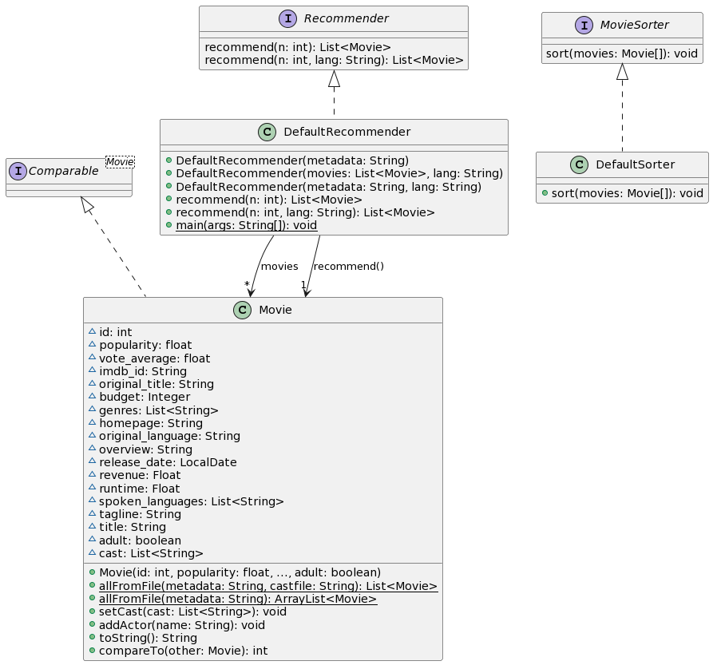

# Laboratorio 1 - Búsqueda y ordenación

Análisis y Diseño de Software, 2022

Grado en Ingeniería de Tecnologías y Servicios de 
Telecomunicación 

ETSI de Telecomunicación

Universidad Politécnica de Madrid

# Objetivos

1. Familiarizarse con los conjuntos de datos y las clases principales para las prácticas
2. Desarrollar algoritmos muy sencillos de búsqueda y filtrado
2. Desarrollar una implementación personalizada de Comparable
4. Depurar un programa, para detectar y corregir errores:
    a.  Desarrollar casos de pruebas con JUnit
    b.  Añadir trazas/registros en el código
    c.  Usar el depurador para detectar y corregir errores

# Descripción de los datos 

En este laboratorio utilizaremos datos sobre películas.
En particular, utilizaremos un conjunto de datos formado por más de las 45.000 películas, de las cuales se conocen varios metadatos tales como el título de la película, la fecha de lanzamiento, la recaudación obtenida o la puntación recibida por usuarios en la plataforma MovieLens.

Este conjunto de datos consta de varios archivos en formato TSV guardados en la carpeta `data`.
Los archivos TSV (del inglés *tab-separated values*) son documentos que representan datos en forma de tabla, en las que las columnas se separan por el caracter tabulador (`\t`) y cada línea contiene una fila.
Los ficheros más importantes son los siguientes:

* `metadata.tsv`: El archivo principal de metadatos de películas. Se trata de un TSV con las siguientes columnas:

  * **popularity**: índice de popularidad de la película.
  * **id**: identificador único de la película
  * **imdb_id**: identificador en la plataforma IMDB (Internet Movie Database)
  * **vote_average**: puntuación media
  * **vote_count**: número de votos recibidos
  * **original_title**: título original
  * **budget**: presupuesto
  * **genres**: géneros de la película, separados por comas.
  * **homepage**: página web de la película.
  * **original_language**: código del idioma principal de la película (p.e., `en`, `es`, `fr`, etc.) 
  * **overview**: sinopsis.
  * **release_date**: fecha de lanzamiento, en formato `YYYY-MM-DD`.
  * **revenue**: recaudación 
  * **runtime**: duración de la película en minutos
  * **spoken_languages**: idiomas hablados, separados por comas.
  * **tagline**: "eslogan".
  * **title**: título.
  * **adult**: "True" si la película es sólo para adultos, "False" en los demás casos.

* `metadata_top100.tsv`: Una selección de las 100 películas más populares del fichero anterior.
* `cast.tsv`: Un archivo con información sobre el reparto de cada una de las películas.
* `cast_hanks.tsv`: Reparto de las películas en las que aparece Tom Hanks (~127 películas).

# Diagrama de clases

Los elementos principales de esta práctica son los siguientes:



# Actividades

## Ejercicio 1: Comprobar la carga de datos

La clase `Movie` contiene dos métodos (`allFromFile`) para leer la lista de películas a partir de un fichero TSV.
Queremos asegurarnos de que el método funciona correctamente.
Para ello, debemos **desarrollar un conjunto de pruebas JUnit** para comprobar el funcionamiento de este método.

Entre otras pruebas, deberemos:

* Comprobar que el tamaño de la lista resultante concuerda con el número de películas en el fichero. Para ello, podemos usar los diferentes ficheros que se nos proporcionan en la carpeta `data`.
* Comprobar que alguna(s) de las películas se encuentran en la lista recuperada. Para ello, no hace falta que comprobemos cada una de las películas manualmente. En su lugar, podemos comprobar simplemente que parte de las propiedades de algunas películas en la lista coinciden con lo contenido en el fichero. Por ejemplo, la película "Head", con puntuación media 7.7, debe aparecer en la lista.


## Ejercicio 2: Implementar Comparable para la clase Movie

Como hemos visto en teoría, en Java la clase `Comparable` nos permite establecer relaciones de orden entre elementos, implementando el método `compareTo`.
Las clases típicas como String ya contienen una implementación por defecto de `compareTo`, pero si creamos clases personalizadas deberemos especificar nuestra propia implementación.

En este ejercicio, **desarrollaremos el método `compareTo`** para la clase `Movie`.
Esto nos permitirá en el futuro ordenar películas en función de la popularidad.

Para comprobar que el método funciona, añadiremos una **prueba unitaria** al conjunto de pruebas del ejercicio anterior.

Nota: Para comprobar el funcionamiento, habrá que comparar películas con diferentes popularidades.
Sin embargo, el constructor de la clase `Movie` requiere varios parámetros y crear varias películas mediante ese constructor sería muy tedioso.
¿Existe alguna alternativa?.

## Ejercicio 3: Diseñar e implementar un algoritmo de recomendación de películas 

Por último, se nos pide **implementar los métodos `recommend(int n)` y `recommend(int n, String lang)`**.
El funcionamiento de estos métodos es sencillo: han de devolver las `n` películas más populares.
En el segundo método, sólo se tendrán en cuenta las películas cuyo idioma original coincida con el parámetro `lang`.

Antes de dar la tarea por terminada, deberemos comprobar que los métodos desarrollados funcionan correctamente.
Para ello, implementaremos dos pruebas unitarias, una para cada método.
Estos métodos han de comprobar que el número de elementos devueltos por el método es el esperado (`n`), y que no existen películas con mayor popularidad (en el idioma especificado).

# Anexos:

## Anexo 1: Cargar un proyecto en Eclipse

- Seleccione el menú File > Import > Existing Projects into
  Workspace > Next
- Navegue hasta el archivo zip que contiene el proyecto tal como se ha
  bajado de Moodle.
- Compruebe que el proyecto está marcado, y seleccione Finish

## Anexo 2: Generar y acceder a la documentación con Javadoc en Eclipse

La documentación existente se encuentra en la carpeta *doc* del
proyecto. Para consultarla, abra el fichero *index.html* en un navegador
(botón derecho \> Open with \> Web browser).

También puede consultar la documentación desde una ventana del editor de
código Java. Si posiciona el ratón sobre el nombre de una clase o un
método aparece una ventana auxiliar con un resumen de la documentación.

Si tiene activada la vista *Javadoc* (con Window \> Show View \>
Javadoc), al hacer clic sobre el nombre de un elemento se mostrará la
documentación correspondiente en la ventana correspondiente a esta
vista.

Para generar o actualizar la documentación *javadoc* vaya al menú
Project \> Generate Javadoc. Si aparecen errores de codificación de
caracteres asegúrese de poner las opciones -encoding utf8 -docencoding
utf8 -charset utf8 en el cuadro *VM options* de la tercera ventana que
aparece (después de hacer Next dos veces).

## Anexo 3: Crear una clase de *JUnit*

Sitúese sobre la ventana del editor correspondiente a la clase que
quiere probar y vaya al menú File \> New \> Junit Test Case. Asegúrese
de que está seleccionada la opción "New JUnit Jupiter test", y conteste
afirmativamente si el entorno le pide añadir la biblioteca Junit 5 al
proyecto.

## Anexo 4: Configurar el registrador (*logger*) java.util.logging

### Opción 1

Los pasos básicos para configurar y usar en un programa son:

-  Importar el paquete

```java
import java.util.logging.*;
```

-  Crear el configurador, que debe ser un atributo de la clase:

```java
static final Logger LOGGER = Logger.getLogger(ListaTrazas.class.getName());
```

-  Configurar el registrador. Ejecutar las siguientes instrucciones en
    el constructor en el que se van a poner los registros:

```java
LOGGER.setUseParentHandlers(false);
handler = new ConsoleHandler();
handler.setLevel(Level.FINEST);
LOGGER.addHandler(handler);
LOGGER.setLevel(Level.FINEST);
```

-  Incluir las trazas donde se considere:

```java
LOGGER.info("Comentario");
LOGGER.fine("La lista: " + this.toString());
```

### Opción 2

En algunas implementaciones, la opción previa duplica las trazas. A continuación se proporciona otra opción:

-  Importar el paquete

```java
import java.util.logging.*;
```
- Copiar el fichero logging.properties por defecto en un diretorio del usuario. Este fichero se encuentra en el paquete de Java en cada computador. Para facilitar, se adjunta una versión de este fichero en la distribución de este laboratorio. 

- Asignar el nivel por defecto de la consosla a: FINEST

```
java.util.logging.ConsoleHandler.level = FINEST
java.util.logging.ConsoleHandler.formatter = java.util.logging.SimpleFormatter
```

- En el código definir el fichero de configuración que el usuario ha cambiado y crear el gestor de trazas:

```
System.setProperty("java.util.logging.config.file", "/MiDirectorio/logging.properties");
LOGGER = Logger.getLogger(ConfigurarSuma.class.getName());

```
	
- Finalmente, es posible elegir el nivel preferido:

```
	LOGGER.setLevel(Level.FINER);
```


## Anexo 5: Uso del depurador

El depurador permite identificar y eliminar errores de un programa que
compila y ejecuta pero que no produce resultados correctos. El depurador
ejecuta el programa de forma interactiva, permitiendo observar una a una
las instrucciones que se ejecutarán, las variables activas en memoria y
sus valores. Para iniciar el depurador sobre la clase que contiene el
método main marque -Menú: Run-\>Debug

Las herramientas disponibles para el control de la ejecución son varias:

-   **Puntos de parada "*breakpoints".*** Paran la ejecución del
    programa en instrucciones determinadas.
-   **Perspectiva de depuración** con las siguientes vistas:
    -   Vista de visualización y modificación de valores de variables.
    -   Vista de consola que muestra la salida del programa
    -   Vista de editor del código fuente con una línea verde en la
        instrucción que va a ser ejecutada
    -   Vista de depuración indicando la línea de código que va a ser
        ejecutada
    -   Vista de vigilancia de expresiones


    
-    **Control de la ejecución** paso a paso, entrando
    en los métodos (*Step in)* o ejecutando los métodos completos y
    parando al terminar de ejecutarlos (*Step over*).

Para buscar un error en un programa pondremos un punto de parada en la
primera sentencia ejecutable del método main. Iremos ejecutando
controladamente el código entrando en los métodos suma y multiplicación
de la clase Operaciones reales saltando las instrucciones que ejecutan
constructores o llamadas a métodos de clases de la API de Java.

Se observa que las variables *op, uno* y *dos* sólo aparecen en la vista
de variables en memoria tras su declaración. Al entrar en la ejecución
del método *suma* se modifican varias vistas. En la del editor se ve la
clase *OperacionesReales*. En la vista de variables se observan las
variables disponibles por el método suma: la referencia a la propia
instancia, *this*, y los parámetros *dos* y *uno*. Estas variables
contienen los valores pasados al invocar el método. Aunque las variables
tienen los mismos nombres que en la sentencia que invoca al método,
están cambiadas de orden de modo que la variable *dos* contiene el valor
almacenado en la variable *uno* de main. Se puede seguir ejecutando y
salir del método. Se puede ver que los valores de las variables *uno* y
*dos* no han cambiado.

Respecto al ejercicio 2, utilice el depurador para ver qué ocurre y
verificar si se ha producido o no el intercambio de valores deseado.
Para ello se pone otro punto de parada en la sentencia que imprime el
mensaje de cambio de sección. Al ejecutar el programa en modo debug,
éste se parará en el primer punto de parada. Siga la ejecución hasta al
siguiente punto de parada para ya ir instrucción a instrucción. Continúe
con la depuración hasta entender por qué un método funciona y otro no.

En la tercera sección del programa se ejecuta la suma y multiplicación
de dos números complejos. El programa funciona sin problemas, pero no da
el valor adecuado. Debe identificar y corregir los errores usando el
depurador.

[^1]: Un *smoke test* es una prueba elemental de que un programa
    funciona, sin entrar en detalles ni casos particulares.
