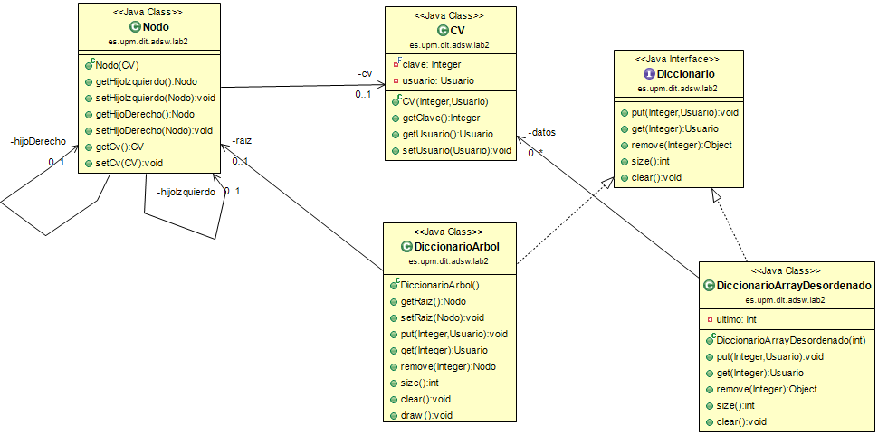
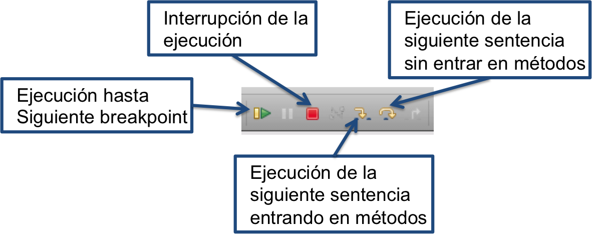

### Análisis y Diseño de Software, 2023

Grado en Ingeniería de Tecnologías y Servicios de 
Telecomunicación  
ETSI de Telecomunicación  
Universidad Politécnica de Madrid
  

# Laboratorio 2 🧪- Diccionarios 📚🔍

El objetivo del laboratorio y práctica 2 consiste en desarrollar un diccionario usando árboles para mejorar la implementación ofrecida por los profesores.

En este laboratorio vamos a desarrollar un conjunto de métodos de un diccionario usando una estructura Árbol y en la práctica 2 se desarrollarán el resto de los métodos del diccionario. 🌳💻

Los diccionarios almacenan un par de Clave-Valor. Usaremos la clase **`CV`** para almacenar esa información.

👀¡¡ATENCIÓN!! No confundir con la clase **`ClaveValor`** del paquete `es.upm.dit.adsw.geosocial` 

Como podemos ver en el diagrama de clases, la clave será un **`Integer`** y el valor que vamos a almacenar es un **`Usuario`** 

La clase **`Usuario`** es la misma que en el modelo del laboratorio y práctica 1.

## Objetivos🎯
 
1. Familiarizarse con los diccionarios, para ello os dejamos la clase **`DiccionarioArrayDesordenado`** para hacer pruebas. 🧐
2. Utilizar las operaciones básicas de un diccionario: *get, put, remove, size, clear.* definidas en la *`interface`* **`Diccionario`** en la clase **`DiccionarioArrayDesordenado`** 
3. Probar el código que tenemos en la clase **`PruebaInsercionBusquedas`**, donde hemos creado un código para probar diccionarios.🧪
4. Desarrollar los dos primeros métodos importantes de la clase **`DiccionarioArbol`**

    a. Desarrollar el método *`public put(Integer, Usuario)`* Que añadirá al diccionario una entrada **`CV`** que serán los parámetros **`Integer`** y **`Usuario`** de entrada
    
    b. Desarrollar el método *`public Usuario get(Integer)`* para obtener el valor **`Usuario`** buscando por la clave **`Integer`** 🔎
    
    c. Desarrollar el método *`int size()`* que devolverá el número de elementos que tiene el diccionario.📈
    
    d. Desarrollar el método *`int clear()`* que eliminará el árbol.🗑️
    
    e. ⚠️IMPORTANTE⚠️ Usar el depurador para detectar y corregir errores. Sin usar el depurador👨‍💻 es imposible hacer las prácticas y aprobar ADSW
    
    (Optativo) Para todos los métodos y como se ve en el diagrama de clases existen métodos auxiliares con visibilidad privada como por ejemplo `private put(Nodo, CV)` este método nos ayudará a resolver el problema de manera recursiva. Si decidimos hacerlo de manera iterativa no haría falta crear métodos auxiliares, aunque se pueden usar tantos métodos auxiliares como se estime necesario. 
    
    📝Nota1: Los métodos se pueden desarrollar de manera recursiva o iterativa. Entendemos que hacer los métodos de manera recursiva puede ser más fácil de desarrollar. Pero es decisión del alumno desarrollarlos en el estilo que prefiera.
    
    📝Nota2: el método auxiliar es `private` porque será llamado desde la propia clase, no debe ser visible desde fuera. 
    
    📝Nota3: para entender el funcionamiento de la búsqueda binaria tenemos la [documentación de la asignatura sobre búsqueda binaria](https://moodle.upm.es/titulaciones/oficiales/course/view.php?id=3301#section-2) y también podemos usar la herramienta [VisuAlgo](https://visualgo.net/en/bst) para ver de manera gráfica los algoritmos.
         
Los ejercicios consisten en **implementar la clase `DiccionarioArbol`** especificada en el diagrama de clases, método a método.
Esta clase funcionará igual que la clase **`es.upm.dit.adsw.lab2.DiccionarioArrayDesordenado`**, implementando el interface **Diccionario**

🚨 **La única clase que se debe editar y ampliar es la clase** **`DiccionarioArbol`** 🚨 

Se pueden ampliar los tests con pruebas nuevas, pero no se aconseja modificar las ya existentes.

Se puede modificar la clase **`PruebaInsercionBusqueda`** con fines educativos cuando se haya terminado la práctica para hacer experimentos.

## Diagrama de clases

Los elementos principales de este laboratorio son los siguientes:



### 📝🔽 Ejercicio 0: Descargar el código e importarlo en Eclipse 

Se debe descargar el fichero `ADSW-Lab2.zip` del 🌐[repositorio en GitHub](https://github.com/adsw-upm/adsw-laboratorios).🌐
El fichero debe importarse en eclipse mediante la opción `File -> Import -> Existing projects into workspace`, y después seleccionando el fichero `ADSW-Lab2.zip`. Si no carga bien, se puede descomprimir este fichero y seleccionar el directorio creado.

Si todo ha ido bien 🤞. veremos un proyecto con dos paquetes: `es.upm.dit.adsw.lab2` y `es.upm.dit.adsw.geosocial`.

Cada uno de los siguientes ejercicios tiene una serie de pruebas asociadas.💻

Si no se ven bien las tildes en los comentarios, cambie la codificación del proyecto a UTF-8. Te colocas encima del proyecto, botón derecho del ratón. `Properties` -> `Text file encoding` -> `Other: "UTF-8"`

### 📝⏱️ Ejercicio 1: Ejecutar el smoke test de la clase `PruebaInsercionBusqueda`

La clase **`PruebaInsercionBusqueda`** es una clase con un método main y varios métodos auxiliares para ejecutar unas pruebas y comprobar el tiempo que tarde distintas implementaciones de diccionarios. 🕰️

1. primero hace un prueba para calcular el tiempo que tarda en hacer un conjunto de inserciones y búsquedas usando un **`DiccionarioArrayOrdenado`**. Como todos sabemos las inserciones y las búsquedas son **O(n)**. La inserción también es **O(n)**, porque busca si la clave ya existe y si existe la sobreescribe.
2. segundo hace la misma prueba pero para un diccionario implementado con un árbol para la clase **`DiccionarioArbol`**. Obviamente, si no tenemos los métodos **put** y **get** implementados tardará muy poco en ejecutar la prueba porque NO HACE NADA! 🤷‍♀️

Cuando tengamos los métodos **put** y **get** implementados en la clase **`DiccionarioArbol`** podremos ejecutar estas pruebas y si lo hemos hecho bien veremos que sorprendentemente mejoramos sustancialmente el tiempo de inserciones y de búsquedas.🤩🚀

### 📝🌳Ejercicio 2: Revisar las clases `CV`, `Nodo`, `DiccionarioArrayDesordenado` y `DiccionarioArbol` 

Os damos las clase completas **`CV`**, **`Nodo`** 
Todas las clases y los métodos de la clases vienen documentados con comentarios Javadoc. 

La clase **`CV`** representa un par **Clave y valor** que se van a almacenar en los diccionarios ya esté implementado con un array desordenado o con un árbol. verás que es una clase muy sencilla.

👀¡¡ATENCIÓN!! No confundir con la clase **`ClaveValor`** del `paquete es.upm.dit.adsw.geosocial` 

La clase **`Nodo`** , representa un nodo de un árbol binario de búsqueda. Por lo tanto, lo que contiene un nodo es:

- un objeto de la clase **`CV`**. 
- un objeto de la clase **`Nodo`** que representa el hijo izquierdo y donde irán los elementos cuya clave sea inferior a la del nodo actual 
- y otro objeto de la clase **`Nodo`** que representa el hijo derecho y irán los elementos cuya clave será superior a la del nodo actual 

Os damos el esqueleto de la clase **`DiccionarioArbol`** donde hay que desarrollar los métodos **put, get, size y clear**

La clase **`DiccionarioArbol`** tiene dos métodos `draw` que sirven para pintar el árbol horizontalmente. 

El primero **`public void draw()`** que es el que se puede ejecutar desde fuera de la clase y que hará la primera llamada al otro método que es recursivo **`private void draw(Nodo nodo, int nivel)`** con el elemento '*raiz*' que se encuentra dentro de la clase **`DiccionarioArbol`**  

Os dejamos el código de los métodos **draw()** porque os puede servir como idea para implementar los métodos recursivos. 💡

👀¡¡ATENCIÓN!! si ejecutamos este método a un **`DiccionarioArbol`** vacío no imprimirá nada. ⚠️Si el método **put** no funciona y no rellena de datos tampoco mostrará nada.

### Ejercicio 3: Diseñar e implementar el método  `public int size()`

Es complicado implementar y probar un método para obtener el número de elementos que tenemos en el árbol si aún no hemos añadido ningún elemento.
Así que este método no lo podemos probar hasta que hayamos añadido elementos al árbol.

👉 Se debe desarrollar el método **`public int size()`** para obtener el número de elementos del árbol.

👉 Para contar los elementos se deben recorrer todos los elementos lo que hará que nuestro algoritmo sea **O(n)**.

👉 Recomendamos realizar la implementación de manera recursiva por su sencillez en el código. Para ello recomendamos también desarrollar un método auxiliar y recursivo **`private int size(Nodo nodo)`**

👉 Esto no significa que no se pueda hacer de manera iterativa. En el caso de hacerlo de manera iterativa, no tiene por qué ser necesario desarrollar el método **`private int size(Nodo nodo)`**

👉 Aunque se pueden usar todos los métodos auxiliares que se necesiten.


### Ejercicio 4: Diseñar e implementar el método  `public void put(Integer clave, Usuario usu)`

👉 Se debe desarrollar el método **`public void put(Integer clave, Usuario usu)`** para insertar un nuevo objeto CV en el árbol.

👉 La inserción se tiene que realizar por el principio de la búsqueda binaria, lo que hará que nuestro algoritmo sea **O(log(n))**.

👉 Además, en el caso de querer insertar un valor con una clave que ya existe se debe actualizar el valor.

👉 Recomendamos realizar la implementación de manera recursiva por su sencillez en el código. Para ello recomendamos también desarrollar un método auxiliar y recursivo **`private void put(Nodo nodo, CV cv)`** 

👉 Esto no significa que no se pueda hacer de manera iterativa. En el caso de hacerlo de manera iterativa, no tiene por qué ser necesario desarrollar el método **`private void put(Nodo nodo, CV cv)`**

👉 Aunque se pueden usar todos los métodos auxiliares que se necesiten.


### Ejercicio 5: Diseñar e implementar el método  `public void clear()` 🌳🗑️

Con este método queremos que se elimine el árbol por completo.

Es el método más sencillo. 

No es necesario recorrer el árbol.

El código es una línea. 


### Ejercicio 6: Diseñar e implementar el método  `public Usuario get(Integer clave)`

👉 Se debe desarrollar el método **`public Usuario get(Integer clave)`** para obtener un **Usuario** buscando por su clave.

👉 La búsqueda se tiene que realizar por el principio de la búsqueda binaria, lo que hará que nuestro algoritmo sea **O(log(n))**.

👉 Al igual que en el caso anterior, recomendamos realizar la implementación de manera recursiva por su sencillez en el código. Para ello recomendamos también desarrollar un método auxiliar recursivo **`private Usuario get(Nodo nodo, int clave)`**

👉 Esto no significa que no se pueda hacer de manera iterativa. En el caso de hacerlo de manera iterativa, no tiene por qué ser necesario desarrollar el método **`private Usuario get(Nodo nodo, int clave)`**

👉 Aunque se pueden usar todos los métodos auxiliares que se necesiten.


### Ejercicio 7: Ejecutar las pruebas unitarias funcionales de la clase `DiccionarioArbolTestFuncionales` 💻🕵️‍♂🌳🐛

En la clase **`DiccionarioArbolTestFuncionales`** tenemos unos métodos de prueba para probar los métodos de la clase **`DiccionarioArbol`** 

Muchas pruebas dependen de varios métodos. P.e. **`testPutAndGet`** depende del método **Put** y el método **Get**. Si falla la prueba, ¿cúal es el método que no funciona? 

Es prácticamente obligatorio usar el depurador para comprobar cuales son los métodos que están fallando. 

Puedes consultar el anexo correspondiente más abajo.👇


### Ejercicio 8: Realizar más pruebas unitarias con JUnit para probar `get` y `put` 💻🕵️‍♂

Os hemos proporcionado pruebas unitarias funcionales en la clase **`DiccionarioArbolTestFuncionales`**

Seguramente no sean suficientes, prueba a hacer más pruebas unitarias para detectar los métodos que fallan.

Y por favor, usa el depurador para detectar los errores.


### Ejercicio 8: Volver a ejecutar el smoke test de la clase `PruebaInsercionBusqueda`⏱️📝

Ya tienes el código de la clase **`DiccionarioArbol`** y funciona!!!

Es el momento de someter a prueba de tiempos a ambos diccionarios.

¿Qué algoritmo es el más rápido? 🚀

¿Te ha sorprendido los resultados?💥😲

## Anexos:


### Anexo 1: Cargar un proyecto en Eclipse

- Seleccione el menú File > Import > Existing Projects into
  Workspace > Next
- Navegue hasta el archivo zip que contiene el proyecto tal como se ha
  bajado de Moodle.
- Compruebe que el proyecto está marcado, y seleccione Finish

### Anexo 2: Generar y acceder a la documentación con Javadoc en Eclipse

La documentación existente se encuentra en la carpeta *doc* del
proyecto. Para consultarla, abra el fichero *index.html* en un navegador
(botón derecho \> Open with \> Web browser).

También puede consultar la documentación desde una ventana del editor de
código Java. Si posiciona el ratón sobre el nombre de una clase o un
método aparece una ventana auxiliar con un resumen de la documentación.

Si tiene activada la vista *Javadoc* (con Window \> Show View \>
Javadoc), al hacer clic sobre el nombre de un elemento se mostrará la
documentación correspondiente en la ventana correspondiente a esta
vista.

Para generar o actualizar la documentación *javadoc* vaya al menú
Project \> Generate Javadoc. Si aparecen errores de codificación de
caracteres asegúrese de poner las opciones -encoding utf8 -docencoding
utf8 -charset utf8 en el cuadro *VM options* de la tercera ventana que
aparece (después de hacer Next dos veces).

### Anexo 3: Crear una clase de *JUnit*

Sitúese sobre la ventana del editor correspondiente a la clase que
quiere probar y vaya al menú File \> New \> Junit Test Case. Asegúrese
de que está seleccionada la opción "New JUnit Jupiter test", y conteste
afirmativamente si el entorno le pide añadir la biblioteca Junit 5 al
proyecto.

### Anexo 4: Configurar el registrador (*logger*) java.util.logging

#### Opción 1

Los pasos básicos para configurar y usar en un programa son:

-  Importar el paquete

```java
import java.util.logging.*;
```

-  Crear el configurador, que debe ser un atributo de la clase:

```java
static final Logger LOGGER = Logger.getLogger(ListaTrazas.class.getName());
```

-  Configurar el registrador. Ejecutar las siguientes instrucciones en
    el constructor en el que se van a poner los registros:

```java
LOGGER.setUseParentHandlers(false);
handler = new ConsoleHandler();
handler.setLevel(Level.FINEST);
LOGGER.addHandler(handler);
LOGGER.setLevel(Level.FINEST);
```

-  Incluir las trazas donde se considere:

```java
LOGGER.info("Comentario");
LOGGER.fine("La lista: " + this.toString());
```

#### Opción 2

En algunas implementaciones, la opción previa duplica las trazas. A continuación se proporciona otra opción:

-  Importar el paquete

```java
import java.util.logging.*;
```
- Copiar el fichero logging.properties por defecto en un diretorio del usuario. Este fichero se encuentra en el paquete de Java en cada computador. Para facilitar, se adjunta una versión de este fichero en la distribución de este laboratorio. 

- Asignar el nivel por defecto de la consosla a: FINEST

```
java.util.logging.ConsoleHandler.level = FINEST
java.util.logging.ConsoleHandler.formatter = java.util.logging.SimpleFormatter
```

- En el código definir el fichero de configuración que el usuario ha cambiado y crear el gestor de trazas:

```
System.setProperty("java.util.logging.config.file", "/MiDirectorio/logging.properties");
LOGGER = Logger.getLogger(ConfigurarSuma.class.getName());

```
	
- Finalmente, es posible elegir el nivel preferido:

```
	LOGGER.setLevel(Level.FINER);
```


### Anexo 5: Uso del depurador

El depurador permite identificar y eliminar errores de un programa que
compila y ejecuta pero que no produce resultados correctos. El depurador
ejecuta el programa de forma interactiva, permitiendo observar una a una
las instrucciones que se ejecutarán, las variables activas en memoria y
sus valores. Para iniciar el depurador sobre la clase que contiene el
método main marque -Menú: Run-\>Debug

Las herramientas disponibles para el control de la ejecución son varias:

-   **Puntos de parada "*breakpoints".*** Paran la ejecución del
    programa en instrucciones determinadas.
-   **Perspectiva de depuración** con las siguientes vistas:
    -   Vista de visualización y modificación de valores de variables.
    -   Vista de consola que muestra la salida del programa
    -   Vista de editor del código fuente con una línea verde en la
        instrucción que va a ser ejecutada
    -   Vista de depuración indicando la línea de código que va a ser
        ejecutada
    -   Vista de vigilancia de expresiones



    
-    **Control de la ejecución** paso a paso, entrando
    en los métodos (*Step in)* o ejecutando los métodos completos y
    parando al terminar de ejecutarlos (*Step over*).

Para buscar un error en un programa pondremos un punto de parada en la
primera sentencia ejecutable del método main. Iremos ejecutando
controladamente el código entrando en los métodos suma y multiplicación
de la clase Operaciones reales saltando las instrucciones que ejecutan
constructores o llamadas a métodos de clases de la API de Java.

Se observa que las variables *op, uno* y *dos* sólo aparecen en la vista
de variables en memoria tras su declaración. Al entrar en la ejecución
del método *suma* se modifican varias vistas. En la del editor se ve la
clase *OperacionesReales*. En la vista de variables se observan las
variables disponibles por el método suma: la referencia a la propia
instancia, *this*, y los parámetros *dos* y *uno*. Estas variables
contienen los valores pasados al invocar el método. Aunque las variables
tienen los mismos nombres que en la sentencia que invoca al método,
están cambiadas de orden de modo que la variable *dos* contiene el valor
almacenado en la variable *uno* de main. Se puede seguir ejecutando y
salir del método. Se puede ver que los valores de las variables *uno* y
*dos* no han cambiado.

Respecto al ejercicio 2, utilice el depurador para ver qué ocurre y
verificar si se ha producido o no el intercambio de valores deseado.
Para ello se pone otro punto de parada en la sentencia que imprime el
mensaje de cambio de sección. Al ejecutar el programa en modo debug,
éste se parará en el primer punto de parada. Siga la ejecución hasta al
siguiente punto de parada para ya ir instrucción a instrucción. Continúe
con la depuración hasta entender por qué un método funciona y otro no.

En la tercera sección del programa se ejecuta la suma y multiplicación
de dos números complejos. El programa funciona sin problemas, pero no da
el valor adecuado. Debe identificar y corregir los errores usando el
depurador.

[^1]: Un *smoke test* es una prueba elemental de que un programa
    funciona, sin entrar en detalles ni casos particulares.
