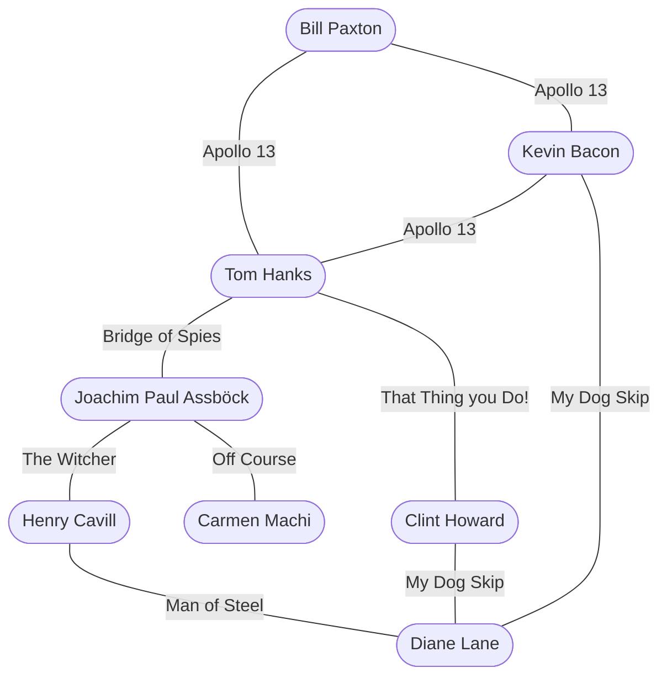
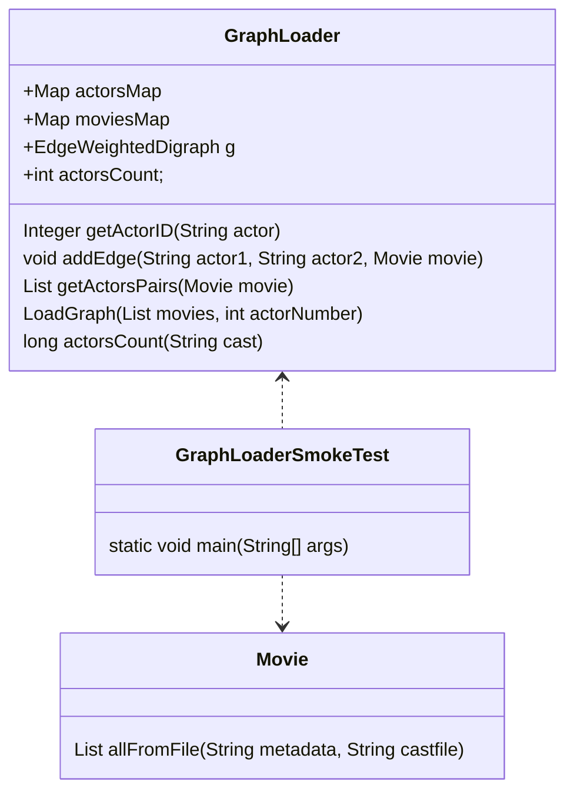

# Laboratorio 2 - Grafos

Análisis y Diseño de Software, 2022

Grado en Ingeniería de Tecnologías y Servicios de 
Telecomunicación 

ETSI de Telecomunicación

Universidad Politécnica de Madrid

# Introducción
En la práctica 2 queremos realizar un algoritmo que haga el cálculo del [número de Bacon](https://es.wikipedia.org/wiki/N%C3%BAmero_de_Bacon), es decir, calcular cuál es el camino mínimo de películas que hay entre dos actores. 

[Esta web calcula el número de Bacon](https://oracleofbacon.org/), que ilustra lo que habrá que hacer en la práctica 2.

Para llegar a ese objetivo final de la práctica 2, vamos a tener que realizar varios sub-objetivos que serán el tema del laboratorio 2.

# Requisitos para importar el proyecto Laboratorio2.zip
Os hemos facilitado el proyecto **Laboratorio2.zip** para empezar con el laboratorio 2, este código hace referencia al proyecto **lab1-ordenacion**, no es necesario tener resuelta la práctica 1 correctamente. 

Solo queremos usar la clase **Movie**. Es posible que tengamos que cambiar la visibilidad de los atributos *title* y *cast* de la clase **Movie** y ponerlos a *public* para que sean accesibles desde nuestro proyecto. Como mostramos en el siguiente cuadro:

```java
/**
* Título de la película en inglés
*/
public String title;
/**
* Elenco de la película. Ejemplo: "Tom Hanks", "Matt Damon"...
*/
public List<String> cast;
```


# Objetivo de laboratorio 2 (necesario para hacer la práctica 2)
Queremos convertir los datos de las películas del laboratorio y práctica 1 en un grafo, como se muestra en la figura. De esta manera, en la práctica 2 podamos aplicar algoritmos de búsqueda avanzados como el algoritmo de **Dijkstra** y, de esta manera, obtener el código de Bacon.


👀NOTA: Los actores serán nuestros vértices y las películas serán las aristas.

De momento, cuando ejecutamos el método **allFromFile** de la clase **Movie**, nos devuelve una lista de objetos de la clase *Movie* leídos del fichero que se pasa por parámetro.

Además el método está sobrecargado y para cargar el elenco de actores de las películas. Esto lo podemos hacer con el segundo parámetro del método.
```java
public static List<Movie> allFromFile(String metadata, String castfile)
```
Tras llamar a este método lo que se nos devuelve es una lista de **Movie** y por cada **Movie** podemos saber cual es su elenco de actores usando el atributo **cast**, declarado como **List<String> cast** lo que significa que es una lista de Strings con sus actores.

# Proyecto para empezar
Os proporcionamos un proyecto para empezar con:

1. Una clase llamada "GraphLoader.java" donde tendremos que desarrollar los métodos necesarios para cargar el grafo.

2. Una clase llamada "GraphLoaderSmokeTest.java" donde tenemos unas pruebas básicas para probar los métodos de la clase anterior.

3. Una clase llamada "TestGraphLoader.java" dónde tenemos unas pruebas unitarias mínimas que tiene que pasar vuestro código. Se pueden añadir más métodos de pruebas unitarias si lo estima necesario.


# Diagrama de clases

  Atributos de clase:

  * **EdgeWeightedDigraph g** es el grafo dirigido donde vamos a representar los vértices (actores) y las aristas (película donde han actuado un par de actores).
  * **int actorsCount = 0** nos servirá para saber cual es el último número de actor que hemos introduccido.
  * **Map<String, Integer> actorsMap** Es un mapa en el que la clave será el nombre del actor y nos devolverá un objeto de la clase Integer. Este valor nos indicará el vértice del actor en el grafo. Nos será muy útil en la práctica.
  * **Map<DirectedEdge, Movie> moviesMap** Es un mapa donde la clave será ina arista y nos devolverá una película de la clase Movie. Este valor nos indicará la película asociada a una arista. Igualmente nos será muy útil en la práctica.

# Sub-objetivos
1. Implementar el método **getActorID(String actor)**, que debe devolver el Integer que representa al actor, búscandolo en **ActorMap** y si no lo encuentra, deberá asignarle el siguiente entero (**actorsCount**) y guardarlo en **ActorMap**
2. Implementar el método **void addEdge(String actor1, String actor2, Movie movie)**, que debe añadir dos **DirectedEdge** (uno del Actor1 al Actor2 y otro del Actor2 al Actor1) al grafo **g** (No olvidar que hay un moviesMap donde deberíamos guardar dichos enlaces ).
3. Implementar el método **List<String[]> getActorsPairs(Movie movie)**, que dada una película. Debe devolver una lista de parejas (representado como un array de Strings) de actores (Strings) que se empareje uno por uno con todos los actores.
3. Implementar el método  **void loadGraph(List<Movie> movies, int actorNumber)**, este método usa de los demás métodos. Primero crea un **EdgeWeightedDigraph** con el tamaño de vértices como actores se pase por parámetro. Después, por cada pelicula, y por cada par de actores de la película (usando el método **getActorsPairs**) llamar al método **addEdge** para añadir al par de actores al grafo.

