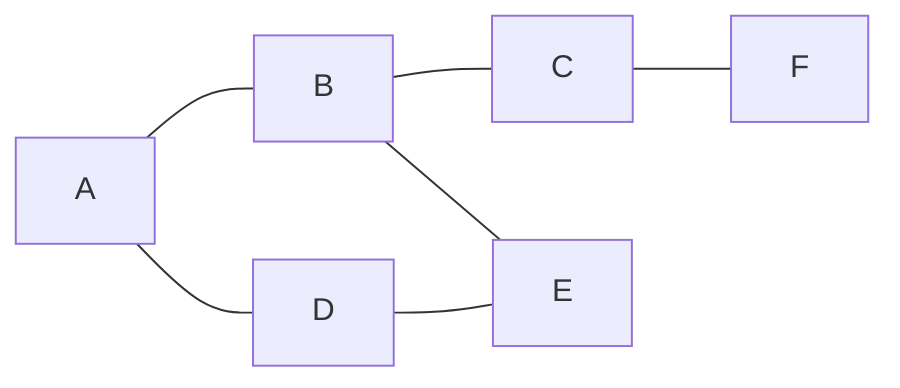
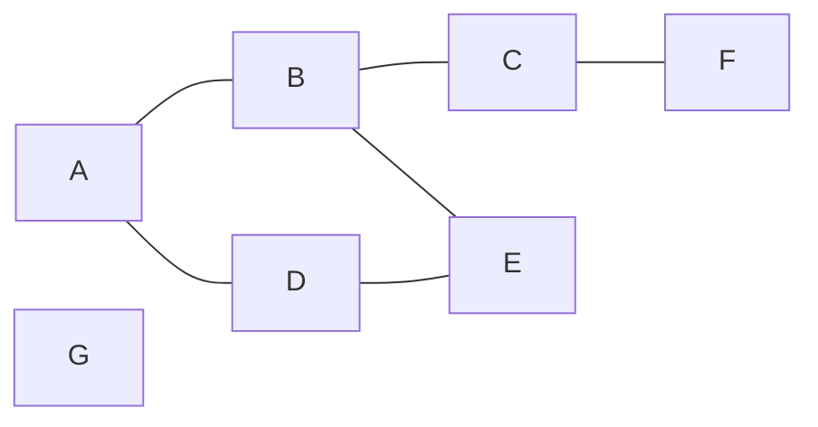

# Laboratorio 3 Grafos

En este laboratorio se trabajará con las amistades de los Usuarios para resolver problemas de grafos. Podemos entender que nuestros datos forman un grafo si consideramos que los Usuarios son los vértices y las amistades son las aristas. Es decir, hay una arista entre dos Usuarios si son amigos.

Vamos a utilizar el grafo de amistades de los Usuarios para resolver los siguientes problemas:
  - ¿Cuántos amigos tiene un usuario? ¿Y si contamos los amigos de los amigos? ¿O los amigos de los amigos de los amigos? ¿Y así sucesivamente? Es decir, vamos a calcular el número de amigos que tiene un usuario de grado N.
  - ¿Cuantas comunidades hay en el grafo? Entendiendo que dos usuarios están en la misma comunidad si podemos llegar de uno a otro a través de una cadena de amistades.

## Ejercicio 1: Un ejemplo de grafos

En este primer ejercicio vamos a trabajar con un grafo de ejemplo para entender el funcionamiento de los algoritmos que vamos a utilizar, sin preocuparnos de como adaptarlo a los datos de geosocial. Utilizaremos la clase `Grafo` y `Nodo` que podemos encontrar en el paquete `ejemplo`.

La clase `Nodo`, tiene una lista con todos los nodos adyacentes a él. La clase `Grafo` tiene una lista con todos los nodos del grafo, además de los métodos `getVecinosOrdenN` y `componentesConexas`. Podemos comprobar que la clase Grafo es correcta, con un smoke-test, ejecutando su método main. **Si el método main no termina de ejecutar, puede que haya un bucle infinito en los métodos implementados**.

### Ejercicio 1.1: `getVecinosOrdenN`

Este método recibe dos parámetros: un nodo y un entero N. Debe devolver una lista con todos los nodos que están a N aristas de distancia, o menos, del nodo dado. En la lista incluiremos al propio nodo en primer lugar; consideramos que un nodo es vecino de si mismo en rango 0, o que un Usuario es su propio amigo. Por ejemplo, si el grafo es el siguiente:

Si llamamos a `getVecinosOrdenN` con el nodo A y N=1, deberíamos obtener la lista [A, B, D]. Si llamamos a `getVecinosOrdenN` con el nodo A y N=2, deberíamos obtener la lista [A, B, D, C, E]. Si llamamos a `getVecinosOrdenN` con el nodo A y N=3, deberíamos obtener la lista [A, B, D, C, E, F].

Podemos desarrollar este método de mútiples formas, la más directa consiste en recorrer el grafo partiendo desde el nodo inicial. Guardaremos en una lista todos los nodos que vayamos visitando, incluyendo el nodo inicial. Primero añadiremos a la lista los nodos adyacentes al nodo inicial, si n>1, añadiremos los nodos adyacentes a esos nodos, y así sucesivamente hasta que no queden nodos por visitar en el grafo o hasta que hayamos alcanzado el rango máximo. Debemos tomar la precaución de no añadir un nodo a la lista si ya lo hemos añadido antes, para evitar ciclos infinitos.

En el grafo de ejemplo, si llamamos a `getVecinosOrdenN` con el nodo A y N=2, empezaremos creando una lista con el nodo A. A continuación, añadiremos a la lista los nodos adyacentes a A: B y D. Con esto tendremos todos los nodos vecinos de orden 0 y 1, por lo que nos faltarían los vecinos de orden 2. Para añadir los vecinos de orden 2, debemos añadir a la lista los nodos adyacentes a B (A, C y E) y todos los adyacentes a D (A y E), teniendo cuidado de no añadir un nodo que ya estuviera en la lista. Con esto, tendremos todos los nodos vecinos de orden 0, 1 y 2, por lo que ya no tenemos que añadir más nodos a la lista. Si N hubiera sido mayor que 2, tendríamos que seguir repitiendo el proceso con los vecinos de E y C.

Tendremos que tener en cuenta dos casos especiales:
  - Si N es negativo, el método debe devolver una lista con todos los nodos a los que se puede llegar desde el nodo inicial.
  - Si N es 0, el método debe devolver una lista con el nodo inicial.

### Ejercicio 1.2: `componentesConexas`

Este método no recibe ningún parámetro. Debe devolver un entero con el número de componentes conexas que hay en el grafo. Una componente conexa es un subconjunto de nodos del grafo, en el que todos los nodos están conectados entre sí. Por ejemplo, si el grafo es el siguiente:

El grafo tiene una componente conexa, que incluye a todos los nodos. Si añadimos un nodo G que no está conectado a ningún otro nodo, el grafo tendrá dos componentes conexas: una que incluye a todos los nodos anteriores, y otra que incluye solo al nodo G.

Para desarrollar este método, podemos utilizar el método `getVecinosOrdenN` con N=-1, de esta forma conseguimos una lista con todos los nodos a los que se puede llegar desde un nodo. Esta lista representa una componente conexa del grafo, podemos repetir el proceso con algún nodo que no este en esa lista, y así sucesivamente hasta que no queden nodos sin visitar. El número de veces que repetimos el proceso es el número de componentes conexas que hay en el grafo.

## Ejercicio 2: Preparar la clase AlmacenLab3

Siguiendo la metodología que hemos utilizado en otros laboratorios, vamos a crear una clase llamada `AlmacenLab3` que implemente la interfaz `GrafoAlmacen` y extienda la clase `GeoAlmacen`. Esta clase debe incluir los constructores que nos permiten acceder a los constructores de `GeoAlmacen`, utilizando una llamada a `super`. En este punto, podemos definir simplemente las cabeceras de los métodos que no sean los constructores, sin implementarlos.

Para comprobar que hemos completado correctamente este ejercicio, ejecutando la clase de pruebas `TestFuncionalesGrafo` deberíamos superar los siguietes tests:
  - testCargarGrafo
  - testExistenConstructores
  - testImplementaInterfaz

## Ejercicio 3: ¿Cuántos amigos tiene un usuario?

En este ejercicio vamos a implementar el método `getAmigosOrdenN`. El concepto de amigo es análogo al concepto de vecino en el ejemplo anterior. El método recibe dos parámetros: un id de usuario y un entero N. Debe devolver una lista con todos los usuarios que están a N aristas de distancia, o menos, del usuario dado. En la lista incluiremos al propio usuario en primer lugar; consideramos que un usuario es amigo de sí mismo en rango 0, o que un Usuario es su propio amigo. Para desarrollar este método podemos reutilizar el método `getVecinosOrdenN` de la clase `Grafo` que hemos desarrollado en el ejercicio 1.1, simplemente adaptándolo para que trabaje con usuarios en lugar de nodos.

Para obtener el Usuario a partir de su id, podemos utilizar el método `getOrCreateUsuario` de la clase `GeoAlmacen`. Debemos tener la precaución de utilizar este método solo con los ids de usuarios que están en el grafo, ya que si no, el método `getOrCreateUsuario` creará un nuevo usuario. Alternativamente, se puede diseñar un nuevo método que nos permita obtener un usuario a partir de su id y que devuelva `null` si el usuario no existe.

Para comprobar que hemos completado correctamente este ejercicio, ejecutando la clase de pruebas `TestFuncionalesGrafo` deberíamos superar los siguientes tests:
  - testAmigosDeGrado1
  - testAmigosDeGrado2
  - testAmigosDeGrado3
  - testAmigosDeGradoNegativo

## Ejercicio 4: ¿cuántas comunidades hay en el grafo?

Finalmente, vamos a implementar el método `getComunidades`. De la misma forma que en el ejercicio 3, podemos reaprovechar el código que hicimos en la clase grafo del ejercicio 1.2, adaptándolo al modelo de `GeoAlmacen`.

Para comprobar que hemos completado correctamente este ejercicio, ejecutando la clase de pruebas `TestFuncionalesGrafo` deberíamos superar los siguietes tests:
  - testComunidades
  - testComunidades2
