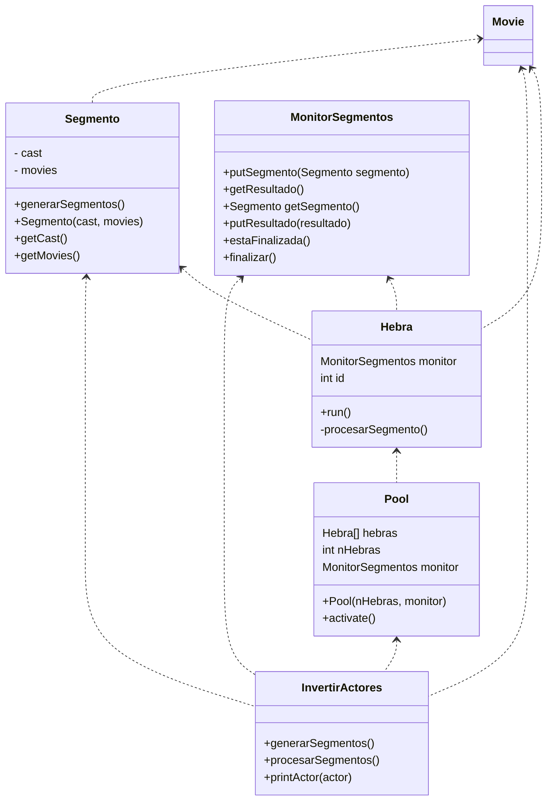

   # Laboratorio 3 - Sistema concurrente

Análisis y Diseño de Software, 2022

Grado en Ingeniería de Tecnologías y Servicios de
Telecomunicación

ETSI de Telecomunicación

Universidad Politécnica de Madrid

# Objetivos

*	Ilustrar un enfoque a procesar grandes datos
*	Desarrollar un sistema concurrente: gestión de hebras y su sincronización
*	Ilustrar la integración de algoritmos y la concurrencia
* Depurar un programa, detectar y corregir errores.

# Introducción

En algunos tipos de sistemas informáticos se requiere procesar grandes candidatos de datos, como ocurren en el ámbito de BigData. En este laboratorio y en la práctica final, se quiere ilustrar cómo se puede mejorar el rendimiento de estos sistemas. Un enfoque habitual consiste en:
* Dividir los datos en fragmentos o segmentos.
* Crear un conjunto de hebras, que ejecuten cada segmento concurrentemente.
* Combinar o integrar los resultados de cada segmento

Este enfoque permite ejecutar varias hebras en paralelo sobre los cores del procesador. Igualmente, podría extenderse con procesos, que se podrían ejecutar en varios computadores, comunicados por el paso de mensajes.

En las últimas actividades, se quiere desarrollar una estructura de datos que invierte el fichero de las películas, basada en un diccionario. En concreto, se quiere obtener todas las películas en las que ha actuado un actor.

# Diagrama de clases

Este diagrama muestra el conjunto de clases en el sistema. En la documentación de este enunciado se proporciona el fichero xxxx que incluye estas clases, donde se indica cuáles son los métodos que hay que desarrollar. Las clases están documentadas con javadoc. En el anexo se recuerda cómo se puede acceder a esta información en Eclipse.

A continuación, se describe brevemente el contenido de estas clases:
* InvertirActores: esta clase genera una estructura de datos que asocie un actor con las películas en las que ha actuado. Los ficheros de entrada son los mismos usados en los laboratorios previos: movies y cast.
* Segmento: mantiene dos atributos, que representan un subconjunto de los ficheros de entrada. El segmento es coherente, en el sentido de que los dos se refieren a las misma películas.
* Pool: crea un conjunto de hebras.
* Hebra: procesa segmentos y producen un resultado.
* MonitorSegmentos: es un monitor que sincroniza a objetos de InvertirActores con hebras (Hebra).
* Movie: es la clase usada en esta asignatura, con mínimos cambios.

En el fichero comprimido que se proporciona incluye todo el código de las siguientes clases: Movie, SegmentoInterface, Segmento y Pool. Además se proporciona una biblioteca (fichero con extensión `monitor.jar`) de la clase MonitorSegmentos. De esta manera se puede ejecutar el programa, sin tener que implementar este monitor.

El resultado de la inversión de actores será un diccionario, en el que la clave es un actor y el valor será la lista de las películas en las que ha actuado.

Los resultados parciales se almacenan en un atributo con el mismo nombre, en la clase ```invertirActores```.

En este laboratorio hay que completar las clases InvertirActores y Hebra, como se describe a continuación.

# Ejercicio 1: Completar el método procesarSegmentos de la clase InvertirActores

El método principal de esta clase crea todos los componentes necesarios: un pool y un monitor. El pool debe ejecutar un conjunto de hebras.

El método procesarSegmentos está encargado de procesar los segmentos: enviar los segmentos al monitor, obtener los resultados e integrar los resultados. En concreto, en este método se pide que se desarrolle el código necesario para interaccionar con el monitor


# Ejercicio 2: Desarrollar la clase Hebra.

 Una hebra debe proporcionar dos operaciones:
 * Run: se basa en un bucle que obtiene un segmento, lo procesa y lo retorna. La hebra se mantiene en este bucle hasta que el monitor ha finalizado el procesamiento. La hebra sale del bucle cuando ha finalizado la operación del monitor. Es posible que recibe un null al interaccionar con el monitor, por lo que hay comprobarlo para evitar errores.

 * procesarSegmento: Este método debe procesar un segmento, que debe invertir la información en un segmento, que se almacena en `Map<String, List<Movie>>`. La clave será el nombre de un actor y se retornará la lista de películas en las que ha actuado.

## Anexo 1: Generar y acceder a la documentación con Javadoc en Eclipse

La documentación existente se encuentra en la carpeta *doc* del proyecto. Para consultarla, abra el fichero *index.html* en un navegador (botón derecho \> Open with \> Web browser).

También puede consultar la documentación desde una ventana del editor de código Java. Si posiciona el ratón sobre el nombre de una clase o un método aparece una ventana auxiliar con un resumen de la documentación.

Si tiene activada la vista *Javadoc* (con Window \> Show View \> Javadoc), al hacer clic sobre el nombre de un elemento se mostrará la documentación correspondiente en la ventana correspondiente a esta vista.

Para generar o actualizar la documentación *javadoc* vaya al menú Project \> Generate Javadoc. Si aparecen errores de codificación de caracteres asegúrese de poner las opciones -encoding utf8 -docencoding utf8 -charset utf8 en el cuadro *VM options* de la tercera ventana que aparece (después de hacer Next dos veces).

## Anexo 2: Ficheros con los datos de películas

Los ficheros de las películas , que se han usado en otros laboratorios /(```metadata.tsv```, ``` cast.tsv```), se han procesado con dos funcionalidades [^1]: Estas funciones :

* Asegurar que los dos ficheros tiene exactamente las mismas películas (id) y ordenarlo.
* Combinarlos, de forma que se la información de la misma película se han agrupado en un segmento. El resultado es una lista de segmentos. Esta lista se ha guardado en un fichero. Al ejecutar ```invertirActores```, se lee este fichero

[^1]: El código de estas operaciones ya está hecho

En el proyecto proporcionado, se indican dos ficheros:

* ```data.txt```: Almacena los segmentos de la información todas las películas
* ```dato_top100.txt```: Almacena los segmentos de la información de 100 películas

## Anexo 3: Pruebas incrementales

Es aconsejable probar los componentes mostrados, antes de integrarlo todo. Se consigue reducir el tiempo del desarrollo del código. Las actividades propuestas son :

* Probar la creación de las hebras: poner trazas en las hebras, en el monitor y en el método ```procesarSegmentos```, para comprobar si se ejecutan e interaccionan correctamente. En las hebras, se puede usar el método ```procesarSegmentos``` que emule la invocación. Se puede usar un ```Sleep``` para simular la ejecución del código.

* Probar el ```procesarSegmento```. Desarrollarlo y probarlo aislado. En concreto, se puede leer los datos y ejecutarlo. En esta prueba, no hay que generar segmentos.

* Probar el sistema completo
