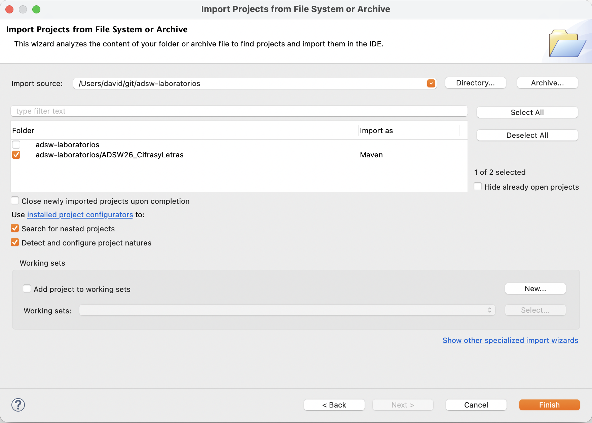

# ADSW Laboratorio 0: Introducción

En este laboratorio introductorio veremos las clases y datos básicos que utilizaremos durante el resto de laboratorios y prácticas.

Este año vamos a recrear el programa de televisión *Cifras y Letras*, que consta de dos pruebas principales: la prueba de Letras y la prueba de Cifras.

## Prueba de Letras

En la prueba de Letras, el concursante recibe un conjunto de letras y debe intentar formar la palabra válida en español más larga posible, utilizando únicamente dichas letras.

Por ejemplo, el concursante recibe el siguiente conjunto de letras:

```
a  e  r  t  l  o  s  m  i
```

Una posible solución sería `realismos`, que emplea las 9 letras disponibles.
Otra solución válida sería `realismo` (8 letras), que es peor al tener menor longitud.
También sería válida `morales` (7 letras).

### Reglas:
* Cada letra del conjunto inicial solo puede utilizarse una vez, salvo que dicha letra aparezca repetida en el conjunto inicial.
  Por ejemplo, si el conjunto contiene una sola letra `e`, no es válido formar una palabra que contenga dos letras `e`.
* No es obligatorio utilizar todas las letras del conjunto, pero cuantas más, mejor.
* La palabra formada debe existir en español y aparecer en el listado de palabras válidas (este listado se encuentra en `data/es.txt`).
* No se permiten nombres propios.
* En caso de existir varias palabras con la misma longitud, cualquiera de ellas se considera una solución correcta.

---

## Prueba de Cifras

En la prueba de Cifras, el concursante recibe un conjunto de números y un número objetivo, y debe intentar obtener dicho número objetivo mediante operaciones aritméticas básicas.

Por ejemplo, el concursante recibe los siguientes números:

```
25 50 75 3 6 8
```

Y como número objetivo:

```
952
```

El concursante debe combinar los números disponibles aplicando operaciones matemáticas para intentar llegar exactamente (o lo más cercano posible; por arriba o por abajo) al número objetivo.

### Simplificación para esta prueba

En el programa original, las operaciones pueden incluir paréntesis y respetan las prioridades habituales de los operadores.

**En este laboratorio introductorio, para simplificar el problema, se adopta una regla más sencilla:**

> Las operaciones se realizan **siempre de dos en dos y de izquierda a derecha**, sin tener en cuenta prioridades entre operadores.

Esto significa que la expresión se evalúa paso a paso, aplicando cada operación sobre el resultado anterior y el siguiente número disponible.

Por ejemplo, dada la siguiente secuencia de operaciones:

```
50 + 75 − 6 × 8
```

La evaluación en este laboratorio se realiza así:

```
50 + 75 = 125
125 − 6 = 119
119 × 8 = 952
```

Es decir, **no se interpreta como una expresión matemática estándar**, sino como operaciones encadenadas evaluadas estrictamente de izquierda a derecha.

> [!CAUTION]
> En esta prueba **no se permiten resultados intermedios negativos ni decimales**.  
> En particular, una división solo es válida si el resultado es **entero exacto** (sin parte decimal).

### Reglas
* Cada número del conjunto inicial solo puede utilizarse una vez.
* En cada paso se aplicará una operación entre el resultado actual y uno de los números restantes.
* Solo se permiten las operaciones básicas: suma (`+`), resta (`-`), multiplicación (`×`) y división (`÷`).
* La división solo está permitida si el resultado es un número entero.
* No se permiten resultados intermedios negativos.
* No es obligatorio utilizar todos los números del conjunto.
* Gana quien obtenga exactamente el número objetivo.
* En caso de no poder obtenerse exactamente, se considera mejor la solución cuyo resultado final esté más cercano al número objetivo.

---

## Importar el Proyecto en Eclipse

La manera más sencilla de descargar este código es clonarlo o importarlo en el entorno de desarrollo.

### Primera descarga

Los proyectos de los laboratorios se pueden importar mediante la función: `File -> Import -> Projects from Git (with smart import) -> Clone URI`.

En el campo `URI` introducimos: https://github.com/adsw-upm/adsw-laboratorios

Al hacerlo, deberían haberse rellenado los siguientes campos automáticamente:

- En el campo `Host` introducimos: `github.com`
- En el campo `Repository path` introducimos: `/adsw-upm/adsw-laboratorios.git`
- El campo `protocol` debe estar seleccionado a `https`

Tras esto, hacemos clic en `Next` **tres veces**, hasta que aparezca la siguiente ventana:



Debemos asegurarnos de marcar **SÓLO** la opción de adsw-laboratorios/ADSW26_CifrasyLetras.

Entonces hacemos clic en `Finish`. El proyecto deberá importarse correctamente. Aunque todo se haya hecho bien, aparecerá
un error en la clase `JuegoHumano`. Esto es normal, se resolverá al ir completando las tareas propuestas en este laboratorio.

### Actualización

Para actualizar el código (si fuera necesario en futuros laboratorios), se puede hacer pulsando con botón derecho en el proyecto general (`adsw-laboratorios`) `-> Team -> Pull`.
Es aconsejable refrescar los ficheros en eclipse previamente `F5` o mediante `Botón derecho -> Refresh` en el repositorio principal.

También pueden verse todos los repositorios disponibles en Eclipse mostrando la vista de repositorios en el menú: `Window -> Show View -> Others... -> Git Repositories`

---

## Objetivo del laboratorio

El objetivo de este laboratorio es poder jugar a ambas pruebas de Cifras y Letras en modo humano a través de la consola.
Esto significa que el programa debe indicar las letras o las cifras, y el usuario puede introducir su solución propuesta en cada caso.
El programa debe verificar si lo que ha introducido el usuario es correcto respecto a las reglas del juego.

> [!ATENTION]
> Esa interación por consola entre la máquina y el usuario se proporciona ya implementada en la clase `JuegoHumano`, por eso
> da error al importar el proyecto, ya que incluye validaciones que implementaremos durante el laboratorio.

---

## Estructura del laboratorio

El código del laboratorio se organiza en varios paquetes, siguiendo una estructura que separa cada una de las pruebas del juego humano.

### Lista de palabras

Disponemos de un listado completo de palabras válidas que existen en español. Este se encuentra en:

```
data/es.txt
```

Este fichero se utiliza en la prueba de Letras para comprobar si una palabra existe en español.  
No es necesario modificar este archivo.

---

### Paquetes principales

El código fuente se organiza en tres bloques principales:

- `cifras`: clases relacionadas con la prueba de Cifras.
- `letras`: clases relacionadas con la prueba de Letras.
- `juego`: lógica general para interactuar con el jugador humano y validadores de las pruebas.

---

### Prueba de Letras

En el paquete `letras` se define la interfaz `Letras`, que especifica el comportamiento que debe implementar cualquier jugador de la prueba de letras.

```java
public interface Letras {

    /**
     * Obtener la palabra más larga que pueda formarse con ese conjunto de letras.
     * Ejemplo:
     *  ttrosanco -> contratos
     *
     * @param letras conjunto de letras disponibles
     * @return palabra más larga encontrada
     */
    public String obtenerPalabra(String letras);

}
```

Las clases que implementan esta interfaz deben proporcionar una implementación concreta del método `obtenerPalabra`.

### Prueba de Cifras

De forma análoga, en el paquete `cifras` se define la interfaz `Cifras`, que especifica el comportamiento de un jugador en la prueba de cifras.

```java
public interface Cifras {

    public static final char[] OPERADORES = new char[] {'+', '-', '*', '/'};

    /**
     * Obtener una cifra que se aproxime al objetivo usando los números dados.
     * El resultado es una expresión en forma de cadena que, al evaluarse,
     * produce la cifra obtenida.
     *
     * Ejemplo:
     *  603 = 3 + 6 * 100
     *
     * @param objetivo número objetivo
     * @param numeros números disponibles
     * @return expresión que produce el resultado
     */
    public String obtenerCifra(int objetivo, List<Integer> numeros);
}
```

Las clases que implementan esta interfaz deben proporcionar una implementación concreta del método `obtenerCifra`.

---

## Tarea 1: Implementar la clase `LetrasHumano`

En esta primera tarea el objetivo es permitir que un **jugador humano** pueda participar en la prueba de Letras introduciendo su respuesta por consola.

Para ello, debes crear la clase:

- `LetrasHumano`

En el paquete:

```
es.upm.dit.adsw.cifrasyletras.letras
```

Esta clase debe implementar la interfaz `Letras`. En esta clase, copia el siguiente código:

```java
package es.upm.dit.adsw.cifrasyletras.letras;

import java.util.Scanner;

public class LetrasHumano implements Letras {

    private Scanner sc;

    public LetrasHumano(Scanner sc) {
        this.sc = sc;
    }

    // Código a implementar
}
```

La clase `Scanner` nos permite manejar la entrada por consola, para poder recibir la palabra que el jugador introduzca.


Cuando la clase `JuegoHumano` del paquete `juego` genera una prueba de letras, mostrará por consola un conjunto de letras disponibles (por ejemplo `aertlosmi`) y, a continuación, invocará el método:

```java
String palabra = jugadorLetras.obtenerPalabra(letras);
```

Este método deberá recuperar la respuesta que el jugador humano (usuario) ha introducido por consola. Pero está funcionalidad aún 
no está implementada. Deberás hacerlo tú, creando y completando el método `obtenerPalabra` de la clase `LetrasHumano` para que haga lo siguiente:

1. Leer la línea completa introducida por el usuario (usando el método `nextLine()`).
2. Eliminar los espacios iniciales y finales (usando el método `trim()`).
3. Devolver la palabra introducida.

Como puedes observar, el método se limita a leer y devolver la palabra introducida manualmente por el usuario.

---

## Tarea 2: Implementar la clase `CifrasHumano`

En esta segunda tarea el objetivo es permitir que un **jugador humano** pueda participar en la prueba de Cifras introduciendo su respuesta por consola.

Para ello, debes implementar la clase:

- `CifrasHumano`

En el paquete:

```
es.upm.dit.adsw.cifrasyletras.cifras
```

Esta clase debe implementar la interfaz `Cifras`. Ahora copia el siguiente código en esa clase:


```java
package es.upm.dit.adsw.cifrasyletras.cifras;

import java.util.List;
import java.util.Scanner;

public class CifrasHumano implements Cifras {

    private Scanner sc;

    public CifrasHumano(Scanner sc) {
        this.sc = sc;
    }

    // Código a implementar
}
```

Recuerda que la clase `Scanner` nos permite manejar la entrada por consola, para poder recibir la expresión que el jugador introduzca.

Cuando la clase `JuegoHumano` genera una prueba de cifras, mostrará por consola:

- la lista de números disponibles (por ejemplo `25 50 75 3 6 8`)
- el objetivo (por ejemplo `952`)

y, a continuación, en dicha clase se invocará el método:

```java
String expresion = jugadorCifras.obtenerCifra(objetivo, numeros);
```

Igual que en la prueba anterior, este método deberá recuperar la respuesta que el jugador humano (usuario) ha introducido por consola. Pero está funcionalidad aún
no está implementada. Deberás hacerlo tú, creando y completando el método `obtenerPalabra` de la clase `CifrasHumano` para que haga lo siguiente:

1. Leer la línea completa introducida por el usuario (usando el método `nextLine()`).
2. Eliminar los espacios iniciales y finales (usando el método `trim()`).
3. Devolver la expresión introducida como una cadena.

El jugador humano será quien haya escrito la expresión manualmente (por ejemplo: `952 = 50 + 75 - 6 * 8`), y 
el método debe limitarse a leer y devolver dicha expresión.

---

## Tarea 3: Entender la clase `JuegoHumano`

En esta tarea no tienes que programar nada.  
El objetivo es entender **cómo funciona el flujo de la interacción humana** y cómo se integran las clases que has implementado.

La clase `JuegoHumano` es el punto central del programa. Se encarga de:
- generar las pruebas de letras y cifras,
- pedir una respuesta al jugador,
- y validar dicha respuesta.

---

### Flujo general del JuegoHumano

1. El programa comienza en el método `main`.
2. Se crean dos jugadores humanos:
- `LetrasHumano` para la prueba de letras.
- `CifrasHumano` para la prueba de cifras.
3. Se llama al método `jugar()`.

---

### Qué ocurre en una prueba de Letras

Para cada prueba de letras:
1. Se generan 9 letras aleatorias.
2. Se muestran por consola.
3. Se pide al jugador una palabra llamando a:
  ```java
        jugadorLetras.obtenerPalabra(letras);
  ```
4. La palabra introducida por consola se valida con `ValidadorLetras`.
5. Se indica si la palabra es válida o no.

Tu clase `LetrasHumano` solo lee la palabra. La validación se realiza con el método `esValida()` de la clase `ValidadorLetras`.

### Qué ocurre en una prueba de Cifras

Para cada prueba de cifras:
1. Se generan 6 números y un objetivo.
2. Se muestran por consola.
3. Se pide al jugador una expresión llamando a:
  ```java
        jugadorCifras.obtenerCifra(objetivo, numeros);
  ```
4. La expresión introducida por consola se valida con `ValidadorCifras`.
5. Se indica si la solución es válida o no.

Tu clase `CifrasHumano` solo lee la expresión. La validación se realiza con el método `esValida()` de la clase `ValidadorCifras`.

---

## Tarea 4: Implementar `esValida()` en `ValidadorLetras`

En esta tarea vas a implementar la validación de una palabra en la prueba de Letras.

La clase `JuegoHumano` llamará a este método después de que el jugador introduzca una palabra por consola:

```java
validadorLetras.esValida(palabra, letras);
```

El método debe devolver `true` si la palabra es válida y `false` en caso contrario.

### Código parcial de la tarea:

Crea la clase `ValidadorLetras` en el paquete `juego`:

```java
package es.upm.dit.adsw.cifrasyletras.juego;

public class ValidadorLetras {

   private Set<String> diccionarioDePalabrasValidas;
    
   // Este método lee el fichero de la ruta que se pasa como parámetro y carga el conjunto de palabras válidas en 
   //  diccionarioDePalabrasValidas
   public ValidadorLetras(String rutaDiccionario) {
      diccionarioDePalabrasValidas = new HashSet<>();
      try{
         BufferedReader br = new BufferedReader(new FileReader(rutaDiccionario));
         String linea;
         while ( (linea = br.readLine()) != null ) {
            diccionarioDePalabrasValidas.add(limpiarPalabra(linea));
         }
         br.close();
      } catch (Exception e) {
         e.printStackTrace();
      }
   }

    // Código a implementar
    public boolean esValida(String palabra, String letras) {
        // A implementar
    }

    // Se usa para normalizar palabras.
    public String limpiarPalabra(String palabra) {
       String palabraLimpia = palabra;
       palabraLimpia = palabraLimpia.toLowerCase();
       palabraLimpia = palabraLimpia.trim();
       palabraLimpia = palabraLimpia.replaceAll("á", "a");
       palabraLimpia = palabraLimpia.replaceAll("é", "e");
       palabraLimpia = palabraLimpia.replaceAll("í", "i");
       palabraLimpia = palabraLimpia.replaceAll("ó", "o");
       palabraLimpia = palabraLimpia.replaceAll("ú", "u");
       palabraLimpia = palabraLimpia.replaceAll("ü", "u");
       return palabraLimpia;
    }
}
```

### Qué significa que la palabra sea válida

Una palabra se considera válida si cumple las dos condiciones siguientes:
1. Solo utiliza letras disponibles en el conjunto letras (respetando repeticiones).
    - Si la palabra contiene alguna letra que no se proporcionó (o la usa más veces de las permitidas), la palabra no es válida.
2. Existe en el listado de palabras válidas (fichero `data/es.txt`).
    - La palabra se comprobará en un conjunto de palabras válidas (`diccionarioDePalabrasValidas`) cargado al iniciar el validador.

Esto lo implementaremos mediante los siguientes pasos:
1. Crearemos una lista que contenga caracteres (`Character`) a partir del conjunto de letras que se da al concursante (las letras con las que intentar formar una palabra).
   - Esto lo haremos creando la lista vacía, iterando cada letra de las proporcionadas en un bucle con `letras.toCharArray()` y añadiendo cada uno de esos caracteres a la lista vacía.
2. Normalizamos la palabra que ha formado el usuario (`palabra`), quitando tildes, espacios y poniéndolo en minúsculas. Esto lo haremos llamando al método `limpiarPalabra(palabra)`.
3. Recorremos los caracteres de la palabra normalizada, igual que en el paso 1: `palabra.toCharArray()`.
   - Intentaremos borrar cada caracter de la lista que contiene las letras válidas (la que hemos creado en el paso 1), utilizando el método `remove()`.
   - El método `remove()` devolverá `true` si ha conseguido borrarlo o `false` si no. Si no lo ha podido borrar, es que esa letra no es válida, en ese caso el método `esValida()` debe devolver `false`.
   - Atención: la lista que hemos creado en el paso 1 es de tipo `Character`, mientras que `toCharArray()` itera una lista del tipo primitivo `char`, luego al hacer el `remove()` saldrá un error. Debemos hacer un cast a `Character`, mediante: `(Character) c`
4. Ahora comprobaremos si la palabra normalizada existe realmente, eso lo sabremos si la palabra existe en `diccionarioDePalabrasValidas`. Si existe, el método `esValida()` devolverá `true`y si no, `false`.

---

## Tarea 5: Implementar `esValida()` en `ValidadorCifras`

En esta tarea vas a implementar la validación de una expresión en la prueba de Cifras.

El JuegoHumano llamará a este método después de que el jugador introduzca una expresión por consola:

```java
validadorCifras.esValida(expresion, numeros);
```

El método debe devolver `true` si la expresión es válida y `false` en caso contrario.

### Código parcial de la tarea:

Crea la clase `ValidadorCifras` en el paquete `juego`:

```java
package es.upm.dit.adsw.cifrasyletras.juego;

import java.util.List;

public class ValidadorCifras {

    // Método auxiliar para comprobar números usados
    public boolean numerosUsadosValidos(String expresion, List<Integer> numerosDisponibles) {
      List<Integer> numerosSinUsar = new ArrayList<>(numerosDisponibles);
      String[] tokens = expresion.split(" ");
      for(int i = 0; i < tokens.length; i+=2 ) {
        try {
          Integer n = Integer.parseInt(tokens[i]);
          if ( !numerosSinUsar.remove(n) ) {
            System.out.println("Número no disponible: " + n);
            return false;
          }
        } catch (NumberFormatException e) {
          System.out.println("Token no es un número: " + tokens[i]);
          return false;
        }
      }
      return true;
    }

    // Código a implementar
    public boolean esValida(String expresion, List<Integer> numerosDisponibles) {
        String[] partes = expresion.split(" = ");
    
        int resultado =  0;
        try {
          resultado = Integer.parseInt(partes[0]);
        } catch (NumberFormatException e) {
          System.out.println("Resultado no es un número: " + partes[0]);
          return false;
        }
    
        if ( !numerosUsadosValidos(partes[1], numerosDisponibles) ) {
          return false;
        }
    
        String[] tokens = partes[1].split(" ");
        // A implementar: Calcular la expresión (tokens) e ir comprobando sus restricciones
    }
}
```

### Formato esperado de la expresión

La expresión que introduce el jugador debe tener el siguiente formato:

```
<resultado> = <número> <operador> <número> <operador> <número> ...
```

Ejemplo:

```
952 = 50 + 75 - 6 * 8
```

> [!IMPORTANT]
> La expresión debe estar separada por espacios exactamente como se muestra:
> - los números y operadores van separados por un espacio,
> - el símbolo `=` debe ir con espacios a ambos lados: " = ".

### Qué significa que la expresión sea válida

Una expresión se considera válida si cumple todas las condiciones siguientes:

1. El resultado a la izquierda del `=` es un número entero.
2. Los números utilizados a la derecha del `=` están disponibles en la lista `numerosDisponibles`.
    - Cada número disponible solo puede usarse una vez.
    - Si se usa un número que no está disponible (o se repite más veces de lo permitido), la expresión no es válida.
3. La expresión puede evaluarse de izquierda a derecha, aplicando operaciones de dos en dos.
4. Solo se permiten los operadores: `+`, `-`, `*`, `/`.
5. No se permiten resultados intermedios negativos.
6. Las divisiones solo son válidas si el resultado es entero exacto.
    - No se permiten divisiones con resto.
    - No se permite dividir entre 0.
7. El resultado calculado al evaluar la parte derecha debe coincidir exactamente con el resultado indicado a la izquierda del `=`.

> [!CAUTION]
> Parte de esta validación ya se ha implementado en el código proporcionado arriba.
> Leyendo el código, ¿sabrías identificar qué puntos se han comprobado?
> 
> Nota: El método `split()`: `expresion.split(" = ")` busca el String `" = "` y devuelve una lista que contiene lo que haya a la izquierda de ese String y como segundo elemento lo que haya a la izquierda. Por ejemplo:
> Dada la expresión: `250 = 125 * 2` devuelve: `["250", "125 * 2"]`

Ahora debemos calcular la expresión paso a paso utilizando el array `tokens`.

Esto lo implementaremos mediante los siguientes pasos:

1. Inicializar el cálculo con el primer número:
   - Convertimos `tokens[0]` a entero con `Integer.parseInt()`.
   - Lo guardamos en una variable, por ejemplo `resultadoCalculado`.

2. Recorrer el array `tokens` de dos en dos empezando en la posición 1:
   - `tokens[i]` será el operador.
   - `tokens[i+1]` será el siguiente número.
   - Convertimos ese número con `Integer.parseInt()`.

3. Aplicar la operación correspondiente usando un `switch`:
   - "+" → sumar.
   - "-" → restar (comprobando que el resultado no sea negativo).
   - "*" → multiplicar.
   - "/" → dividir (comprobando que no sea división entre 0 y que sea exacta, sin resto).
   - Si el operador no es válido → devolver `false`.

4. Si en algún momento:
   - Falta un número después de un operador,
   - El resultado intermedio es negativo,
   - La división no es válida,
     el método debe devolver `false`.

5. Al finalizar el recorrido:
   - Comparar `resultadoCalculado` con el resultado esperado (parte izquierda).
   - Si coinciden → devolver `true`.
   - Si no coinciden → devolver `false`.

> [!TIP]
> Para convertir un String a número entero, estamos usando: `Integer.parseInt()` pasándole como parámetro el String.
>
> Si quieres convertir un char a un String, podemos utilizar `String.valueOf()` pasándole como parámetro el char.

---

## Tarea 6: Crear un test unitario (JUnit)

En esta tarea debes escribir **un test unitario** para comprobar que parte de la validación funciona correctamente.

Crea una clase de test llamada `ValidadorCifrasTest` en el paquete `tests` y escribe un método que:
1. Construya un objeto `ValidadorCifras`.
2. Cree una lista de números disponibles.
3. Llame a `esValida(...)`.
4. Compruebe el resultado con `assertTrue(...)` o `assertFalse(...)`.

### Nota sobre los tests

Para que un método se ejecute como test:
- debe ir anotado con `@Test` (ubicado encima del método),
- y no debe devolver ningún valor (`void`).

### Caso recomendado

Comprueba que la siguiente expresión es válida:

- Números: `25 50 75 3 6 8`
- Expresión: `952 = 50 + 75 - 6 * 8`  