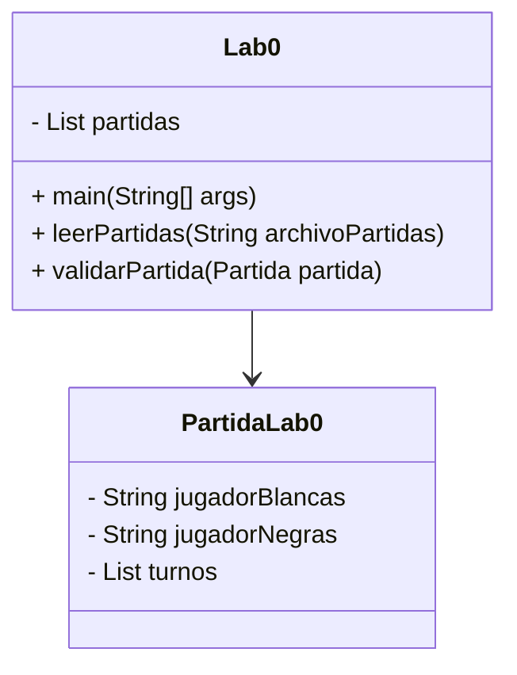
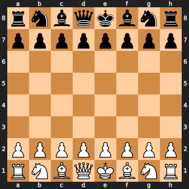

# ADSW Laboratorio 0: Introducción

En este laboratorio introductorio veremos las clases y datos básicos que utilizaremos durante el resto de laboratorios y prácticas. También reforzaremos conceptos básicos de programación como la depuración y el uso de pruebas unitarias.

El laboratorio está estructurado de manera lineal, por lo que para completar un apartado es necesario haber completado los apartados anteriores.

En los siguientes laboratorios y prácticas partiremos de este código para resolver problemas como la búsqueda eficiente de partidas, la ordenación de tableros y partidas por diversos criterios o la recomendación de movimientos a partir de una partida incompleta.

## Objetivos

- Familiarizarse con los datos y las clases principales que usaremos en el resto de laboratorios y prácticas.
- Poner en práctica conceptos de depuración de programas mediante el depurador.
- Utilizar e implementar pruebas con JUnit.

## Diagrama de clases

En este laboratorio utilizaremos una versión simplificada de la clase Partida, llamada PartidaLab0.



## Datos

El conjunto de datos se compone de partidas de ajedrez jugadas en la web lichess. Cada una de las partidas se presenta en formato PGN (Portable Game Notation) ([Wikipedia](https://en.wikipedia.org/wiki/Portable_Game_Notation)), que se resume en un conjunto de líneas en el siguiente orden:

* Identificador/URL de la partida
* Usuario que juega con blancas
* Usuario que juega con negras
* ELO de blancas
* ELO de negras
* Estado del tablero en cada uno de los turnos

Las partidas están separadas por una o más líneas en blanco.

El formato PGN es un estándar para representar partidas de ajedrez que permite almacenar las partidas de forma compacta; sin embargo, es un formato complejo para procesar. Para simplificar la tarea, los archivos de datos proporcionados incluyen una versión simplificada de los tableros en cada turno. **Cada tablero se representa con un `String` de 64 caracteres**. Cada carácter representa una casilla del tablero y puede ser una de las siguientes letras (mayúsculas para piezas blancas y minúsculas para piezas negras):

| Letra | Pieza |
| ----- | ----- |
| K | Rey |
| Q | Reina |
| R | Torre |
| B | Alfil |
| N | Caballo |
| P | Peón |
| . | Casilla vacía |


Este formato es una simplificación del formato FEN ([Wikipedia](https://en.wikipedia.org/wiki/Forsyth%E2%80%93Edwards_Notation)). Como ejemplo, la representación `rnbqkbnrpppppppp................................PPPPPPPPRNBQKBNR` corresponde a esta posición del tablero:



A continuación se muestra un ejemplo de partida entre `mahdii` (ELO 1353) y `eldar63` (ELO 1270) de sólo 5 movimientos:

```
https://lichess.org/vnj19xwf
mahdii
eldar63
1353
1270
rnbqkbnrpppppppp.............................N..PPPPPPPPRNBQKB.R
rnbqkbnrpppppp.p......p......................N..PPPPPPPPRNBQKB.R
rnbqkbnrpppppp.p......p..................P...N..P.PPPPPPRNBQKB.R
rnbqk.nrppppppbp......p..................P...N..P.PPPPPPRNBQKB.R
rnbqk.nrppppppbp......p..................PN..N..P.PPPPPPR.BQKB.R
```

La partida se puede visualizar visitando la [URL de la partida](https://lichess.org/vnj19xwf)

## Tareas

### 1. Descarga y ejecución del código

1. Descargue el código del repositorio GitHub.
2. Importe el proyecto en Eclipse siguiendo las instrucciones del [Anexo 1](#anexo-1-cargar-un-proyecto-en-eclipse) o bien directamente desde el IDE como se mostrará en el laboratorio.
3. Ejecute la clase principal de este laboratorio `Lab0` que incluye un método `main` para validar la configuración inicial.

Si todo funciona correctamente, veremos que el programa indica que se han leído 4 partidas.

> [!IMPORTANT]
> En la ejecución del programa:
> * ¿Qué información se muestra además de las partidas leídas?
> * ¿Hay diferencias entre la salida mostrada y un `print` normal? ¿Por qué?

Por otro lado, el código proporcionado incluye una serie de pruebas que podremos usar para comprobar el buen funcionamiento del programa de una manera más exhaustiva.
Estas pruebas están en la clase `es.upm.dit.adsw.test.Lab0Test`.

> [!IMPORTANT]
> En el conjunto de pruebas del programa:
> * ¿Qué casos se están probando?
> * ¿Son suficientes estas pruebas para garantizar que el programa funciona?

### 2. Ejecución con otros ficheros de partidas

Tanto la ejecución del método main como las pruebas proporcionadas se han realizado con un fichero de partidas de ejemplo (`muestra.txt`). Ahora vamos a proceder a lanzar el programa con un fichero de partidas más extenso (`partidas.txt`). Para ello modifique el método lab0 de la clase Main para que lea el fichero `partidas.txt` y ejecute el programa.

> [!CAUTION]
> ¿Cuántas partidas es capaz de leer el programa?
> ¿Hay algún fallo en la ejecución?

### 3. Arreglando el código

Aunque el código se ejecute sin errores, esto no siempre es una garantia de que el resultado sea correcto. Para verificar que los datos que estamos cargando sean válidos, vamos a hacer probar a ejecutar la clase de pruebas `es.upm.dit.adsw.test.Lab0TestReal`, similar a la que hemos usado en los pasos anteriores pero adaptada al archivo con el conjunto de datos completo. En esta ocasión podemos ver que no todas las pruebas pasan. 

Esto se debe a que algunas de las partidas que estamos leyendo del archivo tienen algún problema, en concreto, alguna situación 'ilegal' según las reglas del ajedrez. Por simplicidad, cualquier partida que contenga una situación ilegal será considerada como no válida y no se contabilizará en el recuento de partidas (se ignora la partida completa). Buscaremos estas situaciones comprobando lo siguiente: **cada tablero de una partida válida debe contener exactamente 1 rey blanco y 1 rey negro**. Cualquier partida que no cumpla esta condición en todos sus tableros será descartada.

La tarea a realizar es modificar el método leerPartidas de la clase LectorPartidas de forma que se evite añadir partidas con tableros ilegales a la lista devuelta. Para resolver esta tarea se recomienda a hacer uso del depurador. También se recomienda añadir alguna traza de registro indicando cuantas partidas ilegales se han detectado.

Además, vamos a ampliar el conjunto de pruebas proporcionadas para automatizar la comprobación del código y para asegurarnos de que versiones futuras del código siguen leyendo correctamente.

El proceso resumido será el siguiente:

* Depurar el código de nuestro lector hasta encontrar el punto en el que se deben filtrar las partidas
* Desarrollar una prueba que replique las condiciones del error en un ejemplo mucho más sencillo
* Modificar el código para evitar que se incluyan los tableros problematicos

Los siguientes subapartados describen cada paso en más detalle.

#### 3.1 Depuración

Para identificar y eliminar errores de un programa que compila y ejecuta pero que no produce resultados correctos hay dos alternativas que no son excluyentes.

La primera es modificar el programa para que produzca más información sobre su estado (p.e., qué línea está procesando y qué valor tienen las variables interesantes).

La segunda es utilizar el depurador. El depurador ejecuta el programa de forma interactiva, permitiendo observar una a una las instrucciones que se ejecutarán, las variables activas en memoria y sus valores. Para iniciar el depurador sobre la clase que contiene el método `main` se puede acceder a `Menú: Run-\>Debug`, pulsar sobre el icono de ejecución de depuración o utilizar el atajo de teclado (recomendado).

Las herramientas disponibles para el control de la ejecución son varias:

-   **Puntos de parada "*breakpoints".*** Paran la ejecución del programa en instrucciones determinadas.
-   **Perspectiva de depuración** con las siguientes vistas:
    -   Vista de visualización y modificación de valores de variables. Vista de consola que muestra la salida del programa
    -   Vista de editor del código fuente con una línea verde en la instrucción que va a ser ejecutada
    -   Vista de depuración indicando la línea de código que va a ser ejecutada
    -   Vista de vigilancia de expresiones
    
-    **Control de la ejecución** paso a paso, entrando
    en los métodos (*Step in)* o ejecutando los métodos completos y
    parando al terminar de ejecutarlos (*Step over*).

Para buscar un error en nuestro programa pondremos un punto de parada en la primera sentencia ejecutable del método `main`.
Iremos ejecutando controladamente el código entrando en los métodos que nos interesen, saltando las instrucciones que ejecutan constructores o llamadas a métodos de clases de la API de Java.

Al entrar en la ejecución del constructor `Lab0` se modifican varias vistas.
En la del editor se cambia el código mostrado al del constructor.
En la vista de variables se observan las variables disponibles en el constructor: la referencia a la propia instancia, *this*, y el parámetro `fichero`.
Estas variables contienen los valores pasados al invocar el método.

Utilice el depurador para ver qué ocurre e inspeccionar los valores de las variables importantes mientras se van leyendo las partidas.
Al ejecutar el programa en modo debug, éste se parará en el primer punto de parada.
Siga la ejecución hasta al siguiente punto de parada para ya ir instrucción a instrucción.

> [!CAUTION]
> ¿En qué parte del código se debería detectar si el tablero es válido?

#### 3.2 Desarrollo de una prueba

Antes de proceder a modificar código, debemos crear una nueva prueba que nos permita saber si el código que generamos es correcto. Vamos a crear un nuevo caso de prueba en la clase `Lab0TestReal` que simule una partida con un tablero ilegal. Para ello, seguiremos los siguientes pasos:

1. Crear un nuevo archivo de partidas con una partida que contenga un tablero ilegal. Para ello, crearemos un nuevo archivo de texto y copiaremos al menos un par de las partidas del archivo `partidas.txt`. Modificaremos uno de los tableros en una de las partidas, eliminando alguno de los reyes (por ejemplo, sustituyendo al rey blanco `K` por un espacio en blanco `.`).
2. Crear un nuevo método de prueba en la clase `Lab0TestReal` que lea el archivo de partidas creado.
3. Comprobar que el resultado de leer este archivo es una lista de partidas en las que no se encuentra la que hemos modificado. Podemos comprobarlo con un `assert` que evalue  el tamaño de la lista de partidas leido.

Una vez añadido el caso de prueba, se debe lanzar al menos una vez para comprobar que el test falla en el estado actual del código.

#### 3.3 Modificación del código

Finalmente, debemos modificar el código para que no se añadan partidas con tableros ilegales a la lista de partidas. Para ello, se recomienda seguir los siguientes pasos:

1. Identificar el punto en el que se debe comprobar si un tablero es válido.
2. Crear un método que compruebe si un tablero es válido.
3. Ignorar las partidas que contengan tableros no válidos.

Una vez realizados estos cambios, se debe ejecutar de nuevo el conjunto de pruebas para comprobar que el código funciona correctamente.

### 4. Mejoras sobre el código (Avanzado, opcional)

Partiendo del código final, se proponen las siguientes mejoras:

- Mostrar el tablero más repetido en todas las partidas.
- Mostrar los cinco tableros más repetidos
- Modificar el lector de tableros para que no almacene la lista de tableros, y lea todos los tableros de las partidas almacenadas cada vez que se ejecuta el método `getTableros`
- Visualizar los tableros en forma de cuadrícula.

Algunas sugerencias de presentación para la visualización:

```
rnbqkbnr
pppppppp
........
........
........
........
PPPPPPPP
RNBQKBNR

```


```
♜♞♝♛♚♝♞♜
♟♟♟♟♟♟♟♟


♙♙♙♙♙♙♙♙
♖♘♗♕♔♗♘♖
```

## Anexos:

### Anexo 1: Cargar un proyecto en Eclipse

Alternativa 1: Importar el archivo comprimido en eclipse

- Descomprime el fichero (ADSW-lab0.zip) que se ha obtenido
- Seleccione el menú File > Import > Existing Projects into
  Workspace > Next
- Navegue hasta el directorio que se ha generado al descomprimir 
  el fichero original.
- Compruebe que el proyecto está marcado, y seleccione Finish

Alternativa 2: Importar directamente desde github

- Seleccione el menú File > Import > Git > Projects from Git (with smart import) > Next
- Seleccione Clone URI > Next
- En el campo URI, copia la dirección del repositorio de GitHub (https://github.com/adsw-upm/adsw-laboratorios)
- Seleccione Next y siga las instrucciones del asistente
- En la pantalla de selección de ramas, seleccione la rama master
- En la pantalla de directorio de destino, seleccione el directorio
  de destino y seleccione Next
- Seleccione las carpetas que se importarán como proyectos y seleccione Finish


[^1]: Un *smoke test* es una prueba elemental de que un programa funciona, sin entrar en detalles ni casos particulares.
