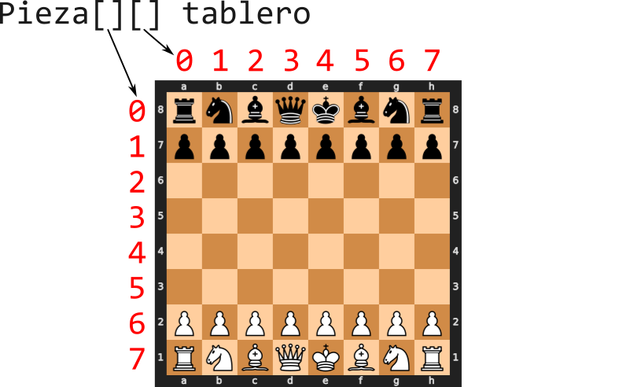

# Laboratorio 1

En este laboratorio continuaremos con el desarrollo de la clase `Tablero`. Añadiremos una serie de métodos que nos permitirán trabajar con colecciones de tableros y realizar operaciones como ordenarlos según un criterio de puntuación.

Empezando en este laboratorio, no se proporcionará una batería de pruebas completa ya implementada, en su lugar se describen qué casos de prueba se pueden añadir para comprobar que la implementación es correcta. Añada todos los casos de prueba que considere en la clase de Test correspondiente a cada laboratorio o clase del proyecto (en el paquete `es.upm.dit.adsw.ajedrez25.laboratorio` de la carpeta de tests).

**No es necesario descargar ningún proyecto nuevo**. Trabajaremos siempre con el mismo proyecto que se descargó en el Laboratorio 0 e iremos añadiendo las clases y métodos necesarios en el mismo proyecto.

## Objetivos

- Completar la implementación de la clase `Tablero`
- Ordenar una colección de tableros
- Buscar tableros según su puntuación

## Paso 1: Constructor de la clase Tablero

En el Laboratorio 0, se vio como se podía representar un tablero como un String de 64 caracteres. El primer objetivo de este laboratorio es crear un constructor para la clase Tablero que reciba como parámetro uno de esos Strings y guarde su información en una matriz de 8x8. La matriz se llamará `matrizPiezas` y será un atributo de la clase `Tablero`. El constructor que se debe completar ya está definido en la clase `Tablero` y su cabecera es `public Tablero(String tableroSerializado)`.

Recordando el formato que ya se presentó en el Laboratorio 0, el String que se recibe como parámetro tiene 64 caracteres que representan las 64 casillas del tablero. Cada caracter representa una casilla y puede ser una pieza o un punto. Las piezas se representan con letras, mayúsculas en el caso del bando blanco y minúsculas en el caso del bando negro. La correspondencia entre las letras y las piezas que representan es la siguiente:

<div style="margin-left: auto;
            margin-right: auto;
            width:30%">

| Letra | Pieza |
| ----- | ----- |
| K | Rey |
| Q | Reina |
| R | Torre |
| B | Alfil |
| N | Caballo |
| P | Peón |
| . | Casilla vacía |

</div>

Para almacenar el tablero en el array bidimensional, consideraremos que la posición `[0][0]` es la casilla superior izquierda, orientando el tablero con las fichas blancas abajo. Es decir, en el tablero inicial de una partida que se representa con el String `"rnbqkbnrpppppppp................................PPPPPPPPRNBQKBNR"`, la primera fila del array contiene las piezas negras que no son peones `rnbqkbnr`. Para cada una de las posiciones que contenga una pieza se debe crear un objeto `Pieza` para representarla, las casillas vacías se dejarán como `null`;
<div style="margin-left: auto;
            margin-right: auto;
            width:30%">



</div>

> [!IMPORTANT]
> Una vez se haya implementado el funcionamiento de `matrizPiezas`, se deben crear los métodos `equals` y `hashCode`. Estos métodos deben utilizar la matriz de piezas para comparar dos tableros. Dos tableros serán iguales si todas las piezas de la matriz son iguales. Para el método `hashCode`, se puede utilizar el siguiente código:
> ```java
> @Override
> public int hashCode() {
>     return Arrays.deepHashCode(matrizPiezas);
> }

### Pruebas recomendadas

- Crear un tablero vacío y recorrer el array comprobando que todas las posiciones son null (utilizar el constructor sin parámetros para crear el tablero vacío)
- Crear un tablero con la posición inicial y comprobar que las piezas están en su sitio (utilizar el método `tableroBasico()` para crear el tablero inicial)
- Crear un tablero con la siguiente distribución y comprobar que las piezas están en su sitio

    ```"..........K................q..k....q..................b........."```

    - `tablero[1][2]` es un rey blanco
    - `tablero[3][3]` es una reina negra
    - `tablero[3][6]` es un rey negro
    - `tablero[4][3]` es una reina negra
    - `tablero[6][6]` es un alfil negro

## Paso 2: Método para evaluar un tablero

El siguiente paso es diseñar un método que indique como de favorable es un tablero para uno de los bandos. Para ello se asignará una puntuación al tablero en función de las piezas que queden vivas del bando que se evalúa. Cada pieza tiene un valor en puntos según la siguiente tabla:
<div style="margin-left: auto;
            margin-right: auto;
            width:30%">

| Pieza | Puntos |
| ----- | ------ |
| Rey | 100 |
| Reina | 9 |
| Torre | 5 |
| Alfil | 3 |
| Caballo | 3 |
| Peón | 1 |

</div>

Este método se llamará `getPuntuacionBando` y devolverá un entero con la puntuación del tablero. Recibirá como parámetro una variable de tipo `Bando` que indicará el bando que se quiere evaluar. El método debe recorrer el tablero y sumar los puntos de las piezas del bando que se quiere evaluar.

### Pruebas recomendadas

- Un tablero vacío tiene puntuación 0 para ambos bandos
- Un tablero en la posición inicial tiene puntuación 139 para los dos bandos 
- El siguiente tablero tiene puntuación 103 para el bando blanco y 127 para el bando negro

    ```"....r...p....k...p.....p.......r..P.p.....Pp....P.....bK.....q.."```

### Nota

Esta forma de evaluar el valor de las piezas de ajedrez es bastante habitual y se conoce como [Valor relativo](https://es.wikipedia.org/wiki/Valor_relativo_de_las_piezas_de_ajedrez). Se usa muchas veces para medir el efecto de una jugada y por los programas de ajedrez.

## Paso 3: Comparar tableros

Java cuenta con una interfaz llamada `Comparable` que permite definir un método de comparación entre objetos. La interfaz `Comparable` tiene un único método llamado `compareTo` que recibe como parámetro un objeto del mismo tipo que el que implementa la interfaz y devuelve un entero. Este entero debe ser negativo si el objeto que llama al método es menor que el que se pasa como parámetro, 0 si son iguales y positivo si el objeto que llama al método es mayor que el que se pasa como parámetro.

Se va a utilizar esta interfaz para poder comparar dos tableros en función de su puntuación. Para ello, la clase `Tablero` debe implementar la interfaz `Comparable` y sobreescribir el método `compareTo`. El método `getPuntuacionBando` que se ha desarrollado en el paso anterior devuelve la puntuación del tablero desde el punto de vista de uno de los bandos; para comparar tableros se utilizará una puntuación general que se calcule como la diferencia entre la puntuación de las blancas y la puntuación de las negras. El método `compareTo` debe utilizar esta puntuación general para comparar dos tableros y decidir cual es el mayor.

El método `compareTo` debe devolver un entero positivo si el tablero que llama al método es mayor que el que se pasa como parámetro, 0 si son iguales y un entero negativo si el tablero que llama al método es menor que el que se pasa como parámetro.

### Pruebas recomendadas

- Dos tableros iguales deben devolver 0 al compararse
- Un tablero vacío y el tablero básico deben devolver también 0 al compararse
- El siguiente tablero debe ser superior al tablero básico

    ```"r.b.k..r........p.N..bpp...P.p......pq..P.N.R..P.PP..PP.R..Q..K."```

- El siguiente tablero debe ser inferior al tablero básico

    ```"....rk.......pppp........r..b...............K..n........q......."```

## Paso 4: Buscar tableros

El último paso de este laboratorio es desarrollar (en la clase `Lab1`) algunos métodos que nos permitan buscar tableros en la colección de tableros que se lee. En concreto en este laboratorio se van a desarrollar dos métodos:
- `public Tablero mayorTablero()`: Este método devolverá el tablero con mayor puntuación.
- `public List<Tablero> getTablerosConPuntuacionMinima(int puntuacion)`: Este método devolverá una lista de tableros que tengan al menos la puntuación indicada.

La práctica 1 trata sobre la implementación de métodos similares a estos, con un diseño eficiente. Por el momento, se puede implementar estos métodos de forma sencilla, recorriendo la colección de tableros y comparando las puntuaciones de cada uno.

### Pruebas recomendadas

- El mayor tablero tiene una puntuación general de 56.
- Hay 1158 tableros con una puntuación general de 25 o más.

## Pasos extra (opcional)

Los siguientes pasos son opcionales y no son necesarios para completar el laboratorio. Se proponen como ejercicios adicionales para aquellos que quieran profundizar en el desarrollo de la clase `Tablero`.

### Comparación avanzada

Si dos tableros tienen la misma puntuación, se puede comparar la posición de los peones más adelantados para decidir cuál es el mejor. Para ello, se puede modificar el método `compareTo` para que en caso de empate, el tablero con un peón blanco más adelantado sea el que se considere como mayor.

### Buscar tableros por puntuación

En el paso 4 se ha desarrollado un método que devuelve una lista de tableros con una puntuación mínima. Se puede desarrollar otro método que reciba puntuaciones máxima y mínima y devuelva una lista de tableros con una puntuación comprendidos entre esos dos valores.

