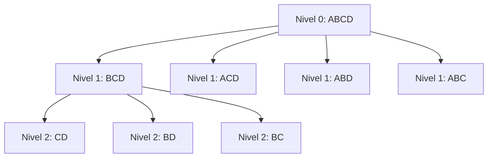

# ADSW Laboratorio 1: Resolver la prueba de Letras automáticamente

En el laboratorio 0 el jugador humano introducía una palabra por consola y el sistema comprobaba si era válida.

En este laboratorio vamos a automatizar la prueba de Letras:

> El programa debe encontrar automáticamente la palabra válida más larga que pueda formarse con las letras dadas.

---

## Objetivo del laboratorio

Implementar la clase:

- `LetrasFuerzaBruta`

en el paquete:

- `es.upm.dit.adsw.cifrasyletras.letras`

Esta clase implementa la interfaz `Letras` y debe devolver la mejor palabra posible en el método:

```java
public String obtenerPalabra(String letras);
```

---

## Enfoque para la resolución

Para hacer la búsqueda eficiente usaremos dos ideas:

1) Normalización por orden alfabético  
   - Si ordenamos las letras de una palabra, obtenemos una representación “canónica”. Por ejemplo: `contratos → acnoorstt`

2) Búsqueda por eliminación de letras (de mayor a menor longitud). Partimos de las 9 letras ordenadas 
(por ejemplo `aeilmorstt`) y generamos todas las combinaciones posibles. Si no encontramos una palabra que contenga
todas esas letras, buscamos palabras de una longitud menor:
   - primero todas las de longitud 9,
   - luego todas las combinaciones de longitud 8,
   - luego 7, etc.

La primera combinación que coincida con una palabra válida será la solución (porque estamos buscando de mayor a menor longitud).

---

## Tarea 1: Crear el índice de palabras válidas

Comienza creando la clase `LetrasFuerzaBruta` en el paquete `es.upm.dit.adsw.cifrasyletras.letras` con esta estructura inicial:

```java
package es.upm.dit.adsw.cifrasyletras.letras;

import java.util.*;

public class LetrasFuerzaBruta implements Letras {

    private HashMap<String, String> palabrasValidas;

    public LetrasFuerzaBruta() {
        palabrasValidas = new HashMap<>();
        // Cargar palabras del fichero igual que en ValidadorLetras
    }

    @Override
    public String obtenerPalabra(String letras) {
        // A implementar
    }
}
```

---

### Objetivo del constructor

Deberá leer el fichero:

`ADSW26_CifrasyLetras/data/es.txt`

y construir un:

`HashMap<String, String> palabrasValidas`

donde:
- la clave será la palabra con sus letras ordenadas alfabéticamente
- el valor será la palabra original

Ejemplo:

- clave: acnoorstt  
- valor: contratos

---

### Qué debes hacer

1. Leer el fichero línea a línea usando la clase `BufferedReader`.
2. Para cada palabra:
    - Eliminar espacios con `trim()` y normalizar la palabra con el método `limpiarPalabra(String palabra)` (cópialo de la clase `ValidadorLetras`).
    - Convertirla en un ArrayList con el método `toCharArray()`.
    - Ordenarla con `Arrays.sort()`.
    - Reconstruir el String ordenado con el constructor de String: `new String(arrayOrdenado)`.
3. Guardar en el `HashMap`:
   palabraOrdenada → palabraOriginal

> [!TIP]
> La clase `BufferedReader` tiene el método `readLine()` que permite ir leyendo línea a línea el fichero. Si este método 
> devuelve `null`, es porque (normalmente) habrá llegado al final del fichero.

---

## Tarea 2: Normalizar las letras del concursante

Dentro del método `obtenerPalabra(String letras)`:

1) Con las `letras` que recibimos para la prueba, deberemos ordenarlas de la misma forma que hicimos antes (`toCharArray()`, `Arrays.sort()` y `new String(...)`).
      
   A ese resultado lo llamaremos `letrasOrdenadas`.

2) Comprobamos si con todas las letras, podemos formar una palabra (`mapaPalabras.contains(...)`)

---

## Tarea 3: Generar combinaciones eliminando letras

Hasta ahora tenemos:
- `palabrasValidas`: un índice que permite comprobar rápido si una combinación de letras ordenadas corresponde a una palabra real.
- `letrasOrdenadas`: las 9 letras disponibles, también ordenadas.

La idea para encontrar la palabra más larga es esta:

1) Primero intentamos con las 9 letras (hasta aquí llegamos en la Tarea 2).
2) Si no hay palabra, probamos con “todas las formas de quitar 1 letra” (palabras de 8 letras).
3) Si tampoco, probamos con “todas las formas de quitar 2 letras” (palabras de 7 letras).
4) Y así sucesivamente.

Como buscamos por niveles (longitud 9 → 8 → 7 → ...), la primera coincidencia que encontremos será necesariamente la más larga posible.

### Visualización (árbol de eliminaciones)

Ejemplo con letras ordenadas: ABCD (en el laboratorio serán 9 letras)

- Nivel 0 (4 letras): ABCD
- Nivel 1 (3 letras): BCD, ACD, ABD, ABC
- Nivel 2 (2 letras): CD, BD, BC, AD, AC, AB
- ...

En cada nivel, comprobamos si alguna cadena existe como clave en `palabrasValidas`.
Si existe, devolvemos el valor asociado (la palabra original).



### Estructuras que usaremos

Usaremos dos conjuntos (`Set`) para ir nivel por nivel, evitando repetidos:

- `claves`: combinaciones del nivel actual (por ejemplo, todas las de longitud 8)

- `nuevasClaves`: combinaciones del siguiente nivel (por ejemplo, todas las de longitud 7)

En cada iteración:

- Generamos `nuevasClaves` eliminando una letra de cada cadena de claves.

- Si alguna combinación generada aparece en `palabrasValidas`, devolvemos la palabra y terminamos.

Si no, pasamos al siguiente nivel (haciendo `claves = nuevasClaves`).

### Implementación:

`Set<String> claves`        (nivel actual)

`Set<String> nuevasClaves`  (siguiente nivel)

Pasos:

1) Inicializar `claves` con una sola cadena: `letrasOrdenadas`.

2) Mientras `claves` no esté vacío:
    - Para cada `clave` en `claves`:
        - Generar nuevas cadenas eliminando una posición i:
          `clave.substring(0, i) + clave.substring(i + 1)`
        - Si esa nueva cadena está en `palabrasValidas`:
          devolver la palabra asociada.
        - Si no está:
          añadir esa nueva cadena a `nuevasClaves`.

3) Al terminar el nivel:
    - `claves = nuevasClaves`
    - y reiniciamos `nuevasClaves` a un nuevo `HashSet` vacío.

Como vamos eliminando letras progresivamente, el primer nivel corresponde a palabras de longitud 9, el siguiente a longitud 8, etc.  
Por eso, la primera coincidencia será la palabra más larga posible.

---

## Resultado esperado

Al ejecutar el juegoHumano usando `LetrasFuerzaBruta`, en cada prueba de letras el programa debe devolver automáticamente una palabra válida.

Si no existiera ninguna palabra posible, se puede devolver `null` (o cadena vacía, según se indique en el laboratorio).

--- 

## Tarea 4: Tests unitarios de `LetrasFuerzaBruta`

En esta última tarea vamos a comprobar automáticamente que tu implementación de `LetrasFuerzaBruta` funciona como se espera para unos pocos casos.

Crea la clase:

- `LetrasFuerzaBrutaTests`

en el paquete:

- `es.upm.dit.adsw.cifrasyletras`

La clase debe contener **tres tests**. Dos se proporcionan ya implementados y el tercero está por hacer.

> [!CAUTION]
> Para que JUnit ejecute un test, el método debe llevar `@Test` encima y devolver `void`.

### Código de partida

```java
package es.upm.dit.adsw.cifrasyletras;

import es.upm.dit.adsw.cifrasyletras.letras.LetrasFuerzaBruta;
import org.junit.jupiter.api.Assertions;
import org.junit.jupiter.api.Test;

public class LetrasFuerzaBrutaTests {

    @Test
    public void testLongitudNueveLetras() {
        LetrasFuerzaBruta test = new LetrasFuerzaBruta();
        String letras = "coatanros";
        Assertions.assertEquals("acostaron", test.obtenerPalabra(letras));
    }

    @Test
    public void testLongitudOchoLetras() {
        LetrasFuerzaBruta test = new LetrasFuerzaBruta();
        String letras = "coatanrox";
        Assertions.assertEquals("acotaron", test.obtenerPalabra(letras));
    }

    @Test
    public void testNull() {
        // A implementar:
        // - Usa un conjunto de letras con el que no pueda formarse ninguna palabra (por ejemplo: "xxxxxxxxx")
        // - Comprueba que el resultado es null usando Assertions.assertNull(...)
    }
}
```

### Qué debes hacer

Completa el método `testNull()` usando `Assertions.assertNull(...)` para comprobar que, si no existe ninguna palabra posible, `obtenerPalabra(...)` devuelve `null`.
