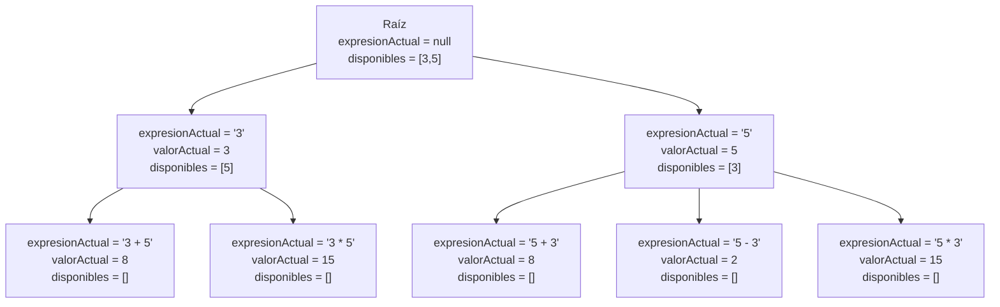

# ADSW Laboratorio 3: Resolución automática de Cifras mediante un árbol de estados

En el laboratorio anterior resolvimos automáticamente la prueba de Cifras generando expresiones y evaluándolas.  

En este laboratorio vamos a resolver el mismo problema con un enfoque distinto. En lugar de generar directamente 
expresiones completas, construiremos un **árbol de estados**.

La idea general es la siguiente:

- cada nodo del árbol representa un estado intermedio de la resolución;
- a partir de un nodo se generan nuevos hijos aplicando una operación válida;
- una vez construido el árbol, se recorre para localizar la expresión más cercana al objetivo.

---

## 1. Idea general de la estructura

Para resolver el problema vamos a utilizar dos clases auxiliares:

- `ExpresionParcial`: representa una expresión matemática y su valor.
  Por ejemplo, la expresión `"3 * 5"` tendría valor `15`.

- `Nodo`: representa un estado del árbol. En cada nodo se almacena:
   - la expresión construida hasta ese momento (`expresionActual`),
   - la lista de expresiones que todavía quedan disponibles para seguir operando (`disponibles`),
   - una referencia al nodo padre (`padre`),
   - y la lista de nodos hijo (`hijos`).

En este laboratorio, las expresiones disponibles corresponden a los números originales que todavía no se han usado, aunque se representen mediante objetos `ExpresionParcial`.

La raíz del árbol no representa una operación real. Solo actúa como punto de partida. Desde ella se elige un primer número, y a partir de ahí cada nodo genera nuevos hijos creando nuevas expresiones a partir de la expresión actual y una de las expresiones disponibles.

Por ejemplo, si partimos de los números `[3, 5]`, el árbol comienza así:


```mermaid
flowchart TD
   R["Raíz<br/>expresionActual = null<br/>disponibles = [3,5]"]

   N3["expresionActual = '3'<br/>valorActual = 3<br/>disponibles = [5]"]
   N5["expresionActual = '5'<br/>valorActual = 5<br/>disponibles = [3]"]

   N35s["expresionActual = '3 + 5'<br/>valorActual = 8<br/>disponibles = []"]
   N35m["expresionActual = '3 * 5'<br/>valorActual = 15<br/>disponibles = []"]
   N53s["expresionActual = '5 + 3'<br/>valorActual = 8<br/>disponibles = []"]
   N53r["expresionActual = '5 - 3'<br/>valorActual = 2<br/>disponibles = []"]
   N53m["expresionActual = '5 * 3'<br/>valorActual = 15<br/>disponibles = []"]

   R --> N3
   R --> N5

   N3 --> N35s
   N3 --> N35m

   N5 --> N53s
   N5 --> N53r
   N5 --> N53m
```

No todas las operaciones generan hijos.

Por ejemplo, `3 - 5` no sería válida porque produce un valor negativo, y `3 / 5` tampoco sería válida porque la división no es exacta.

> [!WARNING]
> En el diagrama anterior, se muestran los elementos disponibles como números enteros para simplificar la visualización, 
> pero en la implementación real se utilizan objetos `ExpresionParcial` que contienen tanto el valor (`valorActual`) 
> como la representación textual de la expresión (`expresion`).
> 
> Para este laboratorio, sólo nos interesa el `valorActual` de los elementos disponibles, mientras que para la Práctica 2 nos interesará también su `expresion`.

---

## 2. Cómo se resuelve el problema con este árbol

El proceso se divide en dos fases:

1. **Construcción del árbol**. A partir de los números iniciales, se generan todos los nodos posibles aplicando operaciones válidas.

2. **Recorrido del árbol**. Una vez construido, se recorre el árbol completo para encontrar la expresión cuyo valor esté más cerca del objetivo.

---

## 3. Vídeo explicativo

En el siguiente vídeo se explica el proceso de construcción y recorrido del árbol con un ejemplo concreto.


---

> [!CAUTION]
> Recordatorio. Las operaciones se evalúan de izquierda a derecha, sin prioridad de operadores ni paréntesis. No se
> permiten resultados intermedios negativos, ni divisiones no exactas o entre 0.
> 
> Por ejemplo, la expresión `50 + 75 - 6 * 8` se evalúa como:
> - 50 + 75 = 125
> - 125 - 6 = 119
> - 119 * 8 = 952

## 4. Qué debes implementar

Debes implementar la clase:

- `CifrasArbol`

en el paquete:

- `es.upm.dit.adsw.cifrasyletras.cifras`

Esta clase implementa la interfaz `Cifras` y debe definir el método:

```java
public String obtenerCifra(int objetivo, List<Integer> numeros);
```

El objetivo final es que este método devuelva una cadena con el formato:

`valor = expresion`

por ejemplo:

`321 = 9 * 4 * 5 + 3`

---

## 5. Código base

### Clase principal

Crea una nueva clase llamada `CifrasArbol` que implemente la interfaz `Cifras` y copia en ella el siguiente código base.
A lo largo del laboratorio completarás los métodos marcados como pendientes.

```java
package es.upm.dit.adsw.cifrasyletras.cifras;

import java.util.*;

public class CifrasArbol implements Cifras {

   private Nodo raiz;
   private List<String> operadores = List.of("+", "-", "*", "/");
   private Nodo mejorNodo;

   private void construirArbol(List<Integer> numeros) {
      // A implementar
   }

   private void construirArbolRecursivo(Nodo padre) {
      // A implementar
   }

   public int calcularValor(int valorActual, String operador, int nuevoNumero) {
      switch (operador) {
         case "+":
            return valorActual + nuevoNumero;
         case "-":
            if ((valorActual - nuevoNumero) < 0) {
               return -1;
            }
            return valorActual - nuevoNumero;
         case "*":
            return valorActual * nuevoNumero;
         case "/":
            if (nuevoNumero == 0 || (valorActual % nuevoNumero != 0)) {
               return -1;
            }
            return valorActual / nuevoNumero;
         default:
            return -1;
      }
   }

   public Nodo obtenerMejorNodo(int objetivo) {
      // A implementar
      return null;
   }

   private void recorrerArbol(Nodo nodoActual, int objetivo) {
      // A implementar
   }

   @Override
   public String obtenerCifra(int objetivo, List<Integer> numeros) {
      if (numeros == null || numeros.isEmpty()) {
         throw new IllegalArgumentException("La lista de números está vacía");
      }
      // A implementar
      return null;
   }
}
```

### Clases auxiliares

Debes crear también las siguientes clases en ficheros separados dentro del mismo paquete:

#### Clase `ExpresionParcial`

Esta clase representa una expresión construida hasta un momento dado y su valor numérico.

```java
package es.upm.dit.adsw.cifrasyletras.cifras;

import java.util.Objects;

public class ExpresionParcial {
    public int valorActual;
    public String expresion;

    public ExpresionParcial(int valorActual, String expresion) {
        this.valorActual = valorActual;
        this.expresion = expresion;
    }

    @Override
    public boolean equals(Object o) {
        if (this == o) return true;
        if (o == null || getClass() != o.getClass()) return false;
        ExpresionParcial that = (ExpresionParcial) o;
        return valorActual == that.valorActual && Objects.equals(expresion, that.expresion);
    }

    @Override
    public int hashCode() {
        return Objects.hash(valorActual, expresion);
    }
}
```

#### Clase `Nodo`

Esta clase representa un nodo del árbol de estados.

```java
package es.upm.dit.adsw.cifrasyletras.cifras;

import java.util.HashSet;
import java.util.List;
import java.util.Objects;

public class Nodo {
    public ExpresionParcial expresionActual;
    public List<ExpresionParcial> disponibles;
    public Nodo padre;
    public List<Nodo> hijos;

    public Nodo(ExpresionParcial expresionActual, Nodo padre, List<Nodo> hijos, List<ExpresionParcial> disponibles) {
        this.disponibles = disponibles;
        this.padre = padre;
        this.hijos = hijos;
        this.expresionActual = expresionActual;
    }

    @Override
    public boolean equals(Object o) {
        if (this == o) return true;
        if (o == null || getClass() != o.getClass()) return false;
        Nodo that = (Nodo) o;
        return Objects.equals(expresionActual, that.expresionActual) &&
                new HashSet<>(this.disponibles).equals(new HashSet<>(that.disponibles));
    }
    
    @Override
    public int hashCode() {
        return Objects.hash(expresionActual, new HashSet<>(disponibles));
    }
}
```

---

## Tarea 1: Construir la raíz y el primer nivel del árbol

En esta tarea debes implementar:

```java
private void construirArbol(List<Integer> numeros)
```

Este método debe crear la raíz del árbol y generar sus primeros hijos.

Recuerda que la raíz **no representa una operación real**, sino un punto de partida.

### Qué debe hacer el método

1. Crear una lista inicial de objetos `ExpresionParcial`, uno por cada número recibido.
   Cada uno debe almacenar:
   - `valorActual = numero`
   - `expresion = String.valueOf(numero)`

2. Crear la raíz:
   - `expresionActual = null`
   - `disponibles = lista inicial`
   - `padre = null`
   - `hijos = lista vacía`

3. Recorrer todas las expresiones disponibles de la raíz.

4. Para cada una:
   - crear una copia de `raiz.disponibles`,
   - eliminar de la copia la expresión elegida,
   - usar esa expresión como `expresionActual` del hijo,
   - crear un nodo hijo con esa expresión parcial y la lista restante de `disponibles`,
   - añadir ese hijo a `raiz.hijos`,
   - llamar a `construirArbolRecursivo(...)` para continuar generando el resto del árbol desde ese hijo.

---

## Tarea 2: Generar recursivamente los hijos de cada nodo

En esta tarea debes implementar:

```java
private void construirArbolRecursivo(Nodo padre)
```

Este método debe generar recursivamente todos los hijos válidos a partir de un nodo dado.

### Qué debe hacer el método

1. Comprobar la condición base:
    - Si `padre.disponibles` está vacío, no se pueden generar más hijos y el método termina.

2. Recorrer todas las expresiones disponibles.

3. Para cada expresión disponible (`nuevoOperando`):
    - recorrer todos los operadores (`+`, `-`, `*`, `/`),
    - calcular el nuevo valor mediante `calcularValor(...)` aplicando el operador entre:
      - `padre.expresionActual.valorActual`
      - y `nuevoOperando.valorActual`

4. Si la operación no es válida, no se crea ningún hijo.

5. Si la operación es válida:
    - crear una copia de `padre.disponibles`,
    - eliminar de esa copia la expresión usada,
    - construir el texto de la nueva expresión:
        - `padre.expresionActual.expresion + " " + operador + " " + nuevoOperando.expresion`
    - crear una nueva `ExpresionParcial`,
    - crear un nuevo `Nodo` hijo,
    - añadirlo a `padre.hijos`,
    - llamar recursivamente a `construirArbolRecursivo(hijo)`.

Ejemplo: si el nodo padre contiene `3` y quedan disponibles `[1, 2]`, aplicar `* 2` generaría un nodo con expresión `"3 * 2"`, valor `6` y disponibles `[1]`.

---

## Tarea 3: Buscar el mejor nodo del árbol

En esta tarea debes implementar:

```java
public Nodo obtenerMejorNodo(int objetivo)
```

Este método debe recorrer el árbol ya construido y devolver el nodo cuya expresión esté más cerca del objetivo.

### Qué debe hacer el método

1. Comprobar si la raíz existe y tiene hijos.
    - Si no tiene hijos, devolver `null`.

2. Inicializar `mejorNodo` con el primer hijo de la raíz.

3. Recorrer el árbol comenzando desde los hijos de la raíz (no desde la raíz, ya que la raíz no representa una expresión real).

4. Devolver el `mejorNodo` encontrado.

---

## Tarea 4: Recorrer recursivamente el árbol

En esta tarea debes implementar:

```java
private void recorrerArbol(Nodo nodoActual, int objetivo)
```

Este método debe comparar cada nodo con la mejor solución encontrada hasta el momento y continuar recorriendo sus hijos.

### Qué debe hacer el método

1. Si el valor del nodo actual es exactamente igual al objetivo:
    - actualizar `mejorNodo`,
    - y terminar esa llamada recursiva.

2. Calcular:
    - la distancia entre `nodoActual.expresionActual.valorActual` y el objetivo,
    - la distancia entre `mejorNodo.expresionActual.valorActual` y el objetivo.

3. Si el nodo actual está más cerca del objetivo, actualizar `mejorNodo`.

4. Recorrer recursivamente todos los hijos del nodo actual.

Ejemplo: si el objetivo es `321` y el mejor valor encontrado hasta ahora es `318`, entonces un nodo con valor `320` mejora la solución, mientras que uno con valor `350` no.

> [!TIP]
> Recuerda que la distancia entre dos números `a` y `b` se calcula como `Math.abs(a - b)`.
> Esto evita problemas con números negativos y asegura que siempre obtenemos un valor positivo que representa la distancia al objetivo.

---

## Tarea 5: Integración final en `obtenerCifra(...)`

En esta última tarea debes implementar:

```java
public String obtenerCifra(int objetivo, List<Integer> numeros)
```

Este método debe conectar todas las piezas anteriores.

### Qué debe hacer el método

1. Construir el árbol completo llamando a:

```java
construirArbol(numeros);
```

2. Obtener el mejor nodo llamando a:

```java
obtenerMejorNodo(objetivo);
```

3. Devolver el resultado en el formato:

```text
valor = expresion
```

por ejemplo:

```text
321 = 9 * 4 * 5 + 3
```

---

## Resultado esperado

Al finalizar el laboratorio, tu implementación debe construir el árbol completo, recorrerlo y devolver la mejor solución encontrada para el objetivo dado.
