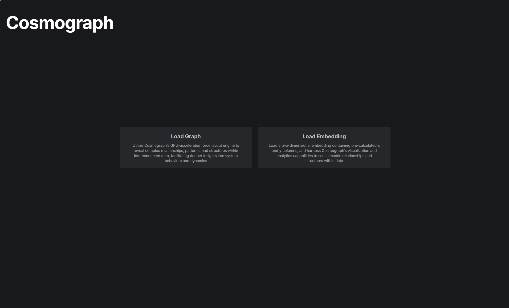

# Laboratorio 3

En este laboratorio trabajaremos con el grafo de tableros de ajedrez que se utiliza también en las prácticas. El laboratorio es independiente de la práctica pero algunas de las funcionalidades desarrolladas en la práctica se pueden reutilizar en el laboratorio y viceversa.

El objetivo principal de este laboratorio es estudiar cómo es el grafo de tableros de ajedrez de forma visual. Para ello empezaremos por definir un formato de exportación del grafo, es decir, una forma de representar nuestro grafo en un archivo para no tener que crearlo cada vez que lo necesitemos usar. El grafo con el que trabajamos puede ser demasiado grande para visualizarlo directamente, por lo que crearemos versiones reducidas del grafo y las compararemos para entender cómo crece a medida que aumentamos la cantidad de información que contiene.

Para realizar la visualización del grafo tenemos disponibles múltiples herramientas, en este caso utilizaremos [Cosmograph](https://cosmograph.app/). Esta herramienta es sencilla de usar y está especialmente diseñada para visualizar grafos de gran tamaño.

### Objetivos
- Crear un grafo de tableros de ajedrez
- Limitar el tamaño del grafo por 
  - Número de partidas
  - Número de movimientos
- Exportar el grafo a un archivo
- Visualizar el grafo

## Paso 1: Crear el grafo de tableros de ajedrez

Empezaremos creando la clase Lab3.java en la que vamos a trabajar en este laboratorio. La clase se llamará "Lab3.java" y la colocaremos en el paquete laboratorios. De manera parecida a como se hace en el laboratorio 1, crearemos un método main que nos permita ejecutar la clase y comprobar que todo funciona correctamente. En este método main, debemos leer el archivo de partidas como ya hemos hecho en otras ocasiones y obtener la lista de objetos Partida.

Crearemos las estructuras de datos que representarán nuestro grafo de tableros de ajedrez tal y como se indica en el enunciado de la práctica. Si todo sale bien, deberíamos conseguir un grafo con 1217330 nodos y 1226387 aristas. 

> [!IMPORTANT]
> Para poder saber si dos nodos o enlaces son iguales, es necesario que sus clases tengan implementada las funciones equals() y hashCode() (la clase `Enlace` ya tiene el equals, pero no el hashcode).
> Estas funciones se pueden generar automáticamente con el IDE, en eclipse sería: botón derecho > Source > Generate hashCode() and equals().
> Sin embargo, si lo generamos de esta forma en la clase `Nodo`, veremos que el hashcode de este se calcula mediante el hashcode del enlace, y este a su vez mediante el hashcode de cada nodo, lo que provoca un bucle.
> Para solucionarlo, el hashcode del Nodo debe calcularse sin tener en cuenta el hash del enlace.
> Es **muy importante** que la función hashCode() de la clase `Enlace` no utilice el `peso` para su cálculo.


> [!TIP]
> ¿Por qué son casi iguales el número de nodos y el número de aristas?
> 
> En el ajedrez, existen un número enorme de posibles movimientos. Utilizando el AnalizadorBasico de la práctica 1, podemos ver que nuestro archivo de datos contiene 1375485 tableros. Si comparamos este resultado con el número de nodos, podemos observar que también son similares, esto quiere decir que la mayoría de los tableros que aparecen en el archivo de datos son únicos o se repiten pocas veces. Si los tableros se repiten poco, es normal que los movimientos que representamos en el grafo también se repitan poco. Un grafo con estas características, es un grafo que se compone de cadenas largas de nodos con pocas interconexiones entre ellas. En los siguientes pasos veremos que este efecto es menos significativo si limitamos el número de movimientos que estudiamos; al principio todas las partidas de ajedrez serán parecidas.

## Paso 2: Limitar el tamaño del grafo por número de partidas

Vamos a modificar el código que hemos desarrollado en el paso anterior para generar versiones reducidas del grafo. Para ello, vamos a limitar el número de tableros que procesamos de dos maneras diferentes:

### 2.1 Limitar el número de partidas

En vez de procesar todas las partidas del archivo, utilizaremos solo las `N` primeras partidas. Para ello, podemos utilizar un contador que nos permita saber cuántas partidas hemos procesado y detenernos cuando lleguemos, o bien modificar el bucle que lee las partidas para que solo itere `N` veces.

### 2.2 Limitar el número de movimientos

Ahora queremos reducir el tamaño de las partidas que analicemos quedándonos solo con los `M` primeros movimientos de la partida. De forma similar a como hicimos en el paso anterior, debemos modificar el bucle que lee los movimientos de una partida para que solo procese las `M` primeras posiciones. 

> [!IMPORTANT]
> `N` y `M` deberían ser variables que podamos modificar.

## Paso 3: Exportar el grafo a un archivo

Utilizando los valores de `N` y `M` que hemos utilizado para limitar el tamaño del grafo, podemos crear versiones del grafo que denominaremos como `grafo_N_M`. Por ejemplo, el `grafo_10_5` es el grafo que hemos creado utilizando las 10 primeras partidas y los 5 primeros movimientos de cada partida. Existen múltiples formatos para exportar el grafo, en este caso optaremos por implementar uno de los más sencillos: un archivo CSV. En este archivo, cada fila representará una arista del grafo y contendrá los siguientes campos:
  - `origen`: el nodo de origen de la arista, en nuestro caso podemos utilizar el hash del tablero de ajedrez que representa el nodo
  - `destino`: el nodo de destino de la arista
  - `peso`: el peso de la arista (en este caso, el número de veces que se ha repetido la arista en el grafo).

Vamos a crear un método que se encargue de exportar el grafo a un archivo CSV. Este método debe recibir como parámetro el nombre del archivo. Podemos utilizar el siguiente fragmento para crear el método:
```java
private void escribirGrafo(String nombreArchivo) {
    try (BufferedWriter writer = new BufferedWriter(new FileWriter(nombreArchivo))) {
        // escribir la cabecera del archivo CSV
        writer.write("origen,destino,peso\n");
        // recorrer el grafo y escribir cada arista en el archivo
    
    } catch (IOException e) {
        e.printStackTrace();
    }
}
```

El archivo resultante debería tener un aspecto similar al siguiente:
```csv
origen,destino,peso
-1206575583,1479863969,4
1288478717,1112418089,1
-1164805277,984102499,1
-1878397681,763998479,1
121957777,-131994765,1
2029955741,762991199,1
-1265615191,-2094014359,1
1323307315,-202749773,1
365224389,-430364765,1
```

## Paso 4: Visualizar el grafo

Una vez tenemos el grafo exportado a un archivo CSV, podemos utilizar Cosmograph para visualizarlo. Para ello, debemos abrir el archivo CSV en Cosmograph y seleccionar las opciones de visualización que más nos gusten. Podemos jugar con los diferentes parámetros de visualización para ver cómo cambia el grafo a medida que aumentamos el número de partidas o el número de movimientos. Cuidado con el tamaño del grafo, si cargamos el grafo completo, probablemente veamos una bola como esta:


Utilizaremos mejor una versión reducida. Seguiremos los siguientes pasos para cargar el grafo:
1. Entramos en la web y pulsamos en Launch 
2. Seleccionamos "Load Graph" y subimos el archivo CSV de nuestro grafo 
3. Identificamos las columnas de nuestro archivo y pulsamos en "Launch" 
4. Ya tenemos el grafo cargado 


**Nota**: Al cargar el grafo, es posible que veamos un mensaje que nos dice que Cosmograph no admite ciclos entre dos nodos. Esto se produce cuando tenemos una pareja de nodos que tienen enlaces en ambas direcciones. 

## Paso 5: Comparar los diferentes grafos

Una vez somos capaces de cargar y visualizar el grafo, se propone realizar una serie de comparaciones entre los diferentes grafos que hemos creado. Para ello, podemos probar las siguientes configuraciones:

|nombre|`N`|`M`|
|---|---|---|
|`grafo_10_10`|10|10|
|`grafo_10_100`|10|100|
|`grafo_10_1000`|10|1000|
|`grafo_100_10`|100|10|
|`grafo_1000_10`|1000|10|
|`grafo_100_100`|100|100|
|`grafo_1000_1000`|1000|1000|

¿Qué diferencias se ven entre las distintas configuraciones? ¿Cómo afecta aumentar el tamaño de `N`? ¿Y al aumentar `M`? ¿Hay algún momento en el que ya da igual aumentarlo? 

Podemos probar con valores aún más grandes para ver cómo sigue creciendo el grafo y también jugar con las opciones de visualización y simulación que ofrece Cosmograph.
