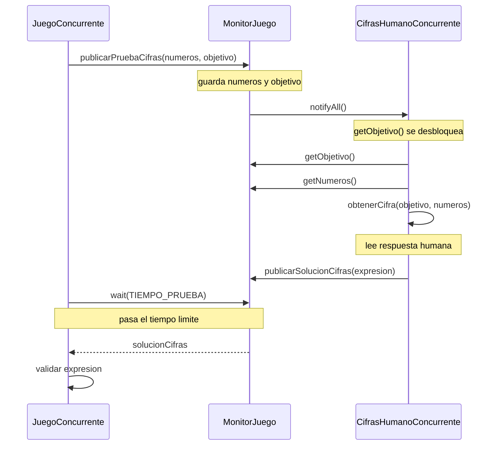

# ADSW Laboratorio 4: Concurrencia — Resolución del juego con límite de tiempo

## Contexto

Hasta ahora en los laboratorios y prácticas anteriores, hemos implementado varios `solvers` para solucionar las pruebas del juego de Cifras y Letras. En el laboratorio 0, hicimos unas implementaciones que recogian las respuestas de un jugador humano. En las prácticas 1 y 2, implementamos unas soluciones que buscaban las soluciones de forma automática. Todos estos solvers se podrían probar con la clase `JuegoHumano`, que ejecuta una serie de pruebas de cifras y de letras de forma secuencial, sin límite de tiempo. Sin embargo, en el juego real, los jugadores tienen un tiempo limitado para encontrar la solución a cada prueba. En este laboratorio, vamos a implementar una clase `JuegoConcurrente` que simule esta situación, y que ejecute cada prueba con un límite de tiempo. Si el solver no encuentra una solución dentro del tiempo límite, se considerará que ha dado una respuesta nula.

> NOTA: vamos a asumir algunas simplificaciones que en un programa real no deberían hacerse, pero nos permitirán centrarnos en la parte de concurrencia sin tener que preocuparnos por otros aspectos del programa. En concreto, los solvers que vamos a crear, se ejecutarán en un bucle infinito, forzaremos su apagado cuando el juego acabe todas las pruebas.

## Resumen

El mecanismo principal que se implementará en este laboratorio es un monitor que controlará la comunicación entre el juego y el solver. El juego avisará al monitor de que ha comenzado una nueva prueba, pasado un tiempo límite, recogerá la respuesta del solver. El solver, por su parte, se quedará esperando a que el juego le avise de que ha comenzado una nueva prueba, y cuando reciba ese aviso, comenzará a buscar la solución. En cuanto encuentre una solución, se la comunicará al monitor, que se encargará de guardarla para que el juego pueda recogerla cuando pase el tiempo límite.



## Objetivos

- [ ] Implementar la clase `MonitorJuego` que se encargará de controlar la comunicación entre el juego y el solver.
- [ ] Implementar la clase `JuegoConcurrente` que se encargará de ejecutar las pruebas de cifras y letras con un límite de tiempo.
- [ ] Convertir los solvers existentes en versiones concurrentes que se ejecuten como hilos, esperen las pruebas publicadas en el `MonitorJuego` y publiquen en él sus soluciones.

---

## Tarea 1: Implementar el monitor

El monitor coordina la comunicación entre el juego y los solvers. El juego publica una prueba y espera una solución durante un tiempo limitado. Los solvers esperan hasta que haya una prueba disponible, la resuelven y publican la solución en el monitor.

### 1. Esqueleto de la clase

Como punto de partida, crea la clase `MonitorJuego` en el paquete `juego` con el siguiente esqueleto:

```java
import java.util.List;

public class MonitorJuego {

    public static final long TIEMPO_PRUEBA = 1000;

    private String letras;
    private String solucionLetras;
    private List<Integer> numeros;
    private int objetivo;
    private String solucionCifras;

    public synchronized String publicarPruebaLetras(String letras) {
        return null;
    }

    public synchronized String publicarPruebaCifras(List<Integer> numeros, int objetivo) {
        return null;
    }

    public synchronized String getLetras() {
        return null;
    }

    public synchronized int getObjetivo() {
        return 0;
    }

    public synchronized List<Integer> getNumeros() {
        return null;
    }

    public synchronized void publicarSolucionLetras(String solucionLetras) {
    }

    public synchronized void publicarSolucionCifras(String solucionCifras) {
    }
}
```

### 2. Comportamiento esperado de los métodos

Los métodos `publicarPruebaLetras` y `publicarPruebaCifras` funcionarán de la siguiente manera:

1. Guardarán la información de la prueba (letras, números y objetivo) en el monitor.
2. Despertarán a los hilos que estén esperando una nueva prueba mediante `notifyAll()`.
3. Se bloquearán durante `TIEMPO_PRUEBA` milisegundos, esperando a que el solver publique una solución. Para esto harán uso de `wait(TIEMPO_PRUEBA)`.
4. Al terminar la espera, recuperarán la solución publicada por el solver (si la hay) y devolverán esa solución. Antes de devolver, limpiarán el estado asociado a esa prueba para que el monitor esté preparado para la siguiente prueba (ponen a `null` o `0` los atributos correspondientes).

Los métodos `getLetras` y `getObjetivo` deben bloquearse mientras no haya una prueba activa, lo que en este monitor equivale a que `letras == null` o `objetivo == 0`, respectivamente.

El método `getNumeros` simplemente devolverá la lista de números de la prueba actual, sin necesidad de bloquearse, porque el solver de cifras solo llamará a este método después de haber recibido el objetivo, y el juego publicará ambos datos al mismo tiempo.

Los métodos `publicarSolucionLetras` y `publicarSolucionCifras` simplemente almacenarán la solución propuesta por el solver en el monitor, para que el juego pueda recogerla cuando termine el tiempo de la prueba.

---

## Tarea 2: Implementar el juego concurrente

En esta tarea vas a construir la clase `JuegoConcurrente` tomando como punto de partida la clase `JuegoHumano` del Laboratorio 0.

El objetivo es mantener la misma lógica general del juego: generación de pruebas, validación de respuestas y presentación de resultados, pero cambiar el modo en que el juego obtiene las soluciones.

En `JuegoHumano`, el juego llama directamente a los métodos del solver:

- `jugadorLetras.obtenerPalabra(...)`
- `jugadorCifras.obtenerCifra(...)`

En `JuegoConcurrente`, el juego no debe llamar directamente a esos métodos. En su lugar, debe publicar cada prueba en el `MonitorJuego`, esperar como máximo `TIEMPO_PRUEBA` milisegundos y recoger desde el monitor la solución que el solver haya publicado, si ha llegado a tiempo.

### 1. Punto de partida

Copia la clase `JuegoHumano` del Laboratorio 0 y renómbrala como `JuegoConcurrente`.

La nueva clase debe conservar la lógica de generación de pruebas y validación, pero debe sustituir la obtención directa de soluciones por la comunicación a través del monitor.

Las firmas y tipos de retorno que debes respetar son:

- `public JuegoConcurrente(int pruebasCifras, int pruebasLetras, Letras jugadorLetras, Cifras jugadorCifras, MonitorJuego monitorJuego)`
- `public void jugar()`
- `private void jugarPruebasLetras()`
- `private void jugarPruebasCifras()`
- `public String generarPruebaLetrasPorFrecuencias()`
- `public int generarObjetivoCifras()`
- `public List<Integer> generarNumerosCifras()`

Los métodos de generación (`generarPruebaLetrasPorFrecuencias`, `generarObjetivoCifras` y `generarNumerosCifras`) pueden reutilizarse sin cambios desde `JuegoHumano`, para mantener el mismo comportamiento en las pruebas.

### 2. Cambios en los atributos y el constructor

Añade a la clase un atributo de tipo `MonitorJuego` y modifica el constructor para recibirlo e inicializarlo.

El constructor debe seguir encargándose de guardar el número de pruebas y las referencias a los jugadores, así como de inicializar los validadores. En esta versión concurrente, el validador de cifras debe ser `ValidadorCifrasConParentesis` en lugar de `ValidadorCifras`. Esta clase se proporciona en el anexo al final del enunciado. El validador de letras puede mantenerse como en `JuegoHumano`.

Además, el constructor debe comprobar que tanto `jugadorLetras` como `jugadorCifras` son instancias de `Thread`, ya que en este laboratorio los solvers se ejecutarán en paralelo al hilo principal del juego.

> Nota: puedes usar `instanceof` para comprobar si un objeto es instancia de `Thread`. Si alguno de los jugadores no cumple esta condición, muestra un mensaje de error y termina el programa, por ejemplo con `System.exit(1)`.

### 3. Cambios en `jugar()`

El método `jugar()` debe mantener la estructura general de `JuegoHumano`: mostrar los mensajes iniciales, ejecutar primero las pruebas de letras y después las de cifras, y mostrar un mensaje final.

La diferencia es que, antes de lanzar las pruebas, debe arrancar los dos hilos solver (`jugadorCifras` y `jugadorLetras`) mediante `start()`. A partir de ese momento, los solvers quedarán esperando en el monitor hasta que el juego publique una prueba.

Al terminar todas las pruebas, el juego debe finalizar. En este laboratorio asumimos que los solvers se ejecutan en un bucle infinito y que se puede finalizar el proceso al terminar el juego.

### 4. Cambios en `jugarPruebasLetras()`

Este método debe conservar la lógica de generación y validación de las pruebas de letras, pero debe cambiar la forma de obtener la respuesta.

Para cada prueba:

1. Genera las letras disponibles.
2. En lugar de llamar directamente a `jugadorLetras.obtenerPalabra(...)`, publica la prueba en el `MonitorJuego` con `publicarPruebaLetras(...)`.
3. Recoge la palabra devuelta por el monitor.
4. Valida la palabra recibida con `ValidadorLetras`.
5. Muestra el resultado de la prueba.

### 5. Cambios en `jugarPruebasCifras()`

Este método debe conservar la lógica de generación y validación de las pruebas de cifras, pero debe cambiar la forma de obtener la respuesta.

Para cada prueba:

1. Genera el objetivo y los números disponibles.
2. En lugar de llamar directamente a `jugadorCifras.obtenerCifra(...)`, publica la prueba en el `MonitorJuego` con `publicarPruebaCifras(...)`.
3. Recoge la expresión devuelta por el monitor.
4. Valida la expresión recibida con `ValidadorCifrasConParentesis`.
5. Muestra el resultado de la prueba.

---

## Tarea 3: Convertir los solvers existentes en hilos

En esta tarea vamos a crear varias clases nuevas, pero todas seguirán exactamente el mismo patrón. Cada solver que ya existe (`CifrasHumano`, `LetrasHumano`, y los solvers automáticos de las prácticas anteriores) necesita una versión concurrente que se ejecute en su propio hilo y se comunique con el juego a través del `MonitorJuego`.

Las clases que hay que crear son:

- `CifrasHumanoConcurrente` — versión concurrente de `CifrasHumano`
- `LetrasHumanoConcurrente` — versión concurrente de `LetrasHumano`
- `CifrasPracticaConcurrente` — versión concurrente del solver automático de cifras
- `LetrasPracticaConcurrente` — versión concurrente del solver automático de letras

Todas se crean del mismo modo. Para cada una, copia la clase original correspondiente y aplica los siguientes pasos:

**Paso 1.** Haz que la clase extienda `Thread` además de implementar su interfaz (`Cifras` o `Letras`):

```java
public class CifrasHumanoConcurrente extends Thread implements Cifras {
```

**Paso 2.** Añade un atributo `MonitorJuego monitorJuego` y recíbelo en el constructor junto con los parámetros que ya tenía la clase original:

```java
private MonitorJuego monitorJuego;

public CifrasHumanoConcurrente(Scanner sc, MonitorJuego monitorJuego) {
    this.sc = sc;
    this.monitorJuego = monitorJuego;
}
```

**Paso 3.** Mantén el método `obtenerCifra` (o `obtenerPalabra`) tal y como estaba en la clase original; no hace falta cambiarlo.

**Paso 4.** Añade el método `run()`, que contiene el bucle infinito del hilo. Su estructura es siempre la misma: pedir al monitor los datos de la prueba actual (bloqueante hasta que el juego publique una nueva), resolver y publicar el resultado.

Para el solver de cifras:

```java
@Override
public void run() {
    while (true) {
        int objetivo = monitorJuego.getObjetivo(); 
        List<Integer> numeros = monitorJuego.getNumeros(); 
        String solucion = obtenerCifra(objetivo, numeros); 
        monitorJuego.publicarSolucionCifras(solucion); 
    }
}
```

Para el solver de letras:

```java
@Override
public void run() {
    while (true) {
        String letras = monitorJuego.getLetras();
        String solucion = obtenerPalabra(letras);
        monitorJuego.publicarSolucionLetras(solucion);
    }
}
```

El punto clave es que `getObjetivo()` y `getLetras()` son bloqueantes: el hilo solver quedará dormido ahí hasta que el juego publique una nueva prueba. En ese momento se despertará, calculará la solución llamando al método que ya tenía y la dejará en el monitor. No hace falta ningún otro mecanismo de sincronización en el solver.

Una vez creadas las cuatro clases, comprueba que `JuegoConcurrente` puede instanciarse con cualquier combinación de solver humano y automático, pasando el mismo `MonitorJuego` a todos ellos.

---

## Tarea 4: Ejecutar y probar el juego concurrente

Una vez implementadas las tres clases anteriores, es el momento de probarlo todo junto ejecutando `JuegoConcurrente`.

El main de JuegoConcurrente necesita un MonitorJuego compartido y dos solvers concurrentes, uno para letras y otro para cifras. Prueba las dos combinaciones siguientes:

**Combinación 1: solvers humanos**

Ambos solvers leen la respuesta por consola. El juego mostrará la prueba y tendrás TIEMPO_PRUEBA milisegundos para escribir tu respuesta antes de que se considere nula.

```java
Scanner sc = new Scanner(System.in);
MonitorJuego monitor = new MonitorJuego();
JuegoConcurrente juego = new JuegoConcurrente(
    2, 2,
    new LetrasHumanoConcurrente(sc, monitor),
    new CifrasHumanoConcurrente(sc, monitor),
    monitor
);
juego.jugar();
```

Comprueba que:
- Si escribes una respuesta antes de que venza el tiempo, el juego la valida.
- Si no escribes nada a tiempo, el juego muestra que la solución recibida es null y continúa con la siguiente prueba.

**Combinación 2: solvers automáticos**

Los solvers de las prácticas anteriores calculan la respuesta sin intervención humana.

```java
MonitorJuego monitor = new MonitorJuego();
JuegoConcurrente juego = new JuegoConcurrente(
    5, 5,
    new LetrasPracticaConcurrente(monitor),
    new CifrasPracticaConcurrente(monitor),
    monitor
);
juego.jugar();
```

Comprueba que:
- Los solvers encuentran una solución válida en la mayoría de las pruebas dentro del tiempo límite.
- El juego no se bloquea aunque el solver tarde más de TIEMPO_PRUEBA en responder.
- El juego termina correctamente después de todas las pruebas.

## Anexo: ValidadorCifrasConParentesis

Esta clase se proporciona ya implementada. Valida expresiones aritméticas con paréntesis y precedencia de operadores, siguiendo el formato `resultado = expresion`.

```java
package es.upm.dit.adsw.cifrasyletras.juego;

import java.util.ArrayDeque;
import java.util.ArrayList;
import java.util.Deque;
import java.util.List;

public class ValidadorCifrasConParentesis {

    public boolean numerosUsadosValidos(String expresion, List<Integer> numerosDisponibles) {
        List<Integer> numerosSinUsar = new ArrayList<>(numerosDisponibles);
        for (String token : expresion.split("[^0-9]+")) {
            if (token.isEmpty()) continue;
            try {
                Integer n = Integer.parseInt(token);
                if (!numerosSinUsar.remove(n)) {
                    System.out.println("Número no disponible: " + n);
                    return false;
                }
            } catch (NumberFormatException e) {
                System.out.println("Token no válido: " + token);
                return false;
            }
        }
        return true;
    }

    public boolean esValida(String expresion, List<Integer> numerosDisponibles) {
        if (expresion == null) return false;
        String[] partes = expresion.trim().split("\\s*=\\s*", 2);
        if (partes.length != 2) {
            System.out.println("Formato incorrecto, falta '='");
            return false;
        }
        int resultado;
        try {
            resultado = Integer.parseInt(partes[0].trim());
        } catch (NumberFormatException e) {
            System.out.println("Resultado no es un número: " + partes[0]);
            return false;
        }
        String exprParte = partes[1].trim();
        if (!numerosUsadosValidos(exprParte, numerosDisponibles)) return false;
        int resultadoCalculado;
        try {
            resultadoCalculado = evaluar(exprParte);
        } catch (Exception e) {
            System.out.println("Error al evaluar expresión: " + e.getMessage());
            return false;
        }
        if (resultadoCalculado != resultado) {
            System.out.println("El resultado calculado " + resultadoCalculado
                    + " no coincide con el resultado esperado " + resultado);
            return false;
        }
        return true;
    }

    private int evaluar(String expresion) {
        Deque<Integer> valores = new ArrayDeque<>();
        Deque<Character> ops = new ArrayDeque<>();
        String s = expresion.replaceAll("\\s+", "");
        int i = 0;
        while (i < s.length()) {
            char c = s.charAt(i);
            if (Character.isDigit(c)) {
                int num = 0;
                while (i < s.length() && Character.isDigit(s.charAt(i)))
                    num = num * 10 + (s.charAt(i++) - '0');
                valores.push(num);
                continue;
            } else if (c == '(') {
                ops.push(c);
            } else if (c == ')') {
                while (ops.peek() != '(')
                    valores.push(aplicar(ops.pop(), valores.pop(), valores.pop()));
                ops.pop();
            } else if (c == '+' || c == '-' || c == '*' || c == '/') {
                while (!ops.isEmpty() && ops.peek() != '('
                        && precedencia(ops.peek()) >= precedencia(c))
                    valores.push(aplicar(ops.pop(), valores.pop(), valores.pop()));
                ops.push(c);
            } else {
                throw new IllegalArgumentException("Carácter no válido: " + c);
            }
            i++;
        }
        while (!ops.isEmpty())
            valores.push(aplicar(ops.pop(), valores.pop(), valores.pop()));
        return valores.pop();
    }

    private int precedencia(char op) {
        if (op == '+' || op == '-') return 1;
        if (op == '*' || op == '/') return 2;
        return 0;
    }

    private int aplicar(char op, int b, int a) {
        switch (op) {
            case '+': return a + b;
            case '-':
                int r = a - b;
                if (r < 0) throw new ArithmeticException("Resultado intermedio negativo");
                return r;
            case '*': return a * b;
            case '/':
                if (b == 0 || a % b != 0) throw new ArithmeticException("División no válida");
                return a / b;
            default: throw new IllegalArgumentException("Operador no válido: " + op);
        }
    }
}
```