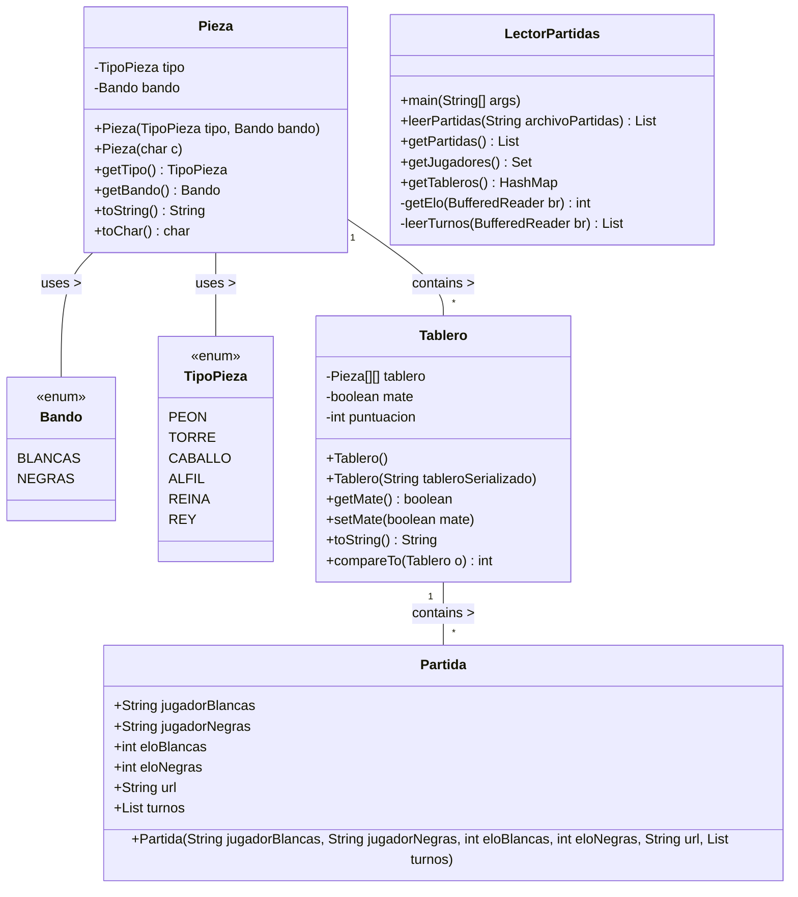

# ADSW Laboratorio 0: Introducción

En este laboratorio introductorio veremos las clases y datos básicos que utilizaremos durante el resto de laboratorios y prácticas.
También reforzaremos conceptos básicos de programación como la depuración y el uso de pruebas unitarias.

El laboratorio está estructurado de manera lineal, por lo que para completar un apartado es necesario haber completado los apartados anteriores.

En los siguientes laboratorios y prácticas partiremos de este código para resolver problemas la búsqueda eficiente de partidas, la ordenación de tableros y partidas por diversos criterios o la recomendación de movimientos a partir de una partida incompleta.

## Objetivos

- Familiarizarse con los datos y las clases principales que usaremos en el resto de laboratorios y prácticas
- Poner en práctica conceptos de depuración de programas mediante el depurador
- Utilizar e implementar pruebas con JUnit

## Diagrama de clases



## Datos

El conjunto de datos se compone de partidas de ajedrez jugadas en la web lichess.
Cada una de las partidas se presenta en formato PGN (Portable Game Notation) (https://en.wikipedia.org/wiki/Portable_Game_Notation), que se resume en un conjunto de líneas en el siguiente orden:

* Identificador/URL de la partida
* Usuario que juega con blancas
* Usuario que juega con negras
* ELO de blancas
* ELO de negras
* Estado del tablero en cada uno de los turnos

Las partidas están separadas por una o más líneas en blanco.

El formato PGN es un estándar para representar partidas de ajedrez que permite almacenar las partidas de forma compacta; sin embargo, es un formato complejo de procesar. Para simplificar la tarea, los archivos de datos proporcionados incluyen una versión simplificada de los tableros en cada turno. Cada tablero se  representa con un String de 64 caracteres. Cada carácter representa una casilla del tablero y puede ser una de las siguientes letras (mayúsculas para piezas blancas y minúsculas para piezas negras):

| Letra | Pieza |
| ----- | ----- |
| K | Rey |
| Q | Reina |
| R | Torre |
| B | Alfil |
| N | Caballo |
| P | Peón |
| . | Casilla vacía |

Este formato es, a su vez, una simplificación del formato FEN (https://en.wikipedia.org/wiki/Forsyth%E2%80%93Edwards_Notation).
Como ejemplo, la representación `rnbqkbnrpppppppp................................PPPPPPPPRNBQKBNR` corresponde a esta posición del tablero:


A continuación se muestra un ejemplo de partida entre `mahdii` (ELO 1353) y `eldar63` (ELO 1270) de sólo 5 movimientos:

```
https://lichess.org/vnj19xwf
mahdii
eldar63
1353
1270
rnbqkbnrpppppppp.............................N..PPPPPPPPRNBQKB.R
rnbqkbnrpppppp.p......p......................N..PPPPPPPPRNBQKB.R
rnbqkbnrpppppp.p......p..................P...N..P.PPPPPPRNBQKB.R
rnbqk.nrppppppbp......p..................P...N..P.PPPPPPRNBQKB.R
rnbqk.nrppppppbp......p..................PN..N..P.PPPPPPR.BQKB.R
```

La partida se puede visualizar visitando la [URL de la partida](https://lichess.org/vnj19xwf)

## Tareas

### Descarga y ejecución del código

La primera tarea consiste en comprobar que el código proporcionado es capaz de leer un fichero de partidas proporcionado.
Para ello, primero deberemos descargar el código del repositorio de GitHub e importarlo en Eclipse.
Los pasos para instalarlo en Eclipse se describen en el [Anexo 1](#anexo-1-cargar-un-proyecto-en-eclipse).

Una vez importado el proyecto, se puede proceder a ejecutar la clase principal, `LectorPartidas`.
Esta clase incluye un método `main` que nos sirve como prueba básica de funcionamiento
de nuestro código (*smoke test*[^1]).
Si todo funciona correctamente, veremos que el programa indica que se han leído 4 partidas.

> [!IMPORTANT]
> En la ejecución del programa:
> * ¿Qué información se muestra además de las partidas leídas?
> * ¿Hay alguna diferencia entre la salida mostrada y un print normal? ¿A qué se debe?

Por otro lado, el código proporcionado incluye una serie de pruebas que podremos usar para comprobar el buen funcionamiento del programa de una manera más exhaustiva.
Estas pruebas están en la clase `es.upm.dit.adsw.test.Lab0Test`.

> [!IMPORTANT]
> En el conjunto de pruebas del programa:
> * ¿Qué casos se están probando?
> * ¿Son suficientes estas pruebas para garantizar que el programa funciona?

### Ejecución con otros ficheros de partidas

Con las pruebas ya lanzadas, tenemos mayor confianza de que el programa funciona de forma correcta.
Por tanto, vamos a proceder a lanzar el programa con un fichero de partidas más extenso (`partidas.txt`).

En este punto nuestro programa no hace mucho, pero sí podemos comprobar cuántas partidas, tableros y jugadores hay en el fichero proporcionado.
Como en el futuro querremos poder lanzar nuestro programa con diferentes ficheros de partidas sin modificar el código, lo primero que haremos será modificar el código para que el fichero a usar se pueda proporcionar como argumento al programa.
Después, crearemos nueva configuración de ejecución para cada fichero que queramos lanzar.
Primero se debe crear una configuración que utilice como argumento el fichero `muestra.txt`.
Al lanzar esta configuración, el resultado debería ser idéntico al obtenido antes de este apartado.

> [!TIP]
> Es aconsejable utilizar un nombre descriptivo para la configuración. En este caso, podría utilizarse uno como "LeerPartidasMuestra"

Una vez hemos comprobado que el caso anterior funciona, procederemos a crear y lanzar otra **nueva** configuración que utilice el fichero `partidas.txt`.

> [!CAUTION]
> ¿Cuántas partidas es capaz de leer el programa?\
> ¿Hay algún fallo en la ejecución?

### Arreglando el código

Hemos podido comprobar que nuestro código falla con ficheros de partidas reales.
Para poder utilizar nuestro programa deberemos encontrar el error y subsanarlo.
Para encontrar el problema vamos a hacer uso de depuración en nuestro entorno de desarrollo.

Además, vamos a ampliar el conjunto de pruebas proporcionadas para automatizar la comprobación del código y para asegurarnos de que versiones futuras del código siguen leyendo correctamente.

El proceso resumido será el siguiente:

* Depurar el código de nuestro lector hasta encontrar el motivo del fallo
* Desarrollar una prueba que replique las condiciones del error en un ejemplo mucho más sencillo
* Modificar el código para evitar el fallo

Los siguientes subapartados describen cada paso en más detalle.

#### Depuración

Para identificar y eliminar errores de un programa que compila y ejecuta pero que no produce resultados correctos hay dos alternativas que no son excluyentes.

La primera es modificar el programa para que produzca más información sobre su estado (p.e., qué línea está procesando y qué valor tienen las variables interesantes).
Esta información producida por el programa se llaman trazas, y el proceso de generación se describe en un anexo.

La segunda es utilizar el depurador.
El depurador ejecuta el programa de forma interactiva, permitiendo observar una a una las instrucciones que se ejecutarán, las variables activas en memoria y sus valores.
Para iniciar el depurador sobre la clase que contiene el método `main` se puede acceder a `Menú: Run-\>Debug`, pulsar sobre el icono de ejecución de depuración o utilizar el atajo de teclado (recomendado).

Las herramientas disponibles para el control de la ejecución son varias:

-   **Puntos de parada "*breakpoints".*** Paran la ejecución del programa en instrucciones determinadas.
-   **Perspectiva de depuración** con las siguientes vistas:
    -   Vista de visualización y modificación de valores de variables. Vista de consola que muestra la salida del programa
    -   Vista de editor del código fuente con una línea verde en la instrucción que va a ser ejecutada
    -   Vista de depuración indicando la línea de código que va a ser ejecutada
    -   Vista de vigilancia de expresiones
    
-    **Control de la ejecución** paso a paso, entrando
    en los métodos (*Step in)* o ejecutando los métodos completos y
    parando al terminar de ejecutarlos (*Step over*).

Para buscar un error en nuestro programa pondremos un punto de parada en la primera sentencia ejecutable del método `main`.
Iremos ejecutando controladamente el código entrando en los métodos que nos interesen, saltando las instrucciones que ejecutan constructores o llamadas a métodos de clases de la API de Java.

Se observa que las variables locales como `archivoPartidas` o `lector` sólo aparecen en la vista de variables en memoria tras su declaración.
Al entrar en la ejecución del constructor `LectorPartidas` se modifican varias vistas.
En la del editor se cambia el código mostrado al del constructor.
En la vista de variables se observan las variables disponibles en el constructor: la referencia a la propia
instancia, *this*, y el parámetro `fichero`.
Estas variables contienen los valores pasados al invocar el método.

Utilice el depurador para ver qué ocurre e inspeccionar los valores de las variables importantes antes de que se produzca el error.
Al ejecutar el programa en modo debug, éste se parará en el primer punto de parada.
Siga la ejecución hasta al siguiente punto de parada para ya ir instrucción a instrucción.

> [!CAUTION]
> ¿En qué posición del fichero se produce el error?\
> ¿A qué se debe el error?

#### Desarrollo de una prueba

Antes de proceder a arreglar el error del código, debemos crear una nueva prueba que capture la condición del error y que nos permita reproducirlo de forma rápida.

Para crear nuevas pruebas tenemos dos opciones.
La primera es añadir una prueba al conjunto de pruebas proporcionado.
Esto se consigue mediante un nuevo método anotado con `@Test`.
La otra opción es crear un caso de prueba nuevo en un fichero independiente.
Esto se puede hacer teniendo el fichero de la clase a probar abierto y yendo al menú `File \> New \>` Junit Test Case.
Habrá que seleccionar la opción `New JUnit Jupiter test` y contestar afirmativamente si el entorno pide añadir la biblioteca Junit 5 al proyecto.

Para hacer la prueba, es aconsejable crear un fichero de partidas que contenga un ejemplo sencillo en que se reproduzca el error visto en el fichero completo.
Es importante que ese fichero sea lo más simple posible, para hacerlo más fácil de entender y para evitar introducir algún otro error no relacionado.
En este caso, deberán introducirse el menor número de partidas y el menor número de tableros necesarios para reproducir el error.

Una vez añadido el caso de prueba, se debe lanzar al menos una vez para comprobar que el test falla en el estado actual del código.

<details>
  <summary>El motivo del fallo es... (leer sólo en caso de emergencia)</summary>
  
  El código de lectura del fichero no tiene en cuenta los casos con más de una línea en blanco entre partidas.
  Lo deseable sería que nuestro código ignorase las líneas en blanco
  
</details>

#### Modificación del código

Una vez comprobada la prueba, es hora de modificar el código y comprobar que funciona la nueva versión lanzando todas las pruebas existentes. 


### Mejoras sobre el código (Avanzado, opcional)

Partiendo del código arreglado, se proponen las siguientes mejoras:

- Mostrar el tablero más repetido en todas las partidas.
- Mostrar los cinco tableros más repetidos
- Modificar el lector de tableros para que no almacene la lista de tableros, y lea todos los tableros de las partidas almacenadas cada vez que se ejecuta el método `getTableros`
- Visualizar el tablero en formar de cuadrícula, en lugar de mostrar todo en una línea.


Algunas sugerencias de presentación para la visualización:

```
rnbqkbnr
pppppppp
........
........
........
........
PPPPPPPP
RNBQKBNR


♜♞♝♛♚♝♞♜
♟♟♟♟♟♟♟♟
□■□■□■□■
■□■□■□■□
□■□■□■□■
■□■□■□■□
♙♙♙♙♙♙♙♙
♖♘♗♕♔♗♘♖
```

## Anexos:

### Anexo 1: Cargar un proyecto en Eclipse

Alternativa 1: 

- Descomprime el fichero (ADSW-lab0.zip) que se obtenido

- Seleccione el menú File > Import > Existing Projects into
  Workspace > Next
- Navegue hasta el directorio que se ha generado al descomprimir 
  el fichero original.
- Compruebe que el proyecto está marcado, y seleccione Finish


### Anexo 2: Generar y acceder a la documentación con Javadoc en Eclipse

La documentación existente se encuentra en la carpeta *doc* del
proyecto. Para consultarla, abra el fichero *index.html* en un navegador
(botón derecho \> Open with \> Web browser).

También puede consultar la documentación desde una ventana del editor de
código Java. Si posiciona el ratón sobre el nombre de una clase o un
método aparece una ventana auxiliar con un resumen de la documentación.

Si tiene activada la vista *Javadoc* (con Window \> Show View \>
Javadoc), al hacer clic sobre el nombre de un elemento se mostrará la
documentación correspondiente en la ventana correspondiente a esta
vista.

Para generar o actualizar la documentación *javadoc* vaya al menú
Project \> Generate Javadoc. Si aparecen errores de codificación de
caracteres asegúrese de poner las opciones -encoding utf8 -docencoding
utf8 -charset utf8 en el cuadro *VM options* de la tercera ventana que
aparece (después de hacer Next dos veces).


### Anexo 3: Configurar el registrador (*logger*) java.util.logging

En algunas implementaciones, la opción previa duplica las trazas. A continuación, se proporciona otra opción:

-  Importar el paquete

```java
import java.util.logging.*;
```
- Crear un atributo de las clase, llamado LOGGER. 

```java
static Logger LOGGER;
```
Se caracteriza como *static* para que otras clases del proyecto puedan usar este *logger*. Para ello, se podría invocar desde cualquiera clase como: 

```java
LectorPartidas.LOGGER.fine("Prueba");
```
- Copiar el fichero logging.properties por defecto en un directorio del usuario. Este fichero se encuentra en el paquete de Java en cada computador. Para facilitar, se adjunta una versión de este fichero en Moodle. 

- Asignar el nivel por defecto de la consola a: FINEST

```java
java.util.logging.ConsoleHandler.level = FINEST
java.util.logging.ConsoleHandler.formatter = java.util.logging.SimpleFormatter
```

- En el código definir el fichero de configuración que el usuario ha cambiado y crear el gestor de trazas en el constructor de la clase con el *main* a ejecutar:

```java
System.setProperty("java.util.logging.config.file", "/MiDirectorio/logging.properties");
LOGGER = Logger.getLogger(ConfigurarSuma.class.getName());

```
	
- Finalmente, es posible elegir el nivel preferido:

```
	LOGGER.setLevel(Level.FINER);
```

[^1]: Un *smoke test* es una prueba elemental de que un programa funciona, sin entrar en detalles ni casos particulares.
