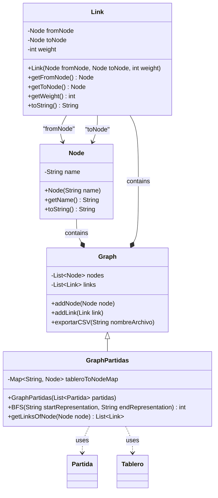

# 🌟 Laboratorio 3 de ADSW: Explorando Grafos en el Ajedrez 🌟

¡Bienvenidos al tercer laboratorio de ADSW! En esta ocasión, nos adentraremos en el fascinante mundo de los grafos 🌐. 

Usaremos nuestro conocimiento para explorar partidas de ajedrez de una manera única, representando todas las partidas como un grafo donde los nodos son tableros y las aristas son los movimientos de una pieza de un tablero a otro.

## Pre-requisitos 📚

Antes de comenzar, asegúrate de tener:
- Una comprensión básica de grafos y cómo representarlos en código.
- El modelo de `Partida` y `Tablero`, así como la clase `LectorPartidas` de laboratorios anteriores.
- Ganas de explorar y visualizar grafos de maneras creativas.

## Objetivos del Laboratorio 🔍

1. Implementar la clase `GraphPartidas`, extendiendo la funcionalidad de las clases `Graph`, `Node` y `Link` que te proporcionamos.
2. Utilizar el método `exportarCSV` para exportar el grafo en CSV y luego visualizarlo en la herramienta online [Cosmograph](https://cosmograph.app/), lo que te permitirá ver de manera gráfica las conexiones entre los diferentes tableros de ajedrez.
3. Desarrollar un método para realizar búsquedas en anchura (BFS) para encontrar la distancia más corta entre dos representaciones de tablero en el grafo.

---

### ¿Por qué usar el algoritmo de BFS? 

El algoritmo de Búsqueda en Anchura (BFS, por sus siglas en inglés) es una estructura de algoritmo ampliamente utilizada el estudio de grafos, especialmente útil para encontrar el camino más corto entre dos nodos en términos de cantidad de aristas o "saltos". 

Esta característica lo hace particularmente valioso en el contexto de nuestra aplicación, donde cada nodo representa un tablero de ajedrez y cada arista un movimiento. Utilizar BFS nos permite determinar la menor cantidad de movimientos necesarios para pasar de un estado del tablero a otro. 

En las clases de teoría, se ha trabajado con el algoritmo de Dijkstra, que también permite encontrar el camino mínimo entre dos nodos. Entonces, ¿cuál es la diferencia entre estos dos algoritmos? En términos generales, ninguna; ambos resuelven el mismo problema y tienen la misma complejidad, al menos en escenarios como el que vamos a trabajar en este laboratorio. El matiz que realmente nos hace decantarnos por uno u otro es que el algoritmo de Dijkstra está diseñado para trabajar con aristas que tengan pesos. Dijkstra explora el grafo partiendo desde el nodo origen, comprobando siempre el nodo con el camino más corto que aún no haya sido visitado, es decir, recorre el grafo siguiendo algún tipo de orden. Por otro lado, BFS es más simple o "tonto", según se mire, ya que no suele tener en cuenta los pesos de las aristas, pero a cambio, tiene una lógica mucho más sencilla. En resumen, ante un grafo sin pesos, ambos algoritmos se comportan de manera similar; elegimos BFS porque es más sencillo.

En secciones sucesivas analizaremos el algoritmo de BFS, sus estructuras y el pseudo código.

## Clases Provistas 🧩

Te proporcionamos el código base para las clases `Graph`, `Node`, y `Link`. Estas clases formarán la base sobre la que construirás `GraphPartidas`.

Es muy importante que estudies y analices las clases que te proporcionamos para que entiendas su funcionamiento antes de copiar y pegar a lo loco. 🧐

A continuación de mostramos el diagrama de clases de las clases provistas y más adelante el código para que puedas copiarlo a tu proyecto.




### Clase Node
```java
public class Node {
    private String name;

    public Node(String name) {
        this.name = name;
    }

    public String getName() {
        return name;
    }

    @Override
    public String toString() {
        return name;
    }
}
```

### Clase Link
```java
public class Link {
    private Node fromNode;
    private Node toNode;
    private int weight;

    public Link(Node fromNode, Node toNode, int weight) {
        this.fromNode = fromNode;
        this.toNode = toNode;
        this.weight = weight;
    }

    public Node getFromNode() {
        return fromNode;
    }

    public Node getToNode() {
        return toNode;
    }

    public int getWeight() {
        return weight;
    }

    @Override
    public String toString() {
        return fromNode + " -> " + toNode + " [Weight: " + weight + "]";
    }
}
```

### Clase Graph
```java
import java.util.ArrayList;
import java.util.HashMap;
import java.util.List;
import java.util.Map;
import java.io.FileWriter;
import java.io.PrintWriter;
import java.io.IOException;

public class Graph {
    protected List<Node> nodes = new ArrayList<>();
    protected List<Link> links = new ArrayList<>();

    public void addNode(Node node) {
        // Flag para verificar si el nodo ya existe
        boolean exists = false;

        // Buscar en la lista de nodos existentes
        for (Node existingNode : nodes) {
            if (existingNode.getName().equals(node.getName())) {
                exists = true;
                break; // Salir del bucle si se encuentra un nodo con el mismo nombre
            }
        }

        // Añadir el nodo solo si no existe uno con el mismo nombre
        if (!exists) {
            nodes.add(node);
        } else {
            System.out.println("Ya existe un nodo con el nombre: '" + node.getName() + "'.");
        }
    }

    public void addLink(Link link) {
        links.add(link);
    }

    public void exportarCSV(String nombreArchivo) {
        try (PrintWriter pw = new PrintWriter(new FileWriter(nombreArchivo))) {
            // Escribir el encabezado en la primera línea
            pw.println("from,to,weight");

            // Iterar sobre cada enlace y escribir sus datos en el archivo
            for (Link link : links) {
                int fromNodeHash = link.getFromNode().hashCode();
                int toNodeHash = link.getToNode().hashCode();
                int weight = link.getWeight();
                pw.println(fromNodeHash + "," + toNodeHash + "," + weight);
            }
        } catch (IOException e) {
            System.err.println("Error al escribir el archivo: " + e.getMessage());
        }
    }
}
```

---

**Nota: 📝**

Copia el código de las clases anteriores en tu proyecto. Pero recuerda que debes mantener el paquete que estés usando.

---

## Tu Misión, si decides aceptarla 🚀

### Paso 1: Implementa `GraphPartidas`

Tu primera tarea es implementar la clase `GraphPartidas`. Esta clase debe extender (heredar) la clase `Graph` y utilizar las clases `Partida` y `Tablero` para construir el grafo.

#### Constructor `GraphPartidas`

El método constructor debe tener la siguiente cabecera:

```java
public GraphPartidas(List<Partida> partidas) {
    // TODO: Implementar el constructor
}
```

**Pseudocódigo del Constructor:**

1. Para cada `Partida` en `partidas`, iterar a través de los `Tablero` en `Partida`.
2. Crear o encontrar un nodo para cada `Tablero` basado en su representación [FEN](https://en.wikipedia.org/wiki/Forsyth%E2%80%93Edwards_Notation) que os recordamos que lo explicamos en el [lab0](https://github.com/adsw-upm/adsw-laboratorios/tree/main/lab0) 
3. Conectar nodos consecutivos con aristas, representando movimientos entre tableros.

Recuerda que tienes que crear un nodo por cada Tablero, pero si te vuelves a encontrar un tablero que se representa por un Nodo no debes crear uno nuevo. Puedes crear todas las aristas asignándoles un peso (weight) de 1.

Para ello te proponemos la siguiente nota.

---

**Nota: 📝**

Para facilitar la implementación de la clase `GraphPartidas` y hacer más sencillo el manejo de los nodos del grafo, considera usar la siguiente estructura dentro de tu clase:

```java
private Map<String, Node> tableroToNodeMap = new HashMap<String, Node>();
```

Este mapa te permitirá asociar la representación de un tablero (en formato [FEN](https://en.wikipedia.org/wiki/Forsyth%E2%80%93Edwards_Notation) ) directamente con el nodo correspondiente en el grafo. Usar este mapa simplificará significativamente el proceso de búsqueda y conexión de nodos, especialmente cuando estés construyendo el grafo y cuando realicemos la búsqueda en anchura (BFS).

---


### Paso 2: Carga y Prueba con Archivos de Diferente Tamaño 📂➡️🔍

Una vez implementada tu clase `GraphPartidas`, es hora de ponerla a prueba. Comienza cargando un fichero de muestra que contenga partidas de ajedrez representadas como grafos. Empieza probando con el fichero "muestra.txt". Es recomendable que empieces con archivos pequeños y vayas incrementando el tamaño gradualmente. Esto te permitirá observar cómo se comporta tu programa con conjuntos de datos de diferentes magnitudes.

🚨 **Advertencia:** Ten especial cuidado al trabajar con archivos más grandes, como "partidas.txt", ya que el procesamiento de estos puede tardar más de 10 minutos. Empieza haciendo pruebas con ficheros con pocos datos y continua probando con ficheros con más partidas.


**Ejemplo de Uso:**
```java
String archivoPartidas = "data/muestra.txt";
List<Partida> partidas = LectorPartidas.leerPartidas(archivoPartidas);
GraphPartidas gp = new GraphPartidas(partidas);
// OJO!! ten cuidado en no sobreescribir el fichero "muestra.txt" 
gp.exportarCSV("data/muestra.csv");
```

Con el archivo CSV generado, ahora puedes visualizar tu grafo utilizando [Cosmograph](https://cosmograph.app). 

Simplemente sigue estos pasos: ve a "launch" -> "load graph" y arrastra el fichero CSV que acabas de generar. En la configuración, asegúrate de que en "Source column" aparezca "from" y en "Target column" aparezca "to". Si no es así, necesitarás revisar tu proceso de generación del CSV.


---


### Paso 3: Método Auxiliar `getLinksOfNode`

Para facilitar la implementación de BFS, crea un método auxiliar en `Graph` que devuelva todos los enlaces salientes de un nodo dado.

**Pseudocódigo de `getLinksOfNode`:**

```java
public List<Link> getLinksOfNode(Node node) {
    // TODO: Implementar el método
}
```
**Pseudocódigo:**

1. Inicializa una lista vacía para almacenar enlaces salientes.
2. Para cada enlace en la lista de enlaces...
    2.1 Si el enlace sale del nodo dado, añádelo a la lista.
3. Devuelve la lista de enlaces salientes.

### Paso 4: Implementa BFS en `GraphPartidas`

Implementa el algoritmo de búsqueda en anchura (BFS) para encontrar la distancia más corta entre dos nodos basados en sus representaciones [FEN](https://en.wikipedia.org/wiki/Forsyth%E2%80%93Edwards_Notation) 

```java
public int BFS(String startRepresentation, String endRepresentation) {
    // TODO: Implementar el algoritmo BFS
}

```
**Nota: 📝** 
Recuerda que puedes usar la estructura que definiste anteriormente para mapear representaciones de tablero a nodos.

```java
private Map<String, Node> tableroToNodeMap = new HashMap<String, Node>();
```


### Algoritmo de BFS

Para empezar, os dejamos un enlace a un video de esos "otros" 🕵️‍♂️ (sí, la competencia), pero creemos que es tan bueno que merece ser visto. En él se explica el funcionamiento del algoritmo BFS de manera sencilla.

[](https://www.youtube.com/watch?v=_no9DorK0ww)

Os proporcionamos el enlace al algoritmo BFS en VisuAlgo [VisuAlgo](https://visualgo.net/en/dfsbfs) para puedas comprobar su funcionamiento de manera visual.

Después de explorar el algoritmo de Búsqueda en Anchura (BFS) a través del video, es momento de sumergirnos en cómo podemos implementar este concepto en Java. 🌟 Sabemos que BFS es como un explorador que recorre un mapa (el grafo) buscando el tesoro (el nodo destino) de la manera más eficiente posible. Pero, ¿qué estructuras de datos vamos a necesitar? 🛠️

#### Estructuras de datos necesarias

Antes de sumergirnos en el funcionamiento del algoritmo 🔄, es crucial comprender las estructuras de datos que necesitaremos. Tras visualizar el vídeo, ¿te atreves a pensar cuáles son esas estructuras necesarias? 🤔 

Haz una pausa aquí y reflexiona. ¿Logras identificarlas? Recuerda, el verdadero desafío de este curso es desarrollar esta habilidad analítica, ya que en el examen no contarás con una guía paso a paso. ¡Es hora de activar tu ingenio y poner a prueba tus conocimientos!

¿Ya lo has pensado? ¡Entonces continúa! 🚀

### 1. 🗂️ Estructura para Nodos Visitados

Primero, necesitamos una manera de recordar a dónde hemos ido para no perder tiempo visitando los mismos lugares y evitar ciclos infinitos. Para esto, utilizaremos una estructura que funcione como un registro de nodos ya explorados. Podríamos optar por un HashSet, un ArrayList, o un HashMap. Sin embargo, vamos a inclinarnos por usar un HashMap por su eficiencia en términos de complejidad. Aquí, la clave es un objeto de la clase `Node`, y el valor es un `Boolean` (recuerda, debe ser el objeto envoltorio `Boolean`, no el primitivo `boolean`). 🧐

### 2. 📏 Estructura para Guardar Distancias

Además, queremos saber cuán lejos hemos llegado, especialmente si buscamos el camino más corto.  Otra vez más podemos utilizar un array, un ArrayList, etc. Pero vamos a volver a elegir un HashMap. Esta vez, asociaremos cada `Node` con un `Integer` que representa su distancia desde el punto de inicio. Importante: al igual que antes, utilizamos la clase envoltorio `Integer` en lugar del tipo primitivo `int`.

### 3. 🚀 Estructura Tipo Cola para Nodos a Visitar

Ahora, ¿cómo decidimos nuestro próximo destino? Necesitamos una cola [FIFO - First In, First Out](https://es.wikipedia.org/wiki/First_in,_first_out ) que nos diga cuál nodo visitar a continuación. Piensa en esto como la cola de una taquilla de cine; el primero que llega es el primero en ser atendido. Aunque Java proporciona la interfaz [Queue](https://docs.oracle.com/javase/8/docs/api/java/util/Queue.html)  para implementar colas, que si quieres puedes usar con total libertad, puedes sentirte más cómodidad usando algo más familiar como `ArrayList<Node>`. Al usar un ArrayList, podríamos considerar extraer y eliminar el primer elemento para simular una cola. Pero, ¿sabías que el método `remove` de `ArrayList` no solo elimina un elemento sino que también lo devuelve? Así, podemos manejar esta operación en un solo paso. ✨ 
Revisa la documentación del método [remove de la clase ArrayList](https://docs.oracle.com/javase/8/docs/api/java/util/ArrayList.html#remove-int-) 

#### Pseudo código del algoritmo de BFS

1. 🌟 Inicialización: Crea tres ArrayLists: `cola` para los nodos a visitar, `visitados` para marcar nodos ya explorados, y `distancias` para las distancias desde el nodo inicial.
2. 🚪 Agrega el nodo inicial a `cola`, marca como visitado en `visitados`, y establece su distancia en `distancias` a 0. El resto de las distancias deberá ser infinito. 
3. 🔄 Mientras `cola` no esté vacía:
   - 📤 Saca el primer nodo de `cola`.
   - 🎯 Si el nodo es el destino, ¡celebra! Has encontrado la distancia mínima.
   - 🌍 Para cada vecino del nodo actual:
     - Si no ha sido visitado, entonces visítalo y para ello debes hacer:
       - Márcalo como visitado.
       - Actualiza su distancia (distancia actual + 1).
       - Agrégalo a `cola`.
4. ❌ Si no encuentras el nodo destino, retorna -1. Significa que no hay camino.

### 4. 🧪 Realización de una Batería de Pruebas

Tras haber implementado tus clases, es crucial verificar su correcto funcionamiento. Para ello, te recomendamos realizar una serie de pruebas denominadas "SmokeTest". Estas pruebas básicas te permitirán detectar posibles errores o comportamientos inesperados, facilitando su corrección.

#### GraphPartidas

En primer lugar, necesitamos poder acceder a `tableroToNodeMap` para llevar a cabo nuestras pruebas. Para ello, añade este `getter` en la clase `GraphPartidas`:
```java
    public Map<String, Node> getTableroToNodeMap(){
        return this.tableroToNodeMap;
    }
```

#### SmokeTest

A continuación, te proporcionamos un esqueleto básico para tu `SmokeTest`. Este código está diseñado para evaluar aspectos fundamentales de tu implementación, asegurando que la construcción del grafo y la ejecución de BFS se realicen como se espera.

```java
import java.io.IOException;
import java.util.List;
import java.util.Map;

public class SmokeTest {

    public static void main(String[] args) throws IOException, Exception {
        String archivoPartidas = "data/muestra.txt";
        List<Partida> partidas = LectorPartidas.leerPartidas(archivoPartidas);
        GraphPartidas gp = new GraphPartidas(partidas);
        System.out.println("Grafo creado.");
        
        System.out.println("\nComprobando el funcionamiento del constructor...");
        Map<String, Node> tableroToNodeMap = gp.getTableroToNodeMap();
        
        // Test 1
        if (tableroToNodeMap.size() == 235) {
            System.out.println("[✔] Test 1 pasado correctamente");
        } else {
            System.out.println("[✘] Test 1 incorrecto");
            System.out.println("Tamaño esperado del grafo: 235, tamaño actual: " + tableroToNodeMap.size());
        }
        
        // Test 2
        Node n = tableroToNodeMap.get("........Q.pk....K.......r.......Pq.......P.P..n...P.n...........");
        if (n != null) {
            System.out.println("[✔] Test 2 pasado correctamente");
        } else {
            System.out.println("[✘] Test 2 incorrecto");
            System.out.println("Al menos un nodo no se ha encontrado en el grafo.");
        }
        
        System.out.println("\nComprobando el funcionamiento del BFS...");
        
        // Test 3
        int res = gp.BFS("rnbqkbnrpppppppp.............................N..PPPPPPPPRNBQKB.R", "................................................................");
        if (res == -1) {
            System.out.println("[✔] Test 3 pasado correctamente");
        } else {
            System.out.println("[✘] Test 3 incorrecto");
            System.out.println("Debe comprobarse que ambas representaciones estén en el grafo");
        }
        
        // Test 4
        int res2 = gp.BFS("rnbqkbnrpppppppp.............................N..PPPPPPPPRNBQKB.R", "rnbqkbnrpppppppp.............................N..PPPPPPPPRNBQKB.R");
        if (res2 == 0) {
            System.out.println("[✔] Test 4 pasado correctamente");
        } else {
            System.out.println("[✘] Test 4 incorrecto");
            System.out.println("La distancia entre dos elementos iguales debería ser 0");
        }
        
        // Test 5
        int res3 = gp.BFS("rnbqkbnrpppppppp.............................N..PPPPPPPPRNBQKB.R", "........Q.pk....K.......r.......Pq.......P.P..n...P.n...........");
        if (res3 == -1) {
            System.out.println("[✔] Test 5 pasado correctamente");
        } else {
            System.out.println("[✘] Test 5 incorrecto");
            System.out.println("No debería haberse encontrado camino entre dos nodos");
        }
        
        // Test 6
        int res4 = gp.BFS("rnbqkbnrpppppppp....................P...........PPPP.PPPRNBQKBNR", "........Q.pk....K.......r.......Pq.......P.P..n...P.n...........");
        if (res4 == 89) {
            System.out.println("[✔] Test 6 pasado correctamente");
        } else {
            System.out.println("[✘] Test 6 incorrecto");
            System.out.println("La distancia entre los nodos debería haber sido 89, pero se ha obtenido: " + res4);
        }
    }
}
```

### Reto 🌟

Si has navegado hasta este punto y aún buscas desafíos, tenemos una intrigante propuesta para ti.

Imagina, por un momento, alterar la estructura de `cola` por una que opere como una `pila`.

¿Te animas a explorar cómo se transformaría el comportamiento del algoritmo con esta modificación? 🤔

¡Felicidades!🎉 Acabas de dar tus primeros pasos hacia el entendimiento del algoritmo [DFS (Búsqueda en Profundidad)](https://es.wikipedia.org/wiki/B%C3%BAsqueda_en_profundidad).

+ Info:

[](https://www.youtube.com/watch?v=caI2bdJep_8)

[Algoritmo DFS en VisuAlgo](https://visualgo.net/en/dfsbfs)


