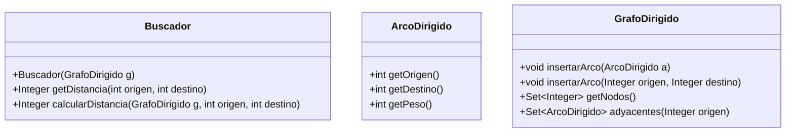
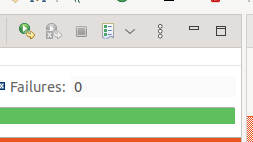

# Laboratorio 4 - Sistemas concurrentes

En el laboratorio 3 completamos un sistema capaz de generar un grafo de tableros en diversas partidas de ajedrez.
Esto nos permitía responder a preguntas del tipo "¿en cuántos movimientos puede llegarse de un tablero a otro?".
Cada movimiento es un arco que une dos tableros, por lo que utilizamos el algoritmo BFS para buscar caminos mínimos en el grafo.

Calcular el camino mínimo entre dos nodos es un proceso costoso.
Por ello, en este laboratorio exploraremos cómo usar concurrencia, con el objetivo final de aprovechar el paralelismo en sistemas modernos.

Para completar este laboratorio no es necesario haber completado el laboratorio 3.
Utilizaremos una clase muy simple para representar grafos y otra para arcos.
En la práctica 3 utilizaremos lo aprendido en este laboratorio y lo integraremos con nuestro lector de tableros.


## Objetivos

* Ilustrar la integración de algoritmos y concurrencia
* Desarrollar diferentes versiones de un programa concurrente:
  * Sin concurrencia
  * Con concurrencia pero sin regiones críticas
  * Con concurrencia y sincronización manual
  * Con concurrencia usando monitores
* Depurar un programa, detectar y corregir errores.

## Introducción

En este laboratorio y en la práctica final, se quiere ilustrar cómo se puede mejorar el rendimiento de algunos sistemas utilizando concurrencia.
Un enfoque habitual consiste en:

* Dividir los datos en fragmentos o segmentos.
* Crear un conjunto de hebras, que ejecuten cada segmento concurrentemente.
* Combinar o integrar los resultados de cada segmento

Este enfoque permite ejecutar varias hebras en paralelo sobre los núcleos (`cores`) del procesador.
Igualmente, podría extenderse con procesos, que se podrían ejecutar en varios computadores, comunicados por el paso de mensajes.

## Clases proporcionadas 

Las clases `GrafoDirigido` y `ArcoDirigido` del paquete `es.upm.dit.adsw.lab4.grafos` proporcionan una implementación simple de un grafo dirigido cuyos nodos son números enteros.
Los números no tienen por qué ser consecutivos.




## Pre-requisitos

Es necesario comprender los fundamentos de la programación secuencial:

* Concepto de hebras y sus estados
* Memoria compartida
* Acceso sincronizado a memoria

Aunque es recomendable comprender el objetivo del algoritmo BFS (lab3), no es estrictamente necesario.
Se proporciona una implementación de referencia usando las clases `GrafoDirigido` y `ArcoDirigido`.

## Pasos

### Estrategia 0: `Buscador` (Secuencial)

Antes de introducir concurrencia, analizaremos la implementación secuencial de este mismo algoritmo disponible en la clase `Buscador`.
Esto nos servirá para:

* Familiarizarnos con las clases proporcionadas
* Comprobar que somos capaces de producir una solución correcta (aunque sea lenta)
* Comparar su rendimiento con otras estrategias concurrentes

En esta clase se han implementado los métodos necesarios para calcular las distancias entre todo par de nodos en un grafo.
El funcionamiento esperado de esta clase es el siguiente:

* Un buscador se crea a partir de un `GrafoDirigido`
* Al crear el buscador, se calculan automáticamente las distancias entre todos los pares de nodos
* Después, el método `getDistancia` devuelve la distancia calculada durante la creación del buscador

Tras analizar el código, responde a las siguientes preguntas sobre la clase `Buscador`:

* ¿Qué atributos tiene?, ¿para qué sirve cada uno?
* ¿Qué métodos tiene además del constructor y `getDistancia`?, ¿para qué sirve cada uno?
* (Opcional) ¿Qué orden de complejidad tiene el constructor en el caso medio en función del número de nodos (V) y de arcos totales (E) del grafo de entrada?

Se deben lanzar también las pruebas de `TestBuscador` para comprobar que la implementación funciona adecuadamente.
Estas pruebas utilizan un grafo generado automáticamente (un grafo sintético) para desarrollar las pruebas.
Estudie el código de pruebas y responda a las siguientes preguntas:

* ¿Sobre qué grafo se estará probando el buscador con la variable `profundidad = 2`? Dibújalo.

### Estrategia 1: `BuscadorConcurrente`

La primera alternativa concurrente se debe implementar en la clase `BuscadorConcurrente`.
Esta clase deberá heredar de la clase `Buscador`, y se debe generar un nuevo constructor que calcule las distancias de una nueva manera.

A diferencia de la estrategia anterior, en este caso se lanzará una nueva hebra para procesar cada nodo de origen.
El pseudocódigo del algoritmo es el siguiente:

```
Inicializar diccionario de distancias
Para cada nodo n1 del grafo:
  Lanzar una hebra que:
    Cree un nuevo diccionario local con distancias desde n1
    Para cada nodo n2 del grafo:
      calcule el camino óptimo de n1 a n2 y lo guarde en el diccionario local
Esperar a que concluyan las hebras
Actualizar el diccionario global de distancias con los valores locales desde cada origen
```

Se recomienda crear una clase (p.e., `HebraIndependiente`), que reciba como argumentos los datos necesarios para resolver el problema y guardar los resultados: 

* El grafo original
* El nodo de origen

Además, la hebra tendrá que guardar el diccionario local con las distancias desde el origen hacia el resto de nodos.

¿Debe haber algún tipo de sincronización entre las hebras?

Para comprobar que la implementación funciona, se debe añadir un nuevo método a la clase `TestBuscador` que compruebe esta implementación.
El método debe ser similar al método `testSecuencial`, pero utilizando la nueva subclase.


### Estrategia 2: `BuscadorSincronizado`

En la estrategia anterior, no existe acceso compartido a datos, ya que cada hebra calcula su propio diccionario de distancias.
Esto no es siempre posible para todos los problemas, y debemos ser capaces de generar código con regiones críticas y acceso compartido a memoria.

En este paso, vamos a crear un nuevo buscador (`BuscadorSincronizado`) en el que todas las hebras tendrán acceso compartido a un único diccionario de distancias.

Se recomienda crear una clase (p.e., `HebraSincronizada`), que reciba como argumentos los datos necesarios para resolver el problema y guardar los resultados: 
A diferencia del caso anterior, esta hebra necesitará tener acceso al diccionario compartido.

El algoritmo sería aproximadamente el siguiente:

```
Inicializar diccionario de distancias
Para cada nodo n1 del grafo:
  Lanzar una hebra que:
    Para cada nodo n2 del grafo:
      Calcule el camino óptimo de n1 a n2
      Lo guarde en el diccionario de distancia
Esperar a que concluyan las hebras
```

Es importante darse cuenta de que, dado que el diccionario es compartido, el acceso a éste debe ser sincronizado. 
Hay varias formas de conseguir esta sincronización en Java, pero para este apartado recomendamos **alguna** de las siguientes:

* Mediante la creación de un cerrojo, que debe proporcionarse a la hebra.
* Mediante un bloque sincronizado. La sincronización debe ser con un objeto compartido por todas las hebras.
* Mediante un método sincronizado. El método debe ser de un objeto compartido por todas las hebras.

En el fondo, todas son equivalentes. 
Una vez terminado el laboratorio, es aconsejable intentar implementar cada una de ellas por separado para compararlas.

Al igual que con las anteriores implementaciones, se debe añadir un nuevo método a la clase `TestBuscador` para comprobar que funciona en el grafo sintético.
Tras evaluar la implementación, responde a las siguientes preguntas:

* ¿Se ha detectado algún error de acceso concurrente a los datos?
* ¿Qué pasa si se elimina el mecanismo de sincronización? Por ejemplo, si no se bloquea o desbloquea el cerrojo.
* ¿Qué efecto tendría incluir el cálculo de BFS entre dos nodos dentro de la región crítica?

### Estrategia 3: `BuscadorMonitor`

Para evitar problemas de acceso concurrente a este diccionario, crearemos una clase que controlará el acceso a este diccionario.
Es decir, vamos a desarrollar un monitor para las distancias.
Las hebras tendrán acceso a este monitor, en lugar de tener acceso directo a las distancias.

El monitor debe implementar los métodos:

* `get(int origen, int destino)`
* `put(int origen, int destino, int distancia)`

Como en los apartados anteriores, se recomienda crear una clase `HebraMonitor`, y realizar una prueba para este nuevo buscador.

Tras realizar la implementación, responde a las siguientes preguntas:

* ¿Qué operaciones has incluido en la región crítica?
* ¿Has creado una clase nueva para el monitor?
* ¿Podrían usarse las clases `HebraMonitor` o `BuscadorMonitor` como monitores (implementando los médotos adecuados? ¿Cómo? ¿Qué ventajas e inconvenientes habría?

## Análisis de tiempos de ejecución

En el código proporcionado se incluye una clase `TestBuscador`, que contiene un un smoketest en forma de tests JUnit.
Como último paso, se deberán analizar los tiempos de ejecución de cada estrategia para diferentes "profundidades".
Es decir, para diferentes tamaños del grafo.

¿Cuál de las estrategias implementadas es más rápida? ¿Dependerá del número de procesadores disponibles?

### Estrategia 4: `BuscadorOptimizado`

Por último, vamos a realizar una nueva alternativa.
Quizá te hayas percatado de que la búsqueda por BFS para cada una de las parejas es bastante ineficiente: la mayor parte de los pasos se repiten para cada nodo destino.
Una mejor estrategia es calcular BFS hacia todos los nodos de destino.

Para ahorrar tiempo, se propone la siguiente implementación:

<details>
  <summary>Código de la clase `BuscadorOptimizado.java`</summary>

```java
package es.upm.dit.adsw.lab4;

import java.util.ArrayList;
import java.util.HashMap;
import java.util.Map;

import es.upm.dit.adsw.lab4.Buscador;
import es.upm.dit.adsw.lab4.grafos.ArcoDirigido;
import es.upm.dit.adsw.lab4.grafos.GrafoDirigido;

/**
 * Versión alternativa del BuscadorSecuencial.
 */
public class BuscadorSecuencialOptimizado extends Buscador {
	public BuscadorSecuencialOptimizado(GrafoDirigido g) {
		this.distancias = new HashMap<Integer, Map<Integer, Integer>>(); 
		for(Integer n1: g.getNodos()) {
			Map<Integer, Integer> m = calcularDesdeOrigen(g, n1);
			distancias.put(n1, m);
		}
	}

	/**
	 * Método que calcula todas las distancias mínimas desde el nodo origen.
	 * @param g Grafo dirigido.
	 * @param origen Nodo de partida de todos los caminos.
	 * @return
	 */
	public static Map<Integer, Integer> calcularDesdeOrigen(GrafoDirigido g, Integer origen) {
		Map<Integer, Integer> distancias = new HashMap<>();
		ArrayList<ArcoDirigido> pendientes = new ArrayList<>();
		
		distancias.put(origen, 0);
		for(ArcoDirigido arco: g.adyacentes(origen)) {
			pendientes.add(arco);
		}

		while(!pendientes.isEmpty()) {
			ArcoDirigido arco = pendientes.remove(0);
			if(distancias.containsKey(arco.getDestino())) {
				continue;
			}
			distancias.put(arco.getDestino(), distancias.get(arco.getOrigen()) + 1);
			for(ArcoDirigido saliente: g.adyacentes(arco.getDestino())) {
				pendientes.add(saliente);
			}
		}
		return distancias;
	}
}
```

</details>

Copia el código anterior en el fichero `BuscadorOptimizado.java`.
Lanza de nuevo las pruebas, dando a profundidad los siguientes valores:

* 5
* 10
* 12

Fíjate especialmente en los valores de los tiempos de ejecución de cada prueba.
Puedes ordenar las pruebas de mayor a menor tiempo de ejecución usando el `View Menu`:




Esta nueva estrategia:

* ¿Es secuencial o concurrente?
* ¿Es más rápida que las anteriores?
* ¿Qué orden de complejidad tiene este nuevo algoritmo?
* En caso de que sea secuencial, ¿podría paralelizarse?

<details>
  <summary>Respuesta</summary>

Esta nueva solución es secuencial, y aun así es órdenes de magnitud más rápida que el resto de soluciones que hemos implementado.
El orden de complejidad de esta solución es menor, y además el número de operaciones es siempre inferior al resto de métodos.
Esto se debe a que en nuestro proceso de cálculo de BFS para cada pareja repite la mayoría de operaciones de manera innecesaria.

Este resultado es un ejemplo de que el paralelismo no puede solucionar un mal algoritmo.
Es importante tomar un tiempo para reflexionar sobre los aspectos a mejorar en el código antes de invertir tiempo en paralelizarlo.
</details>

## Anexo: Medidas de tiempo

El siguiente texto permite, aproximadamente, medir el tiempo de ejecución de un segmento de código.  se rodea de llamadas al reloj del sistema y la diferencia es el tiempo que le cuesta hacerlo

¿Cuál de las estrategias implementadas es más rápida? ¿Dependerá del número de procesadores disponibles?

```java
long t1 = System.currentTimeMillis();
… lo que queremos medir …
long t2 = System.currentTimeMillis();
System.out.println(t2-t1);
```
Prácticamente siempre conviene medir varias ejecuciones y tomar un valor promedio.
```java
long t1 = System.currentTimeMillis();
for (int i= 0; i < N; i++) {
	… lo que queremos medir …
}
long t2 = System.currentTimeMillis();
System.out.println(t2-t1);
```
Durante las medidas conviene estabilizar lo que hace el equipo, pues la CPU se puede dedicar a
muchas tareas y en la medida de tiempo sólo medidos dos instantes, pero no sabemos qué
fracción de ese tiempo corresponde a nuestro objeto de medida

## Copyright 


Análisis y Diseño de Software, 2024

Grado en Ingeniería de Tecnologías y Servicios de Telecomunicación
ETSI de Telecomunicación
Universidad Politécnica de Madrid
